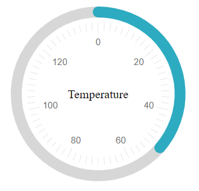

# Circular

The Telerik **RadCircularGauge** is a Control representing a value on a circular arc. It offers a customizable scale and appearance. RadCircularGauge extends the [RadArcGauge Control]() by modifying its appearance to a complete circle.

The CircularGauge UI Control for ASP.NET AJAX is available as of R2 2023. The RadCircularGauge is a server-side WebForms wrapper over the [Kendo UI CircularGauge for jQuery widget](https://docs.telerik.com/kendo-ui/controls/gauges/circulargauge/overview).



To get an idea which element corresponds to which tag check the [RadGauge Structure]() article. The above gauge was created with the following simple markup:

````ASP.NET
<telerik:RadCircularGauge runat="server" ID="RadCircularGauge1" Height="300" Width="300" Value="51" Skin="Silk">
    <CenterTemplate>
        Temperature
    </CenterTemplate>
    <Scale Min="0" Max="140">
        <MajorTicks Visible="true" />
        <MinorTicks Visible="true" />
        <Labels Visible="true" />
    </Scale>
</telerik:RadCircularGauge>
````

The control offers more customization options than the ones shown above:

* **Center Template** - You can customize the content inside the center of the CircularGauge by using the center template.  RadCircularGauge uses [Kendo UI Templates]("https://docs.telerik.com/kendo-ui/framework/templates/overview") to provide full control over the rendering of center element. To evaluate the current value of the Gauge in its center element use `#:value#`.

* **Basic Scale configuration** - the `Scale` is the main wrapper of the control and details are configurable through inner properties. The main `Scale` tag, however, offers the basic functionality - the `Min` and `Max` values of the gauge, the `MajorUnit` and `MinorUnit` properties that control the ticks and label distance,and the `Reverse` property which shows the higher values first when set to true. The specific properties here is `StartAngle` which controls the angle from which the gauge's dial starts.

* **Labels configuration** - you can choose the `BackgroundColor`, `Color` and `Font` to customize their appearance. The `Visible` property controls if they are shown and the `Format` takes a format string that will be applied to the text according to the value. The format string uses the `{0}` placeholder to indicate the value. The `Template` property is a client template similar to the format - it takes a similar string to show in the labels, but the value placeholder is `#=value#`. The `Position` property controls whether the labels are inside or outside of the dial.

* **Ticks configuration** - the `MajorTicks` and `MinorTicks` inner tags expose the small lines that protrude from the ranges to show the value. They offer various options for customization - `Color`, `Size` or `Width` (in pixels) and `Visible` (boolean).

* **Color Ranges configuration** - the `ColorsCollection` tag can contain multiple `CircularGaugeColor` tags that represent the areas of the gauge that will show differently than the regular scale. Each color range has the `From` and `To` properties that control is positioning on the scale and also the `Color` property that can be used to specify their fill.

* **Main gauge configuration** - the `Appearance` tag of the control allows for customizing its entire look. It offers the `BackgroundColor` property which sets the wrapper's background fill and also `Height`, `Width`, and `Margin` defining the size of the wrapper and the distance between the Gauge itself and the contour of its wrapper.

## See Also

 * [RadGauge Structure]()
 
 * [Arc]()

 * [Linear]()

 * [Radial]()

 * [Demo: Arc Gauge](https://demos.telerik.com/aspnet-ajax/gauge/examples/types/circular/defaultcs.aspx)
