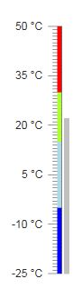

# Linear

The **RadLinearGauge** represents the ranges and the value in a linear format, like its name suggests. It can be explained quite simply like a termomether - the pointer is the quicksilver that fills the tube and the ranges can represent the temperatures in which we feel cold, hot or simply fine. For example:



To get a better idea which element corresponds to which tag check the [RadGauge Structure]() article. The above gauge was created with the following simple markup:

````ASP.NET
<telerik:RadLinearGauge runat="server" ID="RadLinearGauge1" Height="300px" Width="100px">
	<Pointer Value="22" Color="Silver">
	</Pointer>
	<Scale Min="-25" Max="50" MajorUnit="15" MinorUnit="1">
	<Labels Format="{0} &deg;C" />
		<Ranges>
			<telerik:GaugeRange From="-25" To="-5" Color="Blue" />
			<telerik:GaugeRange From="-5" To="15" Color="LightBlue" />
			<telerik:GaugeRange From="15" To="30" Color="GreenYellow" />
			<telerik:GaugeRange From="30" To="50" Color="Red" />
		</Ranges>
	</Scale>
</telerik:RadLinearGauge>
````

The control offers more customization options than the ones shown above:

* **Advanced pointer customizations** - the pointer can be a tick or a bar depending on its **Shape** property,you can choose its **Color** and **Value** as well. When the pointer is a bar you an also control its **Track** - the background behind the bar itself - its **Color** and **Opacity** properties allow you to choose its appearance. The Opacity must be between 0 and 1.

* **Basic Scale configuration** - the **Scale** is the main wrapper of the control and details are configurable through inner properties. The main **Scale** tag, however, offers the basic functionality - the **Min** and **Max**values of the gauge, the **MajorUnit** and **MinorUnit** properties that control the ticks and label distance, the **Mirror** property which chooses the side on which the ticks and labels are shown, the **Vertical** property which makes the gauge horizontal when set to false and the **Reverse** property which shows the higher values first when set to true.

* **Labels configuration** - you can choose the **BackgroundColor**, **Color** and **Font** to customize their appearance. The **Visible** property controls if they are shown and the **Format** takes a format string that will be applied to the text according to the value. The format string uses the **{0}** placeholder to indicate the value.The **Template** property is a client template similar to the format - it takes a similar string to show in the labels,but the value placeholder is **#=value#**.

* **Ticks configuration** - the **MajorTicks** and **MinorTicks** inner tags expose the small lines that protrude from the ranges to show the value. They can be customized in terms of **Color**, **Size** or **Width** (in pixels) and **Visibility** (boolean).

* **Ranges configuration** - the **Ranges** tag contains several **GaugeRange** tags that represent the areas of the gauge that will show differently than the regular scale. Each range has the **From** and **To** properties that control is positioning on the scale and also the **Color** property that can be used to specify their fill.

* **Main gauge configuration** - the **Appearance** tag of the control allows for customizing its entire look. Currently it offers the **BackgroundColor** property which sets the wrapper's background fill.
