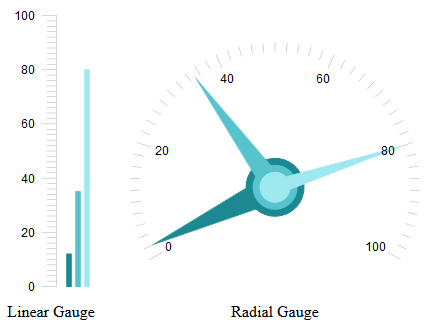

# Multiple Pointers


As for __Q1 2015__, you can add multiple pointers in a	RadGauge control by using the Pointers collection. It is available for	both the [Linear Gauge]() and the	[Radial Gauge]() (__Figure 1__).
>caption Figure 1: Multiple pointers in Linear Gauge and Radial Gauge.



## Adding Pointers

You can add multiple pointers in a __RadGauge__ control by using the __Pointers__ collection and add LinearPointeritems for a __LinearGauge__ and __RadialPointer__ items for a __RadialGauge__.

__Figure 1__ shows two gauge controls with multiple pointers and you can examine the code that renders them in__Example 1__ and __Example 2__.

>important Note that the __Pointer__ inner tag used together with the __Pointers__ collection is not a valid scenario.	If it happens that both are added to one __RadGauge__ configuration, the multiple pointers will overwrite	the single one and it won’t be rendered.
>


The style and value options available for each type of the multiple pointers are the same as the ones exposed for the single pointer.You can learn more about the available properties for [Linear Gauge]() itemsand for the [Radial Gauge]().

In __Figure 1__ are shown the two gauge controls with multiple pointers added, whereas in	__Example 1__ you can examine the code that renders them.

__Example 1__: Adding pointers in the Pointers collection of Linear Gauge and Radial Gauge in the markup.

````ASPNET
		<telerik:RadLinearGauge runat="server" ID="RadLinearGauge1" Width="100px" Height="300px">
			<Pointers>
				<telerik:LinearPointer Value="12" Margin="10" Shape="BarIndicator" Color="#1b8892"></telerik:LinearPointer>
				<telerik:LinearPointer Value="35" Margin="19" Shape="BarIndicator" Color="#56c3cd"></telerik:LinearPointer>
				<telerik:LinearPointer Value="80" Margin="28" Shape="BarIndicator" Color="#9fe8ef"></telerik:LinearPointer>
			</Pointers>
		</telerik:RadLinearGauge>
		<telerik:RadRadialGauge runat="server" ID="RadRadialGauge1" Width="300px" Height="300px">
			<Pointers>
				<telerik:RadialPointer Value="2" Cap-Size="0.2" Color="#1b8892"></telerik:RadialPointer>
				<telerik:RadialPointer Value="35" Cap-Size="0.15" Color="#56c3cd"></telerik:RadialPointer>
				<telerik:RadialPointer Value="80" Cap-Size="0.1" Color="#9fe8ef"></telerik:RadialPointer>
			</Pointers>
		</telerik:RadRadialGauge>
````


__Example 2__: Adding pointers in the Pointers collection via the code behind.

>tabbedCode

````ASPNET
			<telerik:RadLinearGauge runat="server" ID="RadLinearGauge1" Width="100px" Height="300px">
			</telerik:RadLinearGauge>
	
			<telerik:RadRadialGauge runat="server" ID="RadRadialGauge1" Width="300px" Height="300px">
			</telerik:RadRadialGauge>
````


````C#
	    protected void Page_Load(object sender, EventArgs e)
	    {
			LinearPointer linearPointer1 = new LinearPointer();
			linearPointer1.Value = 12;
			linearPointer1.Margin = 10;
			linearPointer1.Shape = Telerik.Web.UI.Gauge.PointerShape.BarIndicator;
			linearPointer1.Color = ColorTranslator.FromHtml("#1b8892");
	
			LinearPointer linearPointer2 = new LinearPointer();
			linearPointer2.Value = 35;
			linearPointer2.Margin = 19;
			linearPointer2.Shape = Telerik.Web.UI.Gauge.PointerShape.BarIndicator;
			linearPointer2.Color = ColorTranslator.FromHtml("#56c3cd");
	
			LinearPointer linearPointer3 = new LinearPointer();
			linearPointer3.Value = 80;
			linearPointer3.Margin = 28;
			linearPointer3.Shape = Telerik.Web.UI.Gauge.PointerShape.BarIndicator;
			linearPointer3.Color = ColorTranslator.FromHtml("#9fe8ef");
	
			RadLinearGauge1.Pointers.Add(linearPointer1);
			RadLinearGauge1.Pointers.Add(linearPointer2);
			RadLinearGauge1.Pointers.Add(linearPointer3);
	
			RadialPointer radialPointer1 = new RadialPointer();
			radialPointer1.Value = 2;
			radialPointer1.Cap.Size = 0.2f;
			radialPointer1.Color = ColorTranslator.FromHtml("#1b8892");
	
			RadialPointer radialPointer2 = new RadialPointer();
			radialPointer2.Value = 35;
			radialPointer2.Cap.Size = 0.15f;
			radialPointer2.Color = ColorTranslator.FromHtml("#56c3cd");
	
			RadialPointer radialPointer3 = new RadialPointer();
			radialPointer3.Value = 80;
			radialPointer3.Cap.Size = 0.1f;
			radialPointer3.Color = ColorTranslator.FromHtml("#9fe8ef");
	
			RadRadialGauge1.Pointers.Add(radialPointer1);
			RadRadialGauge1.Pointers.Add(radialPointer2);
			RadRadialGauge1.Pointers.Add(radialPointer3);
		}
	
````


````VB.NET
		Protected Sub Page_Load(ByVal sender As Object, ByVal e As System.EventArgs) Handles Me.Load
			Dim linearPointer1 As New LinearPointer()
			linearPointer1.Value = 12
			linearPointer1.Margin = 10
			linearPointer1.Shape = Telerik.Web.UI.Gauge.PointerShape.BarIndicator
			linearPointer1.Color = ColorTranslator.FromHtml("#1b8892")
	
			Dim linearPointer2 As New LinearPointer()
			linearPointer2.Value = 35
			linearPointer2.Margin = 19
			linearPointer2.Shape = Telerik.Web.UI.Gauge.PointerShape.BarIndicator
			linearPointer2.Color = ColorTranslator.FromHtml("#56c3cd")
	
			Dim linearPointer3 As New LinearPointer()
			linearPointer3.Value = 80
			linearPointer3.Margin = 28
			linearPointer3.Shape = Telerik.Web.UI.Gauge.PointerShape.BarIndicator
			linearPointer3.Color = ColorTranslator.FromHtml("#9fe8ef")
	
			RadLinearGauge1.Pointers.Add(linearPointer1)
			RadLinearGauge1.Pointers.Add(linearPointer2)
			RadLinearGauge1.Pointers.Add(linearPointer3)
	
			Dim radialPointer1 As New RadialPointer()
			radialPointer1.Value = 2
			radialPointer1.Cap.Size = 0.2F
			radialPointer1.Color = ColorTranslator.FromHtml("#1b8892")
	
			Dim radialPointer2 As New RadialPointer()
			radialPointer2.Value = 35
			radialPointer2.Cap.Size = 0.15F
			radialPointer2.Color = ColorTranslator.FromHtml("#56c3cd")
	
			Dim radialPointer3 As New RadialPointer()
			radialPointer3.Value = 80
			radialPointer3.Cap.Size = 0.1F
			radialPointer3.Color = ColorTranslator.FromHtml("#9fe8ef")
	
			RadRadialGauge1.Pointers.Add(radialPointer1)
			RadRadialGauge1.Pointers.Add(radialPointer2)
			RadRadialGauge1.Pointers.Add(radialPointer3)
	
		End Sub
````


>end

# See Also

 * [RadGauge Structure]()

 * [Linear]()

 * [Radial]()

 * [Demo: Multiple Pointers](http://demos.telerik.com/aspnet-ajax/gauge/examples/multiplepointers/defaultcs.aspx)
