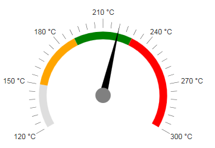

# Radial


## 

The __RadRadialGauge__ represents the ranges and the value in a circular format, much like a car dashboard.In a similar manner it offers a customizable dial and a pointer, that rotates around its cap to show the value on the scale. For example:

To get a better idea which element corresponds to which tag check the [RadGauge Structure]() article.The above gauge was created with the following simple markup:

````ASPNET
		<telerik:RadRadialGauge runat="server" ID="RadRadialGauge1" Height="350px" Width="350px">
			<Pointer Value="220" Color="Black">
				<Cap Color="Gray" Size="0.1" />
			</Pointer>
			<Scale Min="120" Max="300" MajorUnit="30" MinorUnit="5">
			<Labels Format="{0} &deg;C" Position="Outside" />
				<Ranges>
					<telerik:GaugeRange Color="Orange" From="150" To="190" />
					<telerik:GaugeRange Color="Green" From="190" To="230" />
					<telerik:GaugeRange Color="Red" From="230" To="300" />
				</Ranges>
			</Scale>
		</telerik:RadRadialGauge>
````


The control offers more customization options than the ones shown above:

* __Advanced pointer customizations__ - The arrow is customizable in terms of __Value__ and__Color__. The __Cap__ (the axis around which the arror rotates) offers the__Color__ and __Size__ properties. The size is a percentage of the whole dial and its value must bebetween [0;1].

* __Basic Scale configuration__ - the __Scale__ is the main wrapper of the control and details are configurablethrough inner properties. The main __Scale__ tag, however, offers the basic functionality - the __Min and Max__values of the gauge, the __MajorUnit and MinorUnit__ properties that control the ticks and label distance,and the __Reverse__ property which shows the higher values first when set to true. The specific properties here are__StartAngle__ and __EndAngle__ which control the angle from which the gauge's dial starts and at which it ends.The difference between them must be less than 360 degrees and they can also take negative values so that the gauge rotates from the default vertical centering.The __zero angle__ is horizontal to the left.

* __Labels configuration__ - you can choose the __BackgroundColor, Color and Font__ to customize their appearance.The __Visible__ property controls if they are shown and the __Format__ takes a format string that will be appliedto the text according to the value. The format string uses the __{0}__ placeholder to indicate the value.The __Template__ property is a client template similar to the format - it takes a similar string to show in the labels,but the value placeholder is __#=value#__. The __Position__ property controls whether the labels areinside or outside of the dial.

* __Ticks configuration__ - the __MajorTicks and MinorTicks__ inner tags expose the small lines that protrudefrom the ranges to show the value. They can be customized in terms of __Color__, __Size or Width__ (in pixels) and__Visibility__ (boolean).

* __Ranges configuration__ - the __Ranges__ tag contains several __GaugeRange__ tagsthat represent the areas of the gauge that will show differently than the regular scale. Each range has the __From and To__properties that control is positioning on the scale and also the __Color__ property that can be used to specify their fill.

* __Main gauge configuration__ - the __Appearance__ tag of the control allows for customizing its entirelook. Currently it offers the __BackgroundColor__ property which sets the wrapper's background fill.
