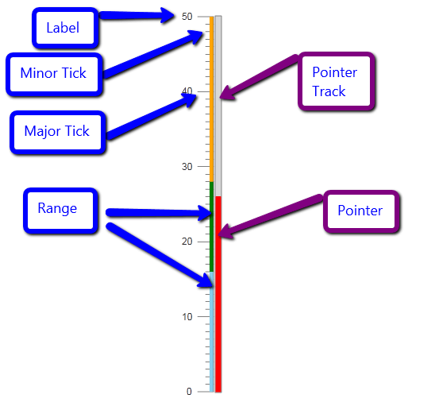
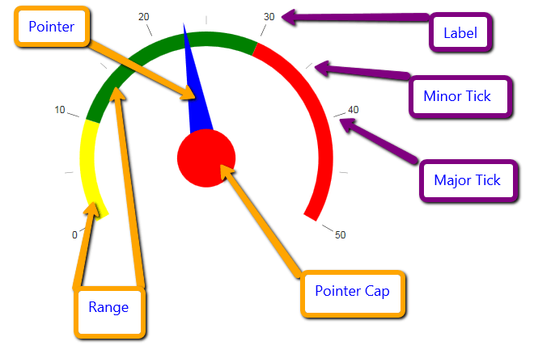

# RadGauge Structure

The basic structure of the **RadGauge**, regardless of its type (Radial or Linear) consists of a **Scale**	and a **Pointer** that shows the value on that scale. The scale contains the Major and Minor **Ticks** that mark the values, along with the **Labels** for them. In the scale the developer can define separate **Ranges**	in order to colorize them differently. The **Pointer** has a **Cap** (Radial) or **Track** (Linear)	that allow for customizing its appearance.

The sections and images below show these elements on simple gauges for visual clarity.

## Linear Gauge

## Radial Gauge

