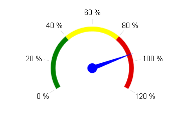

# Programmatic Creation


## 

RadGauge can be created programmatically through its [ server-side ]() properties:

````ASPNET
	    <asp:PlaceHolder runat="server" ID="PlaceHolder1"></asp:PlaceHolder>
````


````C#
	    protected void Page_Init(object sender, EventArgs e)
	    {
	        //Create new RadialGauge object
	        RadRadialGauge radialGauge = new RadRadialGauge();
	        radialGauge.ID = "radialGauge1";
	
	        //Set Pointer properties
	        radialGauge.Pointer.Value = (decimal)0.95;
	        radialGauge.Pointer.Cap.Size = (float)0.10;
	        radialGauge.Pointer.Cap.Color = System.Drawing.Color.Blue;
	        radialGauge.Pointer.Color = System.Drawing.Color.Blue;
	
	        //Set Min and Max values of the Scale
	        radialGauge.Scale.Min = 0;
	
	        //In order the Max value to be displayed it should be multiple of the MajorUnit
	        radialGauge.Scale.Max = (decimal)1.2;
	        radialGauge.Scale.MinorUnit = (decimal)0.5;
	        radialGauge.Scale.MajorUnit = (decimal)0.2;
	
	        //Set Minor and Major Ticks properties
	        radialGauge.Scale.MinorTicks.Visible = false;
	        radialGauge.Scale.MajorTicks.Size = 10;
	
	        //Set Scale Labels properties
	        radialGauge.Scale.Labels.Visible = true;
	        radialGauge.Scale.Labels.Font = "15px Arial,Helvetica,sans-serif";
	        radialGauge.Scale.Labels.Color = System.Drawing.Color.Black;
	        radialGauge.Scale.Labels.Format = "P0";
	        radialGauge.Scale.Labels.Position = Telerik.Web.UI.Gauge.ScaleLabelsPosition.Outside;
	
	        //Create new GaugeRange object
	        GaugeRange gr1 = new GaugeRange();
	
	        //Set the properties of the new object
	        gr1.From = 0;
	        gr1.To = (decimal)0.4;
	        gr1.Color = System.Drawing.Color.Green;
	
	        GaugeRange gr2 = new GaugeRange();
	        gr2.From = (decimal)0.4;
	        gr2.To = (decimal)0.8;
	        gr2.Color = System.Drawing.Color.Yellow;
	
	        GaugeRange gr3 = new GaugeRange();
	        gr3.From = (decimal)0.8;
	        gr3.To = (decimal)1.2;
	        gr3.Color = System.Drawing.Color.FromArgb(225, 0, 0);
	
	        //Add Gauge objects to the RadialGauge
	        radialGauge.Scale.Ranges.Add(gr1);
	        radialGauge.Scale.Ranges.Add(gr2);
	        radialGauge.Scale.Ranges.Add(gr3);
	
	        //Add RadialGauge object to the div wrapper
	        PlaceHolder1.Controls.Add(radialGauge);
	    }
````
````VB
	    Protected Sub Page_Init(sender As Object, e As System.EventArgs) Handles Me.Init
	
	        'Create new RadialGauge object
	        Dim radialGauge As New RadRadialGauge()
	        radialGauge.ID = "radialGauge1"
	
	        'Set Pointer properties
	        radialGauge.Pointer.Value = 0.95
	        radialGauge.Pointer.Cap.Size = 0.1
	        radialGauge.Pointer.Cap.Color = System.Drawing.Color.Blue
	        radialGauge.Pointer.Color = System.Drawing.Color.Blue
	
	        'Set Min and Max values of the Scale
	        radialGauge.Scale.Min = 0
	
	        'In order the Max value to be displayed it should be multiple of the MajorUnit
	        radialGauge.Scale.Max = 1.2
	        radialGauge.Scale.MinorUnit = 0.5
	        radialGauge.Scale.MajorUnit = 0.2
	
	        'Set Minor and Major Ticks properties
	        radialGauge.Scale.MinorTicks.Visible = False
	        radialGauge.Scale.MajorTicks.Size = 10
	
	        'Set Scale Labels properties
	        radialGauge.Scale.Labels.Visible = True
	        radialGauge.Scale.Labels.Font = "15px Arial,Helvetica,sans-serif"
	        radialGauge.Scale.Labels.Color = System.Drawing.Color.Black
	        radialGauge.Scale.Labels.Format = "P0"
	        radialGauge.Scale.Labels.Position = Telerik.Web.UI.Gauge.ScaleLabelsPosition.Outside
	
	        'Create new GaugeRange object
	        Dim gr1 As New GaugeRange()
	
	        'Set the properties of the new object
	        gr1.From = 0
	        gr1.To = 0.4
	        gr1.Color = System.Drawing.Color.Green
	
	        Dim gr2 As New GaugeRange()
	        gr2.From = 0.4
	        gr2.To = 0.8
	        gr2.Color = System.Drawing.Color.Yellow
	
	        Dim gr3 As New GaugeRange()
	        gr3.From = 0.8
	        gr3.To = 1.2
	        gr3.Color = System.Drawing.Color.FromArgb(225, 0, 0)
	
	        'Add Gauge objects to the RadialGauge
	        radialGauge.Scale.Ranges.Add(gr1)
	        radialGauge.Scale.Ranges.Add(gr2)
	        radialGauge.Scale.Ranges.Add(gr3)
	
	        'Add RadialGauge object to the div wrapper
	        PlaceHolder1.Controls.Add(radialGauge)
	
	    End Sub
````


Programmatically created RadGauge looks like:
