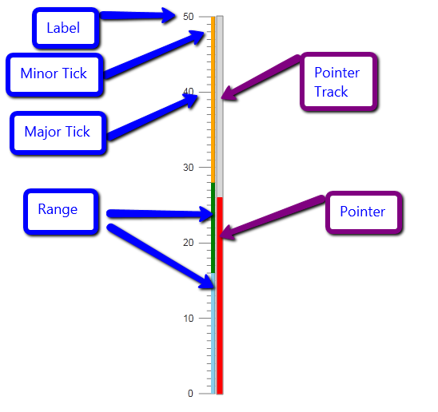
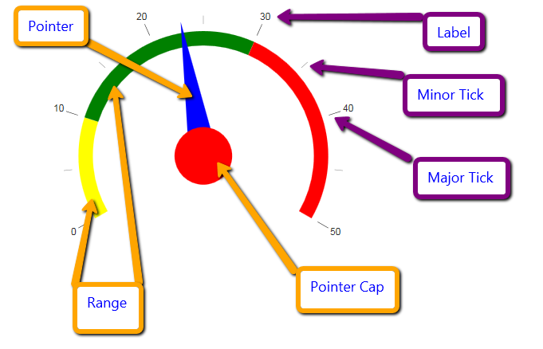

# RadGauge Structure

The basic structure of the **RadGauge**, regardless of its type consists of a **Scale**. The scale contains the Major and Minor **Ticks** that mark the values, along with the **Labels** for them. In the scale the developer can define separate **Ranges**	in order to colorize them differently.

The `RadArcGauge` and `RadCircularGauge` Controls have value that is visually represented by the filler of the Scale. `RadLinearGauge` and `RadRadialGauge` Controls expose a **Pointer** that shows the value on the scale. The **Pointer** has a **Cap** (Radial) or **Track** (Linear) that allow for customizing its appearance.

The sections and images below show these elements on simple gauges for visual clarity.

## Linear Gauge

## Radial Gauge

## Arc Gauge and Circular Gauge

## See Also
 
 * [Arc]()

 * [Circular]()

 * [Linear]()

 * [Radial]()

 * [Live demos](https://demos.telerik.com/aspnet-ajax/gauge/examples/overview/defaultcs.aspx)

