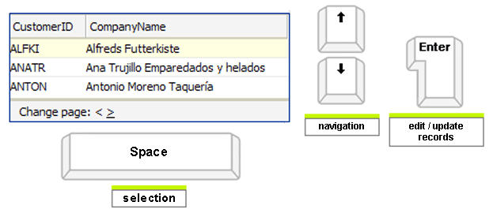

# Keyboard support

## 

You can enable keyboard navigation in the **RadGrid** control by setting the **ClientSettings.AllowKeyboardNavigation** property to **True** (its default value is **False**). Currently the following features are supported:

* **Access Keys**: An access key is a key combination (e.g. Alt+F) that lets the user move focus to the grid and subsequently use the Up and Down arrow keys for navigation. The access key is defined using the **AccessKey** property. For example, setting the **AccessKey** property to "F" enables users to move focus to the grid by typing Alt+F.

* **FocusKey:**To specify the key combination that focuses the grid you need to set the **FocusKey** in the **KeyBoardNavigationSettings** tag property **-**the first key is preset to [CTRL] by design.

* **InitInsertKey**: Setting this property provides a shortcut for opening RadGrid insert form. The first key is preset to [CTRL] by design.

* **RebindKey**: Allows the users to rebind RadGrid. The first key is preset to [CTRL] by design.

* **AllowActiveRowCycle:**To allow the active row to cycle to the beginning upon having reached the end of the grid table, you have to set **ClientSettings -> KeyboardNavigationSettings -> AllowActiveRowCycle**property to **true**.

* **Arrowkey Navigation**: When arrow key navigation is enabled, users can navigate the rows of the grid using the up and down arrow keys.

* **Selection**: Users can select rows by pressing the [SPACE] key.

* **Multi rows selection**: When RadGrid **AllowMultiRowSelection** property is set to **true**, users can use the [CTRL] and [SHIFT] keys to simulate Windows Explorer-like selection.

* **Editing**: When editing is enabled, users can edit rows hitting the [ENTER] key. Then to update/insert rows they can use the [ENTER] key again. And to exit edit/insert mode without saving any changes, they can hit the [ESC] key.
>caption 

## See Also

 * [Cancel Enter and Arrow Key Press ]()
