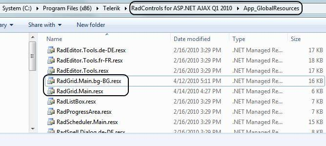
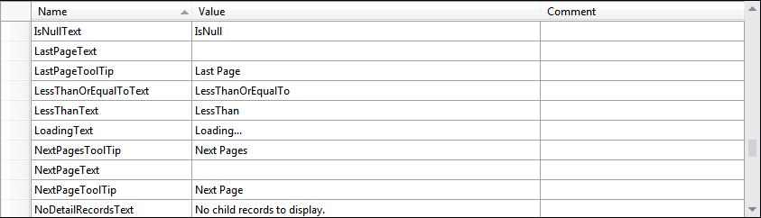
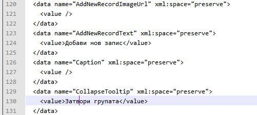

# Localization through Global Resources


From **UI for ASP.NET AJAX Q2 2010** onwards,*RadGrid* supports built-in localization through Global resources. Similar to **RadEditor** and **RadScheduler**, you can use the resx files to localize the control with minimum efforts.

## Using the resource file

The resource files should be placed within the **App_GlobalResources** folder in your application. You can either create your own language pack (see below) or use an existing one (if available for your language). Telerik controls installation wizard automatically copies the built-in resources to the **App_GlobalResources** in your local installation.



To change the current language/resource you should set the **Culture** property accordingly.

>note RadGrid's default **Culture** is taken from the page's **CurrentUICulture** .
>


````ASP.NET
<telerik:RadGrid RenderMode="Lightweight" ID="RadGrid1"    runat="server"    Culture="en-US" ... </telerik:RadGrid>			
````


Here is how to localize your **RadGrid** in simple steps:

1. Create a new resource file or copy an existing one from the **App_GlobalResources** in your installation folder

2. Add the resource file (**resx**) file to the **App_GlobalResources** folder in your application. Note that you should have two files as a bare minimum - **RadGrid.Main.resx** and the localization file itself - for example **RadGrid.Main.en-GB.resx**

3. Set the **Culture** property to the corresponding language (for example: it-IT, en-GB, ja-JP and so on)


## Creating/Modifying resource files

The resource files are represented in a human-readable format (XML) and can be easily modified either in the built-in Visual Studio resource editor or directly in the file, by hand.





## How to create a new localization resource

The process of creating a new global resource follows the same pattern as in **RadEditor** and **RadScheduler** controls.

1. Make a copy of the **RadGrid.Main.resx** file and save it as **RadGrid.Main.YOURLANGUAGE.resx** (for example: **RadGrid.Main.ja-JP.resx**)

2. Replace the default strings with the translated ones

3. Set the **Culture** property to the relevant language

>caution Please ** -do not- ** modify/remove the **ReservedResource** key.
>


>note We encourage that you submit your localized resource files. Your efforts will be rewarded accordingly.
>


You can find a complete list of the culture codes [here](https://msdn.microsoft.com/en-us/library/system.globalization.cultureinfo%28vs.71%29.aspx).
