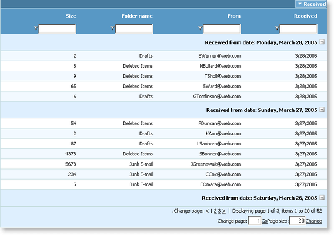

# Right-to-left support


## 

You can present the content of your grid instance in a right-to-left direction very easily. To provide RTL support for your grid, you merely need to set the **Dir** property for the **MasterTableView/GridTableViews** to **RTL**.

Here is an example:

````ASP.NET
      <telerik:RadGrid ID="RadGrid1" DataSourceID="SqlDataSource1" runat="server" Width="97%" AllowPaging="True" 
        PageSize="12" AllowSorting="True" ShowGroupPanel="True" AutoGenerateColumns="False"
        GridLines="none" AllowFilteringByColumn="true">
        <PagerStyle Mode="NextPrevNumericAndAdvanced"></PagerStyle>
        <MasterTableView Width="100%" Dir="RTL">
            <GroupByExpressions>
                <telerik:GridGroupByExpression>
                    <SelectFields>
                        <telerik:GridGroupByField FieldAlias="Received" FieldName="Received" FormatString="{0:D}"
                            HeaderValueSeparator=" from date: "></telerik:GridGroupByField>
                    </SelectFields>
                    <GroupByFields>
                        <telerik:GridGroupByField FieldName="Received" SortOrder="Descending"></telerik:GridGroupByField>
                    </GroupByFields>
                </telerik:GridGroupByExpression>
            </GroupByExpressions>
            <Columns>
                <telerik:GridBoundColumn SortExpression="Received" HeaderText="Received" HeaderButtonType="TextButton"
                    DataField="Received" DataFormatString="{0:d}">
                </telerik:GridBoundColumn>
                <telerik:GridBoundColumn SortExpression="From" HeaderText="From" HeaderButtonType="TextButton"
                    DataField="From">
                </telerik:GridBoundColumn>
                <telerik:GridBoundColumn SortExpression="FolderName" HeaderText="Folder name" HeaderButtonType="TextButton"
                    DataField="FolderName">
                </telerik:GridBoundColumn>
                <telerik:GridBoundColumn SortExpression="Size" HeaderText="Size" HeaderButtonType="TextButton"
                    DataField="Size">
                </telerik:GridBoundColumn>
            </Columns>
        </MasterTableView>
        <ClientSettings AllowDragToGroup="True">
            <Selecting AllowRowSelect="True"></Selecting>
        </ClientSettings>
    </telerik:RadGrid>
</div>
<br />
<asp:SqlDataSource ID="SqlDataSource1" ConnectionString="<%$ ConnectionStrings:TelerikConnectionString %>"
    ProviderName="System.Data.SqlClient"
    SelectCommand="SELECT * FROM Mails" runat="server">
</asp:SqlDataSource>
````


You can find the above grid in the following online examples:

[http://demos.telerik.com/aspnet-ajax/Grid/Examples/Styles/RightToLeft/DefaultCS.aspx](http://demos.telerik.com/aspnet-ajax/Grid/Examples/Styles/RightToLeft/DefaultCS.aspx)

[http://demos.telerik.com/aspnet-ajax/Grid/Examples/Styles/RightToLeft/DefaultVB.aspx](http://demos.telerik.com/aspnet-ajax/Grid/Examples/Styles/RightToLeft/DefaultVB.aspx)

Here is an image of RadGrid in RTL mode.


All predefined grid skins (shipped with the grid installation) are optimized to work in RTL mode.
