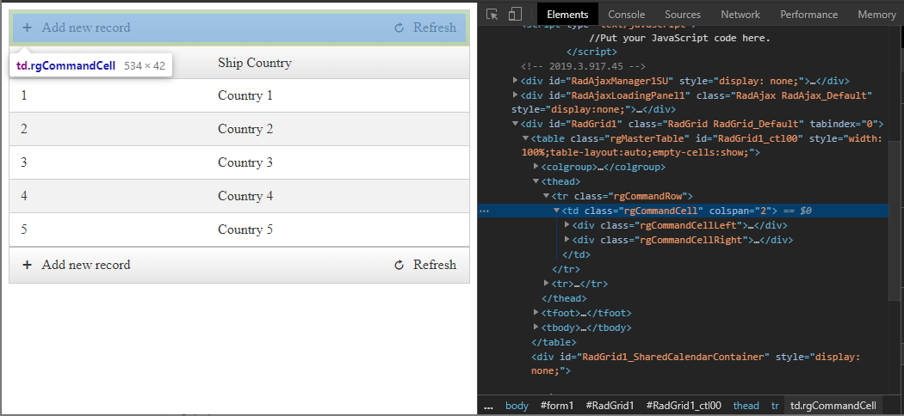

# Accessing Cells

## Accessing Cells Using Column Unique Name

Because of features such as [column reordering]() and [grouping](), the index of individual columns can change on the client. This means that using indexes to access individual cells in the **Cells** collection of a row is not a reliable method of obtaining a cell in a particular column.

To provide a reliable way of locating the cell in a particular column, each column in the grid has a **UniqueName** propertyof type string. This property is assigned automatically at design time. For example, an auto-generated **GridBoundColumn** with **DataField** 'ContactName' generates a **UniqueName** of 'ContactName').You can also set the **UniqueName** property explicitly, although the automatic generation handles most cases. Using the **UniqueName** property of a column lets you reliably locate a column even when its index changes.

````C#
TableCell cell = dataItem["ColumnUniqueName"]; //where dataItem is object of type GridDataItem
````
````VB
Dim cell As TableCell = dataItem("ColumnUniqueName")
'where dataItem is object of type GridDataItem
````

To get the cell's value, use the **Text** property of the cell:

````C#
string cellValue = dataItem["ColumnUniqueName"].Text; //where dataItem is object of type GridDataItem
````
````VB
Dim cellValue As String = dataItem("ColumnUniqueName").Text
'where dataItem is object of type GridDataItem
````

> This approach of obtaining cell values works for auto-generated columns and built-in column types except for **GridTemplateColumn** and **GridCheckBoxColumn**. For template columns, you must find the control in the grid cell and extract its value.

## Accessing the Value of Cells in Edit Mode

If the grid item is in edit mode, you can still use the column's **UniqueName** to access the cell (even if it is in an edit form). Then you can locate the control that contains the cell's value and, depending on [the type of the column editor](), cast it to the appropriate type, and access the value.


````C#
TableCell cell = editedItem["ColumnUniqueName"];
string itemValue = (cell.Controls[0] as TextBox).Text;
````
````VB
Dim cell As TableCell = editedItem("ColumnUniqueName")
Dim itemValue As String = (CType(cell.Controls(0), TextBox)).Text
````


If you have a reference to the column object, you can get an instance of **GridEditManager** from the item and use its **GetColumnEditor(editableCol)** method to access the column editor.


````C#
GridEditableItem editedItem = e.Item as GridEditableItem;
GridEditManager editMan = editedItem.EditManager;
IGridColumnEditor editor = editMan.GetColumnEditor(columnReference);
````
````VB
Dim editedItem As GridEditableItem = CType(e.Item, GridEditableItem)
Dim editMan As GridEditManager = editedItem.EditManager
Dim editor As IGridColumnEditor = editMan.GetColumnEditor(editableCol)
````


For a live example that uses **GridEditManager** to access the column editor, see [Using Column Editors](https://demos.telerik.com/aspnet-ajax/Grid/Examples/DataEditing/EditModes/DefaultCS.aspx).

## Accessing Raw Field Data and Key Values

Accessing the cell value via the **cell.Text** approach demonstrated in the previous section works for the majority of the scenarios. However, in some cases, the Text of the cell is modified, e.g. when using the **DataFormatString** property of the column, therefore, the obtained value would not be the same as in the database. For instance, it is a common practice to display numeric values as Currency and it may turn out a troublesome task to parse the string text back to its original numeric form.

In such cases, it is useful to extract the data directly from the underlying **DataItem** object of the **GridDataItem** instance. The **DataItem** is available only within the **OnItemDataBound** event handler provided by RadGrid.

````C#
protected void RadGrid1_ItemDataBound(object sender, GridItemEventArgs e)
{
    if (e.Item is GridDataItem)
    {
        GridDataItem item = (GridDataItem)e.Item;
        var value = DataBinder.Eval(item.DataItem, "ShipCountry");
    }
}
````
````VB
Protected Sub RadGrid1_ItemDataBound(sender As Object, e As GridItemEventArgs)
	If TypeOf e.Item Is GridDataItem Then
		Dim item As GridDataItem = DirectCast(e.Item, GridDataItem)
		Dim value = DataBinder.Eval(item.DataItem, "ShipCountry")
	End If
End Sub
````

If you need to get the value during any other phase, you can include the Field name in the **DataKeyNames** property of the **MasterTableView** or the corresponding **GridTableView** tag and use the **GetDataKeyValue** method.

````C#
protected void RadGrid1_ItemCommand(object sender, GridCommandEventArgs e)
{
    if (e.CommandName == "RowClick")
    {
        GridDataItem item = (GridDataItem)e.Item;
        var value = item.GetDataKeyValue("ShipCountry");
    }
}
````
````VB
Protected Sub RadGrid1_ItemCommand(sender As Object, e As GridCommandEventArgs)
	If e.CommandName = "RowClick" Then
		Dim item As GridDataItem = DirectCast(e.Item, GridDataItem)
		Dim value = item.GetDataKeyValue("ShipCountry")
	End If
End Sub
````

>tip If you are using detail tables, you may want to check the `item.OwnerTableView.Name` you are accessing to prevent null reference errors. You can find [here](access-parent-data.zip) an example that explains in detail how this is done and how to get data from parent tables as well.

## Accessing Cells in DataItem

````C#
protected void RadGrid1_ItemDataBound(object sender, GridItemEventArgs e)
{
    if (e.Item is GridDataItem)
    {
        var dataItem = (GridDataItem)e.Item;
        var orderIdDataCell = dataItem["OrderID"];
        var cellText = orderIdDataCell.Text;
        var cellControl = orderIdDataCell.Controls[0] as ElasticButton;
        var cellControlText = cellControl.Text;
    }
}
````
````VB
Protected Sub RadGrid1_ItemDataBound(ByVal sender As Object, ByVal e As GridItemEventArgs)
    If TypeOf e.Item Is GridDataItem Then
        Dim dataItem = CType(e.Item, GridDataItem)
        Dim orderIdDataCell = dataItem("OrderID")
        Dim cellText = orderIdDataCell.Text
        Dim cellControl = TryCast(orderIdDataCell.Controls(0), ElasticButton)
        Dim cellControlText = cellControl.Text
    End If
End Sub
````

````C#
protected void RadButton1_Click(object sender, EventArgs e)
{
    foreach (GridDataItem dataItem in RadGrid1.Items)
    {
        var dataItem = (GridDataItem)e.Item;
        var orderIdDataCell = dataItem["OrderID"];
        var cellText = orderIdDataCell.Text;
        var cellControl = orderIdDataCell.Controls[0] as ElasticButton;
        var cellControlText = cellControl.Text;
    }
}
````
````VB
Protected Sub RadButton1_Click(ByVal sender As Object, ByVal e As EventArgs)
    For Each dataItem As GridDataItem In RadGrid1.Items
        Dim dataItem = CType(e.Item, GridDataItem)
        Dim orderIdDataCell = dataItem("OrderID")
        Dim cellText = orderIdDataCell.Text
        Dim cellControl = TryCast(orderIdDataCell.Controls(0), ElasticButton)
        Dim cellControlText = cellControl.Text
    Next
End Sub
````

## Accessing Cells in HeaderItem

````C#
protected void RadGrid1_ItemDataBound(object sender, GridItemEventArgs e)
{
    if (e.Item is GridHeaderItem)
    {
        var headerItem = (GridHeaderItem)e.Item;
        var orderIdHeaderCell = headerItem["OrderID"];
        var cellText = orderIdHeaderCell.Text;
        var cellControl = orderIdHeaderCell.Controls[0] as ElasticButton;
        var cellControlText = cellControl.Text;
    }
}
````
````VB
Protected Sub RadGrid1_ItemDataBound(ByVal sender As Object, ByVal e As GridItemEventArgs)
    If TypeOf e.Item Is GridHeaderItem Then
        Dim headerItem = CType(e.Item, GridHeaderItem)
        Dim orderIdHeaderCell = headerItem("OrderID")
        Dim cellText = orderIdHeaderCell.Text
        Dim cellControl = TryCast(orderIdHeaderCell.Controls(0), ElasticButton)
        Dim cellControlText = cellControl.Text
    End If
End Sub
````

````C#
protected void RadButton1_Click(object sender, EventArgs e)
{
    var headerItem = RadGrid1.MasterTableView.GetItems(GridItemType.Header)[0] as GridHeaderItem;
    var orderIdHeaderCell = headerItem["OrderID"];
    var cellText = orderIdHeaderCell.Text;
    var cellControl = orderIdHeaderCell.Controls[0] as ElasticButton;
    var cellControlText = cellControl.Text;    
}
````
````VB
Protected Sub RadButton1_Click(ByVal sender As Object, ByVal e As EventArgs)
    Dim headerItem = TryCast(RadGrid1.MasterTableView.GetItems(GridItemType.Header)(0), GridHeaderItem)
    Dim orderIdHeaderCell = headerItem("OrderID")
    Dim cellText = orderIdHeaderCell.Text
    Dim cellControl = TryCast(orderIdHeaderCell.Controls(0), ElasticButton)
    Dim cellControlText = cellControl.Text
End Sub
````

## Accessing Cells in FilterItem

````C#
protected void RadGrid1_ItemDataBound(object sender, GridItemEventArgs e)
{
    if (e.Item is GridFilteringItem)
    {
        var filteringItem = (GridFilteringItem)e.Item;
        var orderIdFilterCell = filteringItem["OrderID"];
        var cellText = orderIdHeaderCell.Text;
        var cellControl = orderIdHeaderCell.Controls[0] as ElasticButton;
        var cellControlText = cellControl.Text;        
    }
}
````
````VB
Protected Sub RadGrid1_ItemDataBound(ByVal sender As Object, ByVal e As GridItemEventArgs)
    If TypeOf e.Item Is GridFilteringItem Then
        Dim filteringItem = CType(e.Item, GridFilteringItem)
        Dim orderIdFilterCell = filteringItem("OrderID")
        Dim cellText = orderIdHeaderCell.Text
        Dim cellControl = TryCast(orderIdHeaderCell.Controls(0), ElasticButton)
        Dim cellControlText = cellControl.Text
    End If
End Sub
````

````C#
protected void RadButton1_Click(object sender, EventArgs e)
{
    var filteringItem = RadGrid1.MasterTableView.GetItems(GridItemType.FilteringItem)[0];
    var orderIdFilterCell = headerItem["OrderID"];
    var cellText = orderIdHeaderCell.Text;
    var cellControl = orderIdHeaderCell.Controls[0] as ElasticButton;
    var cellControlText = cellControl.Text;    
}
````
````VB
Protected Sub RadButton1_Click(ByVal sender As Object, ByVal e As EventArgs)
    Dim filteringItem = RadGrid1.MasterTableView.GetItems(GridItemType.FilteringItem)(0)
    Dim orderIdFilterCell = headerItem("OrderID")
    Dim cellText = orderIdHeaderCell.Text
    Dim cellControl = TryCast(orderIdHeaderCell.Controls(0), ElasticButton)
    Dim cellControlText = cellControl.Text
End Sub
````

## Accessing Cells in CommandItem

The CommandItem consists of one cell that is spanned over the columns. This cell has two containers, one to hold the controls on the left, the other on the right.



Accessing the cells in the ItemDataBound event

````C#
protected void RadGrid1_ItemDataBound(object sender, GridItemEventArgs e)
{
    if(e.Item is GridCommandItem)
    {
        var commandItem = (GridCommandItem)e.Item;
        var commandCell = commandItem.Controls[0];
        var panelLeft = commandCell.Controls[0] as Panel;
        var panelRight = commandCell.Controls[1] as Panel;
    }
}
````
````VB
Protected Sub RadGrid1_ItemDataBound(ByVal sender As Object, ByVal e As GridItemEventArgs)
    If TypeOf e.Item Is GridCommandItem Then
        Dim commandItem = CType(e.Item, GridCommandItem)
        Dim commandCell = commandItem.Controls(0)
        Dim panelLeft = TryCast(commandCell.Controls(0), Panel)
        Dim panelRight = TryCast(commandCell.Controls(1), Panel)
    End If
End Sub
````

Accessing the cells in a Button click event

````C#
protected void RadButton1_Click(object sender, EventArgs e)
{
    var commandItem = RadGrid1.MasterTableView.GetItems(GridItemType.CommandItem)[0];
    var commandCell = commandItem.Controls[0];
    var panelLeft = commandCell.Controls[0] as Panel;
    var panelRight = commandCell.Controls[1] as Panel;
}
````
````VB
Protected Sub RadButton1_Click(ByVal sender As Object, ByVal e As EventArgs)
    Dim commandItem = RadGrid1.MasterTableView.GetItems(GridItemType.CommandItem)(0)
    Dim commandCell = commandItem.Controls(0)
    Dim panelLeft = TryCast(commandCell.Controls(0), Panel)
    Dim panelRight = TryCast(commandCell.Controls(1), Panel)
End Sub
````

## Accessing Cells in FooterItem

Accessing the cells in the ItemDataBound event

````C#
protected void RadGrid1_ItemDataBound(object sender, GridItemEventArgs e)
{
    if (e.Item is GridFooterItem)
    {
        var footerItem = (GridFooterItem)e.Item;
        var orderIdFooterCell = footerItem["OrderID"];
        var cellText = orderIdHeaderCell.Text;
        var cellControl = orderIdHeaderCell.Controls[0] as ElasticButton;
        var cellControlText = cellControl.Text;        
    }
}
````
````VB
Protected Sub RadGrid1_ItemDataBound(ByVal sender As Object, ByVal e As GridItemEventArgs)
    If TypeOf e.Item Is GridFooterItem Then
        Dim footerItem = CType(e.Item, GridFooterItem)
        Dim orderIdFooterCell = footerItem("OrderID")
        Dim cellText = orderIdHeaderCell.Text
        Dim cellControl = TryCast(orderIdHeaderCell.Controls(0), ElasticButton)
        Dim cellControlText = cellControl.Text
    End If
End Sub
````

Accessing the cells in a Button click event

````C#
protected void RadButton1_Click(object sender, EventArgs e)
{
    var footerItem = RadGrid1.MasterTableView.GetItems(GridItemType.Footer)[0];
    var orderIdFooterCell = footerItem["OrderID"];    
    var cellText = orderIdHeaderCell.Text;
    var cellControl = orderIdHeaderCell.Controls[0] as ElasticButton;
    var cellControlText = cellControl.Text;    
}
````
````VB
Protected Sub RadButton1_Click(ByVal sender As Object, ByVal e As EventArgs)
    Dim footerItem = RadGrid1.MasterTableView.GetItems(GridItemType.Footer)(0)
    Dim orderIdFooterCell = footerItem("OrderID")
    Dim cellText = orderIdHeaderCell.Text
    Dim cellControl = TryCast(orderIdHeaderCell.Controls(0), ElasticButton)
    Dim cellControlText = cellControl.Text
End Sub
````

## Accessing Cells in GridGroupFooterItem

Accessing the cells in the ItemDataBound event

````C#
protected void RadGrid1_ItemDataBound(object sender, GridItemEventArgs e)
{
    if (e.Item is GridGroupFooterItem)
    {
        var groupFooterItem = (GridGroupFooterItem)e.Item;
        var orderIdGroupFooterCell = groupFooterItem["OrderID"];
        var cellText = orderIdHeaderCell.Text;
        var cellControl = orderIdHeaderCell.Controls[0] as ElasticButton;
        var cellControlText = cellControl.Text;        
    }
}
````
````VB
Protected Sub RadGrid1_ItemDataBound(ByVal sender As Object, ByVal e As GridItemEventArgs)
    If TypeOf e.Item Is GridGroupFooterItem Then
        Dim groupFooterItem = CType(e.Item, GridGroupFooterItem)
        Dim orderIdGroupFooterCell = groupFooterItem("OrderID")
        Dim cellText = orderIdHeaderCell.Text
        Dim cellControl = TryCast(orderIdHeaderCell.Controls(0), ElasticButton)
        Dim cellControlText = cellControl.Text
    End If
End Sub
````

Accessing the cells in a Button click event

````C#
protected void RadButton1_Click(object sender, EventArgs e)
{
    var groupFooterItem = RadGrid1.MasterTableView.GetItems(GridItemType.GroupFooter)[0];
    var orderIdGroupFooterCell = groupFooterItem["OrderID"];
    var cellText = orderIdHeaderCell.Text;
    var cellControl = orderIdHeaderCell.Controls[0] as ElasticButton;
    var cellControlText = cellControl.Text;    
}
````
````VB
Protected Sub RadButton1_Click(ByVal sender As Object, ByVal e As EventArgs)
    Dim groupFooterItem = RadGrid1.MasterTableView.GetItems(GridItemType.GroupFooter)(0)
    Dim orderIdGroupFooterCell = groupFooterItem("OrderID")
    Dim cellText = orderIdHeaderCell.Text
    Dim cellControl = TryCast(orderIdHeaderCell.Controls(0), ElasticButton)
    Dim cellControlText = cellControl.Text
End Sub
````
 
 ## See Also
 
- [Accessing Values and Controls - Overview]()
- [Accessing RadGrid]()
- [Accessing Tables]()
- [Accessing Items]()
- [Accessing Controls]()

