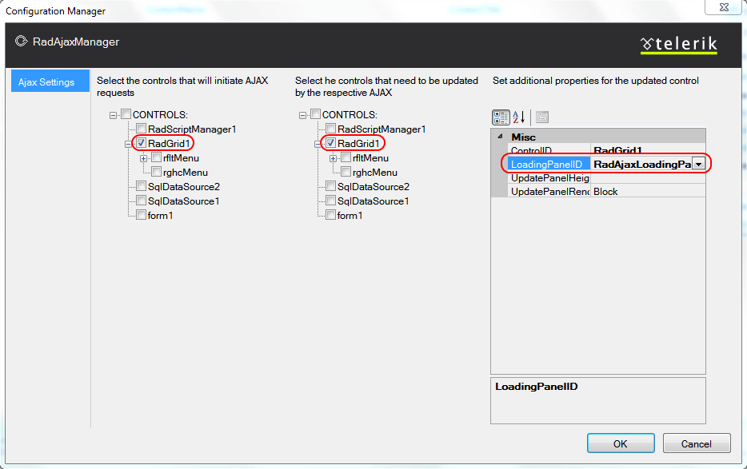

# Postback vs. AJAX

## 

**RadGrid** can take advantage of the [AJAX technology]() to deliver an unsurpassed responsiveness and user experience.

The main idea of the AJAX framework is the elimination of full-page postbacks. In contrast, only the relevant parts of the page are updated, without a disturbing refresh. Moreover, the markup that is transferred between the client machine and the server is reduced dramatically, which results in a significant performance improvement.

The following steps describe how to enable AJAX callbacks with **RadGrid**:

1. Provide a mechanism for giving the user feedback when AJAX callbacks are occurring. You can do this in one of two ways:

	* Add a **RadAjaxLoadingPanel** to the Web page.

	* Set the **ShowStatusBar** property of the grid to **True**.

2. From the **Ajax Resources** section of the **RadGrid**[Smart Tag](), click the **Add RadAjaxManager...** link. This displays the **RadAjax Property Builder**.

3. In the **RadAjax Property Builder**,

4. Check the check box for the **RadGrid** control in the panel for controls that will initiate AJAX requests.

5. Check the check box for the **RadGrid** control in the panel for controls that need to be updated by the respective AJAX requests.

6. If you are using a **RadAjaxLoadingPanel**, select the **RadGrid** control in the second panel and set the **LoadingPanelID** property in the third panel to the **ID** of your **RadAjaxLoadingPanel**.

**RadGrid** gives you the advantage of having your pages indexed by search engines (like Google, MSN search, Yahoo search, etc.) even when working in AJAX mode.
