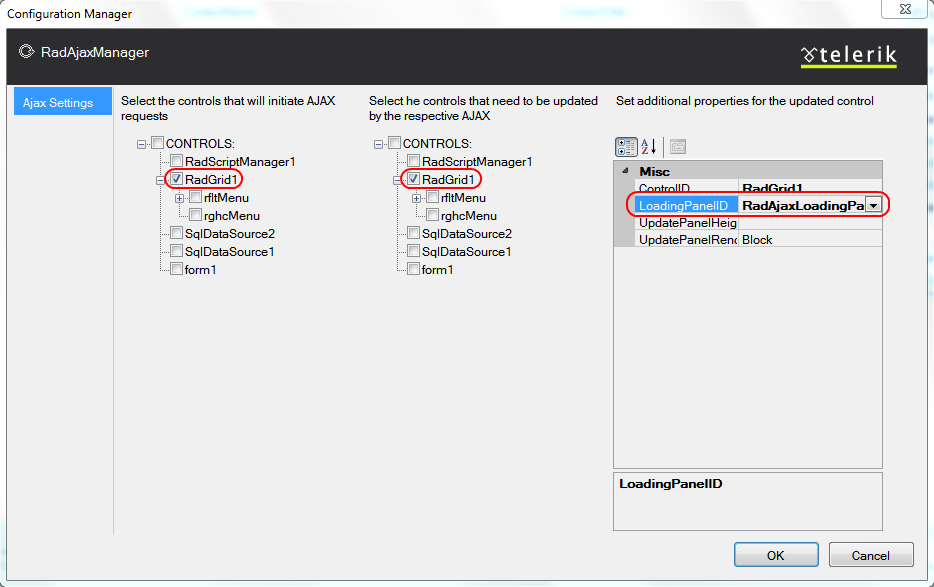

# Postback vs. AJAX

## 

__RadGrid__ can take advantage of the [AJAX technology]() to deliver an unsurpassed responsiveness and user experience.

The main idea of the AJAX framework is the elimination of full-page postbacks. In contrast, only the relevant parts of the page are updated, without a disturbing refresh. Moreover, the markup that is transferred between the client machine and the server is reduced dramatically, which results in a significant performance improvement.

The following steps describe how to enable AJAX callbacks with __RadGrid__:

1. Provide a mechanism for giving the user feedback when AJAX callbacks are occurring. You can do this in one of two ways:

* Add a __RadAjaxLoadingPanel__ to the Web page.

* Set the __ShowStatusBar__ property of the grid to __True__.

1. From the __Ajax Resources__ section of the __RadGrid__[Smart Tag](), click the __Add RadAjaxManager...__ link. This displays the __RadAjax Property Builder__.

1. In the __RadAjax Property Builder__,

1. Check the check box for the __RadGrid__ control in the panel for controls that will initiate AJAX requests.

1. Check the check box for the __RadGrid__ control in the panel for controls that need to be updated by the respective AJAX requests.

1. If you are using a __RadAjaxLoadingPanel__, select the __RadGrid__ control in the second panel and set the __LoadingPanelID__ property in the third panel to the __ID__ of your __RadAjaxLoadingPanel__.

__RadGrid__ gives you the advantage of having your pages indexed by search engines (like Google, MSN search, Yahoo search, etc.) even when working in AJAX mode.
