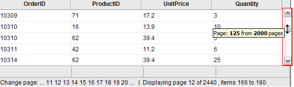

# Virtual Scrolling and Paging


When working with large data sets, you can use the **RadGrid** paging mechanism. For larger data sets, virtual scrolling lets users browse records by scrolling instead of navigating through pages.

>tip If you need endless scrolling in your grid, see the newer [Virtualization]() feature.

## Virtual Scroll Bar

When scrolling with the virtual scroll bar, **RadGrid** can use either standard postbacks or AJAX requests when AJAX callbacks are enabled using **RadAjaxManager**, **RadAjaxPanel**, or the ASP.NET **UpdatePanel**. AJAX callbacks update the configured controls without a full-page refresh.



To enable virtual scrolling for browsing large record sets,

1. Set the **ClientSettings.Scrolling.AllowScroll** and **ClientSettings.Scrolling.EnableVirtualScrollPaging** properties to **True**.

2. Set the **AllowPaging** and **AllowCustomPaging** properties to **True**. Set the **VirtualItemCount** property to the total number of records in the data source.

3. Bind the grid using the **NeedDataSource** event, and in the event handler, use the **CurrentPageIndex** property to determine which subset of the records to fetch.

````ASP.NET
<telerik:RadAjaxManager ID="RadAjaxManager1" runat="server">
  <AjaxSettings>
	<telerik:AjaxSetting AjaxControlID="RadAjaxManager1">
      <UpdatedControls>
        <telerik:AjaxUpdatedControl ControlID="RadGrid1" LoadingPanelID="RadAjaxLoadingPanel1" />
      </UpdatedControls>
    </telerik:AjaxSetting>
  </AjaxSettings>
</telerik:RadAjaxManager>

<telerik:RadAjaxLoadingPanel ID="RadAjaxLoadingPanel1" runat="server" Height="75px"
  Width="75px" Transparency="25">
  '
    style="border: 0;" /></telerik:RadAjaxLoadingPanel>

<telerik:RadGrid RenderMode="Lightweight" ID="RadGrid1" runat="server" Width="97%" Skin="Silk" AllowSorting="True"
  AllowPaging="True" PageSize="14" AllowCustomPaging="true" VirtualItemCount="100000"
  OnNeedDataSource="RadGrid1_NeedDataSource">
  <PagerStyle Mode="NumericPages" />
  <MasterTableView TableLayout="Fixed" />
  <ClientSettings>
    <Scrolling AllowScroll="True" EnableVirtualScrollPaging="True" UseStaticHeaders="True"
      SaveScrollPosition="True" />
  </ClientSettings>
</telerik:RadGrid>
````


````C#
	    protected void RadGrid1_NeedDataSource(object source, Telerik.Web.UI.GridNeedDataSourceEventArgs e)
	    {
	        RadGrid1.DataSource = GetDataTable("SELECT [OrderID], [ProductID], [Quantity], [Discount] FROM [LargeOrderDetails] WHERE ID BETWEEN " + RadGrid1.CurrentPageIndex * RadGrid1.PageSize + " AND " + ((RadGrid1.CurrentPageIndex + 1) * RadGrid1.PageSize));
	    }
````
````VB
	    Protected Sub RadGrid1_NeedDataSource(ByVal source As Object, _  ByVal e As GridNeedDataSourceEventArgs) Handles RadGrid1.NeedDataSource
	        RadGrid1.DataSource = GetDataTable("SELECT [OrderID], [ProductID], [Quantity], [Discount] FROM [LargeOrderDetails] WHERE ID BETWEEN " & RadGrid1.CurrentPageIndex * RadGrid1.PageSize & " AND " & ((RadGrid1.CurrentPageIndex + 1) * RadGrid1.PageSize))
	    End Sub
````


## Fetching additional records when the scroll bar reaches its endpoint

Another approach is to trigger an AJAX request to increase the page size when the user drags the scroll bar to the bottom. This approach uses client-side JavaScript and server-side code. Additional data is supplied while the rendered rows contain fewer records than the full data source:


The following steps describe how to achieve this effect:

1. Add a **RadGrid** control to your Web page.
2. Bind it to a data source.
3. Enable **Paging** in the grid, but set the **PagerStyle.Visible** property to **False** so that the pager does not show.
4. Enable scrolling in the grid. Set the **ClientSettings.Scrolling.ScrollHeight** property sufficiently small so that the scroll bar appears when the grid first loads.
5. Add a **RadAjaxManager** and **RadAjaxLoadingPanel** to the Web page.
6. Configure the **RadAjaxManager** so that **RadGrid** initiates AJAX requests and is updated in response to those requests. Set the **LoadingPanelID** property to the ID of the **RadAjaxLoadingPanel**.
7. Add an **AjaxRequest** event handler to the **RadAjaxManager**. In the event handler, increase the **PageSize** property of the **RadGrid**, then call the grid's **Rebind** method.
8. In the ASPX file, add a **RadCodeBlock** with a JavaScript function named `HandleScrolling` that triggers an AJAX request when the grid's scroll bar reaches the bottom. The **AjaxRequest** event handler then fetches more records.
9. Assign the JavaScript function to the grid's **OnScroll** client event.

````ASP.NET
	  <telerik:RadCodeBlock ID="RadCodeBlock1" runat="server">
	    <script type="text/javascript">
	      function HandleScrolling(e) {
	        var grid = $find("<%=RadGrid1.ClientID %>");
	        var scrollArea = document.getElementById("<%= RadGrid1.ClientID %>" + "_GridData");
	        if (IsScrolledToBottom(scrollArea)) {
	          var currentlyDisplayedRecords = grid.get_masterTableView().get_pageSize() * (grid.get_masterTableView().get_currentPageIndex() + 1);
			  //if the visible items are less than the entire record count
			  //trigger an AJAX request to increase them
	          if (currentlyDisplayedRecords < 100)
	          { $find("<%= RadAjaxManager1.ClientID %>").ajaxRequest("LoadMoreRecords"); }
	        }
	      }
		  //calculate when the scroll bar is at the bottom
			function IsScrolledToBottom(scrollArea) {
				var currentPosition = scrollArea.scrollTop + scrollArea.clientHeight;
				return currentPosition >= scrollArea.scrollHeight;
		  }
	    </script>
	  </telerik:RadCodeBlock>
	  <telerik:RadAjaxManager ID="RadAjaxManager1" runat="server" OnAjaxRequest="RadAjaxManager1_AjaxRequest">
	    <AjaxSettings>
	      <telerik:AjaxSetting AjaxControlID="RadGrid1">
	        <UpdatedControls>
	          <telerik:AjaxUpdatedControl ControlID="RadGrid1" LoadingPanelID="RadAjaxLoadingPanel1" />
	        </UpdatedControls>
	      </telerik:AjaxSetting>
	    </AjaxSettings>
	  </telerik:RadAjaxManager>
	  <telerik:RadAjaxLoadingPanel ID="RadAjaxLoadingPanel1" runat="server" Height="75px"
	    Width="75px" Transparency="25">
	    '
	      style="border: 0;" /></telerik:RadAjaxLoadingPanel>
	
	  <telerik:RadGrid RenderMode="Lightweight" ID="RadGrid1" runat="server" Skin="Silk" DataSourceID="SqlDataSource1"
	    AllowSorting="True" AllowPaging="True" PageSize="15" Width="97%" GridLines="None">
	    <PagerStyle Visible="False" />
		<MasterTableView Width="99%" TableLayout="Fixed" CommandItemDisplay="None" CurrentResetPageIndexAction="SetPageIndexToFirst"
			DataSourceID="SqlDataSource1" PageSize="15">
	    </MasterTableView>
	    <ClientSettings>
	      <Scrolling AllowScroll="True" UseStaticHeaders="True" ScrollHeight="100px" />
	      <ClientEvents OnScroll="HandleScrolling" />
	    </ClientSettings>
	  </telerik:RadGrid>
	  <asp:SqlDataSource ID="SqlDataSource1" runat="server" ConnectionString="<%$ ConnectionStrings:NorthwindConnectionString %>"
	    SelectCommand="SELECT * FROM [Customers]"></asp:SqlDataSource>
````


````C#
	    protected void RadAjaxManager1_AjaxRequest(object sender, AjaxRequestEventArgs e)
	    {
	        RadGrid1.PageSize = 10 + RadGrid1.PageSize;
	        RadGrid1.Rebind();
	    }
````
````VB
	
	    Protected Sub RadAjaxManager1_AjaxRequest(ByVal sender As Object, ByVal e As Web.UI.AjaxRequestEventArgs) Handles RadAjaxManager1.AjaxRequest
	        RadGrid1.PageSize = 10 + RadGrid1.PageSize
	        RadGrid1.Rebind()
	    End Sub
	
````


For a live example demonstrating the techniques described above, see [Virtual scrolling and paging](https://demos.telerik.com/aspnet-ajax/Grid/Examples/Client/VirtualScrollPaging/DefaultCS.aspx).

## See Also

- [Virtualization]()
- [Scrolling Overview]()
