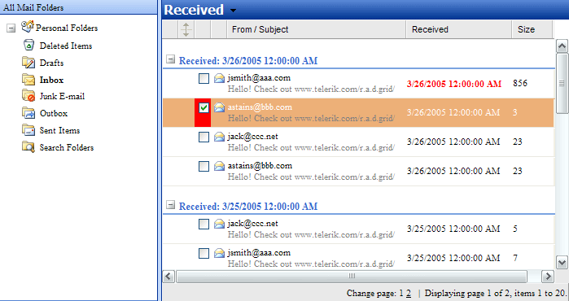

# Conditional Formatting


## Formatting Data Based on a Column

The **RadGrid** object model and events support conditional formatting. To format data based on its column type, use the properties of the corresponding column. For example, **GridBoundColumn.DataFormatString** uses the standard .NET composite formatting rules, so `{0:C}` formats cell values as currency.

The example below shows how to use conditional formatting in a sample mailbox implementation. Selected Items and recently received mail are marked red:

> caption Figure 1: Conditional formatting applied to grid items




> caption Example: Formatting a cell when a data-bound value exceeds a threshold

````C#
protected void RadGrid1_ItemDataBound(object sender, Telerik.Web.UI.GridItemEventArgs e)
{
    //Is it a GridDataItem
    if (e.Item is GridDataItem)
    {
        //Get the instance of the right type
        GridDataItem dataBoundItem = e.Item as GridDataItem;

        //Check the formatting condition
        if (int.Parse(dataBoundItem["Size"].Text) > 100)
        {
            dataBoundItem["Received"].ForeColor = Color.Red;
            dataBoundItem["Received"].Font.Bold = true;
            //Customize more...
        }
    }
}
````
````VB
Protected Sub RadGrid1_ItemDataBound(ByVal sender As Object, ByVal e As Telerik.Web.UI.GridItemEventArgs)
    'Is it a GridDataItem
    If (TypeOf (e.Item) Is GridDataItem) Then
        'Get the instance of the right type
        Dim dataBoundItem As GridDataItem = e.Item

        'Check the formatting condition
        If (Integer.Parse(dataBoundItem("Size").Text) > 100) Then
            dataBoundItem("Received").ForeColor = Color.Red
            dataBoundItem("Received").Font.Bold = True
            'Customize more...
        End If
    End If
End Sub
````


>note When you apply a skin to the grid, the skin definitions can override custom row styles. To preserve custom formatting, define a **CssClass** for the corresponding row and apply the styles to that class.


The following example changes the appearance of items whose **Country** column contains `Mexico`:

> caption Example: Defining a CSS class for matching rows

````ASP.NET
<style type="text/css">
  .MyMexicoRowClass
  {
    background-color: aqua;
    font-size: 16px;
    font-family: Arial;
  }
</style>       
````


And in the code-behind:


> caption Example: Formatting a row in the `ItemDataBound` event

````C#
protected void RadGrid1_ItemDataBound(object sender, Telerik.Web.UI.GridItemEventArgs e)
{
    if (e.Item is GridDataItem)
    {
        GridDataItem dataItem = e.Item as GridDataItem;
        if (dataItem["Country"].Text == "Mexico")
            dataItem.CssClass = "MyMexicoRowClass";
    }
}
````
````VB
Protected Sub RadGrid1_ItemDataBound(ByVal sender As Object, ByVal e As Telerik.Web.UI.GridItemEventArgs) Handles RadGrid1.ItemDataBound
    If (TypeOf e.Item Is GridDataItem) Then
        Dim dataItem As GridDataItem = CType(e.Item, GridDataItem)
        If (dataItem("Country").Text = "Mexico") Then
            dataItem.CssClass = "MyMexicoRowClass"
        End If
    End If
End Sub
````

## See Also

* [Customizing Row Appearance]()
* [Set Style on Mouse Over]()

