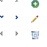
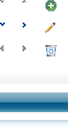
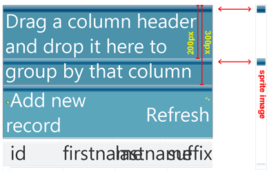
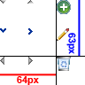

# CSS Sprites


As of Q1 2008, **RadGrid** for ASP.NET AJAX has supported SpriteButtons. In addition to push buttons, link buttons, and image buttons, SpriteButtons use predefined CSS classes and can share a single background image called a CSS sprite. This reduces the number of image requests required by a skin.

The following image shows a GIF file that contains several images with transparent space between them.

> caption Figure 1: Source images in a CSS sprite



By using SpriteButtons and appropriate CSS, you can use this image as the background for all buttons marked with a red border.

> caption Figure 2: RadGrid buttons using a CSS sprite


You can also include skin gradients in the sprite image.

> caption Figure 3: Skin gradients included in a CSS sprite



## Guidelines for Creating and Using a CSS Sprite

Planning and correct positioning of the different small images in a CSS sprite is very important. Please adhere to the following guidelines, which apply for CSS sprites in general, not just RadGrid.

* Leave enough transparent space between images so that adjacent background images remain invisible when an element expands. For example, if a **RadGrid** group panel can be 200 pixels high, leave 200 pixels of transparent space below its background in the sprite.

> caption Figure 4: Background image overflow caused by insufficient transparent space



* You can combine images with different `background-repeat` behavior in one sprite, including non-repeating images, horizontally repeating images, and vertically repeating images.

* Images that repeat in both directions cannot be included in a sprite and should remain separate. Images that repeat horizontally should occupy the full sprite width, while images that repeat vertically should occupy the full sprite height.

## CSS styles and CSS sprites

How do we make a specific part of the sprite image appear as a background for a given element? This is accomplished by setting a suitable background-position style. For example:

````CSS
.RadGrid_Vista .rgDel /* rgDel is the CSS class of the Delete SpriteButton */ {
background:url(sprite-image.gif) -64px -63px no-repeat; }
````

> caption Figure 5: CSS background position for a RadGrid sprite button



## SpriteButton CSS classes

These are the CSS classes available for the different buttons in RadGrid:

* **rgAdd** - add new

* **rgRefresh** - refresh

* **rgEdit** - edit row

* **rgDel** - delete row

* **rgFilter** - filtering menu popup

* **rgPagePrev** - previous page

* **rgPageNext** - next page

* **rgExpand** - expand group

* **rgCollapse** - collapse group

* **rgSortAsc** - sorted ascending (used inside header cells and group panels)

* **rgSortDesc** - sorted descending (used inside header cells and group panels)

* **rgUpdate** - update

* **rgCancel** - cancel edit

## See Also

* [RadGrid Skins]()
