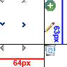

# CSS sprites


As of Q1 2008, RadGrid for ASP.NET AJAX introduced a new rendering mode for all its buttons. In addition to PushButtons, LinkButtons and ImageButtons, it now offers the so called SpriteButtons. SpriteButtons are rendered as <input type="button" /> elements, but they have predefined CSS classes, which can be used to change their look and feel to resemble ImageButtons. The major advantage of SpriteButtons is that they all can share a single background image (called CSS sprite) which contains all the unique background images for all buttons. As a result, a RadGrid skin will use only one image and make only one HTTP request to the server, apart from the CSS file, which will help the skin load a lot faster.

Here is an example. Imagine that we have the following GIF file, containing several images with some transparent space between them:


By using SpriteButtons and appropriate CSS code, we can make RadGrid use this single image as a background for all buttons marked with red border:


What's more, we can include also the skin gradients into the sprite image, like this:


## Guidelines for creating and using a CSS sprite

Planning and correct positioning of the different small images in a CSS sprite is very important. Please adhere to the following guidelines, which apply for CSS sprites in general, not just RadGrid.

* Leave enough transparent space between images, so that if an element is expanded (e.g. multiple lines in a grid row, larger buttons, larger fonts, etc), the adjacent background images in the sprite remain invisible. For example, if you want to support 200px high RadGrid GroupPanel with background image positioned at the top, you should leave 200px transparent space below the GroupPanel background in the CSS sprite. If the GroupPanel becomes higher than 200px, the next background image in the CSS sprite will become visible. This scenario is illustrated in the following picture:


* According to your preference, you can have different mixtures of background images, in terms of background-repeat, in a single CSS sprite: a) only images that do not repeat (e.g. buttons)b)only images that repeat horizontally (e.g. header cell backgrounds, selected row backgrounds, pager background, etc.)c) only images that repeat vertically (currently not used in RadGrid)d) images that do not repeat and images that repeat horizontallye) images that do not repeat and images that repeat vertically

* As a consequence a) images that repeat in both directions cannot be included in a sprite, they should remain on their ownb) images that repeat horizontally should occupy the entire width of a CSS sprite (as in the example above)c) images that repeat vertically should occupy the entire height of a CSS sprite

## CSS styles and CSS sprites

How do we make a specific part of the sprite image appear as a background for a given element? This is accomplished by setting a suitable background-position style. For example:

````XML
	  .RadGrid_Vista .rgDel /* rgDel is the CSS class of the Delete SpriteButton */ {
	  background:url(sprite-image.gif) -64px -63px no-repeat; }
````



## SpriteButton CSS classes

These are the CSS classes available for the different buttons in RadGrid:

* **rgAdd** - add new

* **rgRefresh** - refresh

* **rgEdit** - edit row

* **rgDel** - delete row

* **rgFilter** - filtering menu popup

* **rgPagePrev** - previous page

* **rgPageNext** - next page

* **rgExpand** - expand group

* **rgCollapse** - collapse group

* **rgSortAsc** - sorted ascending (used inside header cells and group panels)

* **rgSortDesc** - sorted descending (used inside header cells and group panels)

* **rgUpdate** - update

* **rgCance**l - cancel edit
