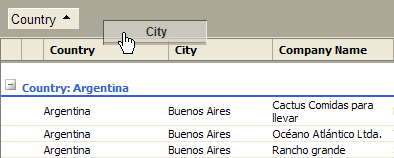

# Customizing the Group Panel

## GroupPanel Customization

If grouping is enabled, Telerik RadGrid will allow grouping by column(s). You need todrag-and-drop the headers of one or more columns on the group panel to define the grouping.

You can modify panel's appearance using __PanelStyle__ and __PanelItemsStyle__ properties.The __PanelStyle__ property customizes the panel itself, and the __PanelItemStyle__ property customizes the items in this panel.

