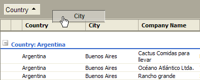

# Customizing the Group Panel

## GroupPanel Customization

If grouping is enabled, Telerik RadGrid will allow grouping by column(s). You need to drag-and-drop the headers of one or more columns on the group panel to define the grouping.

> caption Figure 1: RadGrid group panel with grouped columns

You can modify the panel's appearance with the **PanelStyle** and **PanelItemsStyle** properties. **PanelStyle** customizes the panel itself, and **PanelItemsStyle** customizes the items in the panel.

> caption Figure 2: Group-panel style settings

## See Also

* [RadGrid Skins]()
* [HTML Output]()
