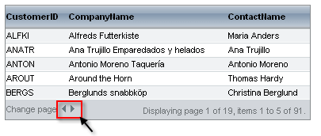

# Customizing the Pager


If paging is enabled, Telerik RadGrid will render pager item(s) (**GridPagerItem**) on the top and/or bottom of each **GridTableView** displayed in the hierarchy.

> caption Figure 1: RadGrid pager


## Pager Appearance

Control pager appearance with the **GridTableView.PagerStyle** property. You can set **RadGrid.PagerStyle** to apply default settings to all **GridTableViews** in the hierarchy. A specific table view can override those settings. Because **PagerStyle** extends **TableItemStyle**, you can set foreground and background colors, borders, fonts, and related styles. **GridPagerStyle** also provides the **PagerStyle.Position** property, which accepts `Top`, `Bottom`, or `TopAndBottom`.

Pager buttons let users navigate between pages or select a page number. Use **GridTableView.PagerStyle.Mode** to control which buttons appear. Use **GridPagerMode.NumericPages** to display a button for each page, or **GridPagerMode.NextPrev** to display only previous and next buttons.

> caption Figure 2: Previous and next pager mode



You can set paging properties in [designers]() or programmatically. Programmatic values are persisted in view state, which keeps page navigation consistent.

To control paging with a custom button, use `CommandName="Page"` and set **CommandArgument** to `Next`, `Prev`, or a page number such as `42`.

## Pager Templates

Use a pager template to customize the pager appearance and features. Template buttons can use the command API. For example, a button with **CommandName** `Page` and **CommandArgument** `Last` navigates to the last page without additional code.

Using declarative binding expressions, command buttons in the pager can control their visibility based on paging-related properties provided by the **PagerItem.Paging** instance.

> caption Figure 3: Custom pager template


> caption Example: Pager template with navigation and refresh commands

````ASP.NET
<PagerTemplate>
   <table border="0" cellpadding="5" height="18px" width="100%">
     <tr>
<td style="border-style:none;">
<asp:LinkButton ID="LinkButton1" CommandName="Page" CausesValidation="false" CommandArgument="First" runat="server">First</asp:LinkButton>
</td>
<td style="border-style:none;">
<asp:LinkButton ID="LinkButton5" CommandName="Page" CausesValidation="false" CommandArgument="Prev" runat="server">Prev</asp:LinkButton>
</td>
<td style="border-style:none;">
<asp:TextBox ID="tbPageNumber" runat="server" Columns="3" Text='<%# (int)DataBinder.Eval(Container, "OwnerTableView.CurrentPageIndex") + 1 %>' />
   <asp:RangeValidator runat="Server" ID="RangeValidator1" ControlToValidate="tbPageNumber" EnableClientScript="true" MinimumValue="1"
    Type="Integer"
    MaximumValue='<%# DataBinder.Eval(Container, "Paging.PageCount") %>'
    ErrorMessage='<%# "Value must be in the range of 1 - " + DataBinder.Eval(Container, "Paging.PageCount") %>'
    Display="Dynamic"></asp:RangeValidator>
</td>
<td style="border-style:none;">
<asp:LinkButton ID="LinkButton4" runat="server" CommandName="CustomChangePage">Go</asp:LinkButton>
</td>
<td style="border-style:none;">
<asp:LinkButton ID="LinkButton3" CommandName="Page" CausesValidation="false" CommandArgument="Next" runat="server">Next</asp:LinkButton>
</td>
<td style="border-style:none;">
<asp:LinkButton ID="LinkButton2" CommandName="Page" CausesValidation="false" CommandArgument="Last" runat="server">Last</asp:LinkButton>
</td>
<td style="border-style:none;width:100%" align="right">
<asp:LinkButton ID="LinkButton6" CommandName="RebindGrid" CausesValidation="false" runat="server">Refresh data</asp:LinkButton>
</td>
</tr>
</table>
</PagerTemplate>

````


> caption Table 1: Pager command names and arguments

|  **CommandName**  |  **CommandArgument**  |  **Description**  |
| ------ | ------ | ------ |
|Page|First|Navigates to the first page|
|Page|Last|Navigates to the last page|
|Page|An integer such as `5`|Navigates to the specified page|
|Page|Next|Navigates to the next page|
|Page|Prev|Navigates to the previous page|

## See Also

* [RadGrid Skins]()
* [HTML Output]()
