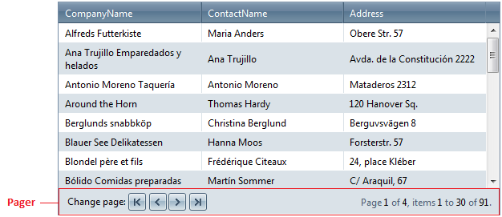

# Customizing the Pager


If paging is enabled, Telerik RadGrid will render pager item(s) (__GridPagerItem__) on the top and/or bottom of each __GridTableView__ displayed in the hierarchy.



## Pager Appearance

The appearance of the pager item can be controlled using __GridTableView.PagerStyle__ property. As most of appearance options, __PagerStyle__ of each __GridTableView__ can be predefined using __RadGrid.PagerStyle__ property - this would apply to all __GridTableViews__ in the hierarchy unless specified other for a certain table-view.As __PagerStyle__ extends the __TableItemStyle__ class the settings could apply to item's *fore-color,**back-color*, *border style*, *font* etc. __GridPagerStyle__ provides also properties to control the position of the items' __PagerStyle.Position__ - *Top*, *Bottom* or *TopAndBottom* and type of pager buttons that appear.

The Pager buttons allow the user to navigate through the pages - change the display page by setting *next* or *previous* or use a page number to directly switch page. Use __GridTableView.PagerStyle.Mode__ property to control the mode pager buttons would be display and would function. Use __GridPagerMode.NumericPages__ to display a button for each page with the corresponding page number. Use __GridPagerMode.PrevNext__ to specify that only buttons for *previous*/*next* page would appear.


All properties controlling paging behavior can be set using either development environment [designers]() or programmatically. The values set programmatically are persisted into the view-state providing consistency in grid's page navigation and ease their use.

If you use any other button(s) to control paging in Telerik RadGrid in a custom manner, you can use command button(s) with CommandName 'Page' and CommandArgument __'Next'__, __'Prev'__, or a number of any page - ex. CommandArgument = "42".

## Pager templates

Pager item can use templates for setting its appearance and features. All command buttons in the template can take advantage of the command API. For example a button with __CommandName__ "Page" and __CommandArgument__ of "Last" will force Telerik RadGrid to go to the last page when clicked. No additional code is necessary.

Using declarative binding expressions command buttons in the pager can control their visibility based on various paging-related properties provided by the __PagerItem.Paging__ instance.


````ASPNET
	<PagerTemplate>
	   <table border="0" cellpadding="5" height="18px" width="100%">
	     <tr>
	<td style="border-style:none;">
	<asp:LinkButton ID="LinkButton1" CommandName="Page" CausesValidation="false" CommandArgument="First" runat="server">First</asp:LinkButton>
	</td>
	<td style="border-style:none;">
	<asp:LinkButton ID="LinkButton5" CommandName="Page" CausesValidation="false" CommandArgument="Prev" runat="server">Prev</asp:LinkButton>
	</td>
	<td style="border-style:none;">
	<asp:TextBox ID="tbPageNumber" runat="server" Columns="3" Text='<%# (int)DataBinder.Eval(Container, "OwnerTableView.CurrentPageIndex") + 1 %>' />
	   <asp:RangeValidator runat="Server" ID="RangeValidator1" ControlToValidate="tbPageNumber" EnableClientScript="true" MinimumValue="1"
	    Type="Integer"
	    MaximumValue='<%# DataBinder.Eval(Container, "Paging.PageCount") %>'
	    ErrorMessage='<%# "Value must be in the range of 1 - " + DataBinder.Eval(Container, "Paging.PageCount") %>'
	    Display="Dynamic"></asp:RangeValidator>
	</td>
	<td style="border-style:none;">
	<asp:LinkButton ID="LinkButton4" runat="server" CommandName="CustomChangePage">Go</asp:LinkButton>
	</td>
	<td style="border-style:none;">
	<asp:LinkButton ID="LinkButton3" CommandName="Page" CausesValidation="false" CommandArgument="Next" runat="server">Next</asp:LinkButton>
	</td>
	<td style="border-style:none;">
	<asp:LinkButton ID="LinkButton2" CommandName="Page" CausesValidation="false" CommandArgument="Last" runat="server">Last</asp:LinkButton>
	</td>
	<td style="border-style:none;width:100%" align="right">
	<asp:LinkButton ID="LinkButton6" CommandName="RebindGrid" CausesValidation="false" runat="server">Refresh data</asp:LinkButton>
	</td>
	</tr>
	</table>
	</PagerTemplate>
	
````


>caption  

|  __CommandName__  |  __CommandArgument__  |  __Description__  |
| ------ | ------ | ------ |
|Page|First|Goes to the first page|
|Page|Last|Goes to the last page|
|Page|An Integer ("5" for example)|Go to the specified page|
|Page|Next|Goes to the next page|
|Page|Previous|Goes to the previous page|
