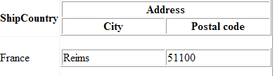

# Customizing with GridTemplateColumn


## 

There are cases in which you may want to have two level headers or custom complex structure for your table cells. This appearance is attainable using __GridTemplateColumns__ with __HTML tables__ in the __HeaderTemplate/ItemTemplate__. Here is an example which holds two tables inside those templates:



````ASPNET
	  <telerik:RadGrid ID="RadGrid1" runat="server" AllowSorting="True" AutoGenerateColumns="false">
	    <MasterTableView>
	      <Columns>
	        <telerik:GridBoundColumn HeaderText="ContactName" DataField="ContactName" UniqueName="ContactName">
	        </telerik:GridBoundColumn>
	        <telerik:GridTemplateColumn UniqueName="TemplateColumn">
	          <HeaderTemplate>
	            <table id="Table1" cellspacing="1" cellpadding="1" width="300" border="1">
	              <tr>
	                <td colspan="2" align="center">
	                  <b>Address</b>
	                </td>
	              </tr>
	              <tr>
	                <td width="50%">
	                  <b>City</b>
	                </td>
	                <td width="50%">
	                  <b>Postal code</b>
	                </td>
	              </tr>
	            </table>
	          </HeaderTemplate>
	          <ItemTemplate>
	            <table id="Table2" cellspacing="1" cellpadding="1" width="300" border="1">
	              <tr>
	                <td width="50%">
	                  <%# DataBinder.Eval(Container.DataItem, "City") %>
	                </td>
	                <td width="50%">
	                  <%# DataBinder.Eval(Container.DataItem, "PostalCode") %>
	                </td>
	              </tr>
	            </table>
	          </ItemTemplate>
	        </telerik:GridTemplateColumn>
	      </Columns>
	    </MasterTableView>
	  </telerik:RadGrid>
````


Handle the __NeedDataSource__ event in the codebehind:

>tabbedCode

````C#
	    private void RadGrid1_NeedDataSource(object source, Telerik.Web.UI.GridNeedDataSourceEventArgs e)
	    {
	        OleDbConnection MyOleDbConnection = new OleDbConnection(("Provider=Microsoft.Jet.OLEDB.4.0; Data Source=" + Server.MapPath("~/Nwind.mdb")));
	        OleDbDataAdapter MyOleDbDataAdapter = new OleDbDataAdapter();
	        MyOleDbDataAdapter.SelectCommand = new OleDbCommand("SELECT TOP 5 ContactName, Address, City, PostalCode FROM Customers", MyOleDbConnection);
	        DataTable myDataTable = new DataTable();
	        MyOleDbConnection.Open();
	        try
	        {
	            MyOleDbDataAdapter.Fill(myDataTable);
	        }
	        finally
	        {
	            MyOleDbConnection.Close();
	        }
	        RadGrid1.DataSource = myDataTable.DefaultView;
	    }
````


````VB.NET
	    Private Sub RadGrid1_NeedDataSource(ByVal [source] As System.Object, ByVal e As Telerik.Web.UI.GridNeedDataSourceEventArgs) Handles RadGrid1.NeedDataSource
	        Dim MyOleDbConnection As New OleDbConnection("Provider=Microsoft.Jet.OLEDB.4.0; Data Source=" + Server.MapPath("~/Nwind.mdb"))
	        Dim MyOleDbDataAdapter As New OleDbDataAdapter
	        MyOleDbDataAdapter.SelectCommand = New OleDbCommand("SELECT TOP 5 ContactName, Address, City, PostalCode FROM Customers", MyOleDbConnection)
	        Dim myDataTable As New DataTable
	        MyOleDbConnection.Open()
	        Try
	            MyOleDbDataAdapter.Fill(myDataTable)
	        Finally
	            MyOleDbConnection.Close()
	        End Try
	
	        RadGrid1.DataSource = myDataTable.DefaultView
	    End Sub
````


>end

You may also refer to the [following online example](http://demos.telerik.com/aspnet-ajax/Grid/Examples/GeneralFeatures/ColumnTypes/DefaultCS.aspx) of Telerik RadGrid which demonstrates the usage of __GridTemplateColumn__.
