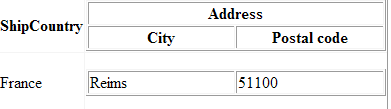

# Customizing with GridTemplateColumn

Use **GridTemplateColumn** when you need two-level headers or a complex structure for table cells. The following example uses **HTML tables** in the **HeaderTemplate** and **ItemTemplate**.

> caption Figure 1: Custom header and item templates in a GridTemplateColumn



> caption Example: Creating custom GridTemplateColumn headers and cells

````ASP.NET
<telerik:RadGrid RenderMode="Lightweight" ID="RadGrid1" runat="server" AllowSorting="True" AutoGenerateColumns="false">
  <MasterTableView>
    <Columns>
      <telerik:GridBoundColumn HeaderText="ContactName" DataField="ContactName" UniqueName="ContactName">
      </telerik:GridBoundColumn>
      <telerik:GridTemplateColumn UniqueName="TemplateColumn">
        <HeaderTemplate>
          <table id="Table1" cellspacing="1" cellpadding="1" width="300" border="1">
            <tr>
              <td colspan="2" align="center">
                <b>Address</b>
              </td>
            </tr>
            <tr>
              <td width="50%">
                <b>City</b>
              </td>
              <td width="50%">
                <b>Postal code</b>
              </td>
            </tr>
          </table>
        </HeaderTemplate>
        <ItemTemplate>
          <table id="Table2" cellspacing="1" cellpadding="1" width="300" border="1">
            <tr>
              <td width="50%">
                <%# DataBinder.Eval(Container.DataItem, "City") %>
              </td>
              <td width="50%">
                <%# DataBinder.Eval(Container.DataItem, "PostalCode") %>
              </td>
            </tr>
          </table>
        </ItemTemplate>
      </telerik:GridTemplateColumn>
    </Columns>
  </MasterTableView>
</telerik:RadGrid>
````

Handle the **NeedDataSource** event in the code-behind:

> caption Example: Binding data to the GridTemplateColumn example

````C#
private void RadGrid1_NeedDataSource(object source, Telerik.Web.UI.GridNeedDataSourceEventArgs e)
{
    OleDbConnection MyOleDbConnection = new OleDbConnection(("Provider=Microsoft.Jet.OLEDB.4.0; Data Source=" + Server.MapPath("~/Nwind.mdb")));
    OleDbDataAdapter MyOleDbDataAdapter = new OleDbDataAdapter();
    MyOleDbDataAdapter.SelectCommand = new OleDbCommand("SELECT TOP 5 ContactName, Address, City, PostalCode FROM Customers", MyOleDbConnection);
    DataTable myDataTable = new DataTable();
    MyOleDbConnection.Open();
    try
    {
        MyOleDbDataAdapter.Fill(myDataTable);
    }
    finally
    {
        MyOleDbConnection.Close();
    }
    RadGrid1.DataSource = myDataTable.DefaultView;
}
````
````VB
Private Sub RadGrid1_NeedDataSource(ByVal [source] As System.Object, ByVal e As Telerik.Web.UI.GridNeedDataSourceEventArgs) Handles RadGrid1.NeedDataSource
    Dim MyOleDbConnection As New OleDbConnection("Provider=Microsoft.Jet.OLEDB.4.0; Data Source=" + Server.MapPath("~/Nwind.mdb"))
    Dim MyOleDbDataAdapter As New OleDbDataAdapter
    MyOleDbDataAdapter.SelectCommand = New OleDbCommand("SELECT TOP 5 ContactName, Address, City, PostalCode FROM Customers", MyOleDbConnection)
    Dim myDataTable As New DataTable
    MyOleDbConnection.Open()
    Try
        MyOleDbDataAdapter.Fill(myDataTable)
    Finally
        MyOleDbConnection.Close()
    End Try

    RadGrid1.DataSource = myDataTable.DefaultView
End Sub
````


You may also refer to the [following online example](https://demos.telerik.com/aspnet-ajax/Grid/Examples/GeneralFeatures/ColumnTypes/DefaultCS.aspx) of Telerik RadGrid which demonstrates the usage of **GridTemplateColumn**.

## See Also

- [RadGrid column types]()
