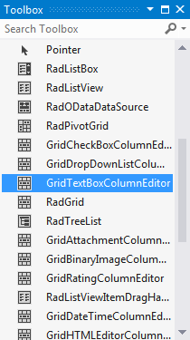
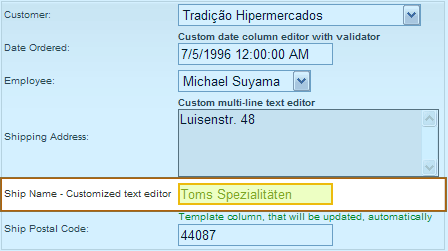

# Declarative Style Editors


You can set the column editors declaratively by setting the __ColumnEditorID__ property of the corresponding column to the ID of the custom column editor. This gives you the flexibility to easily customize the look of the column editors.

To add a column editor declaratively, add an instance of the column editor to the page that contains your grid. If you are using one of the built-in column editor types and simply customizing its properties, you can drag the column editor from the toolbox onto your page:



Assign the properties of the column editor to customize it how you want it:

````ASPNET
	  <telerik:GridTextBoxColumnEditor ID="TextEditor1" runat="server">
	    <TextBoxStyle BackColor="#edffc3" BorderColor="#ecbb0d" BorderStyle="Solid" ForeColor="#7fa822" />
	  </telerik:GridTextBoxColumnEditor>
````


Assign the ID of the column editor to the column you want to attach it to:

````ASPNET
	  <telerik:GridBoundColumn ColumnEditorID="TextEditor1" DataField="ShipName" EditFormHeaderTextFormat="{0} - Customized text editor"
	    HeaderText="Ship Name" UniqueName="ShipName">
	  </telerik:GridBoundColumn>
````


The code above will result in the following:



For an online example that uses declarative custom editors, see [Using grid server-side API for extraction](http://demos.telerik.com/aspnet-ajax/Grid/Examples/DataEditing/ExtractValues/DefaultVB.aspx).

## Creating declarative custom editors programmatically

If you want to assign declarative custom editors at runtime, you need to instantiate them in a __Page_Init__ handler and add them to the __Controls__ collection of a place holder control:


````ASPNET
	  <asp:PlaceHolder ID="PlaceHolder1" runat="server" />
	  <telerik:RadGrid ID="RadGrid1" runat="server" Width="97%" AutoGenerateColumns="False">
	    <MasterTableView>
	      <Columns>
	        <telerik:GridDropDownColumn UniqueName="DropDownListColumn" ListTextField="ContactName"
	          ListValueField="ContactName" DataSourceID="SqlDataSource2" HeaderText="DropDown Column"
	          DataField="ContactName" AllowSorting="true" ColumnEditorID="ddEditor1">
	        </telerik:GridDropDownColumn>
	      </Columns>
	    </MasterTableView></telerik:RadGrid>
````
````C#
	
	    protected void Page_Init(object sender, EventArgs e)
	    {
	        GridDropDownListColumnEditor ddEditor1 = new GridDropDownListColumnEditor();
	        ddEditor1.ID = "ddEditor1";
	        ddEditor1.DropDownStyle.BorderColor = System.Drawing.Color.Coral;
	        ddEditor1.DropDownStyle.BorderStyle = BorderStyle.Solid;
	        ddEditor1.DropDownStyle.BackColor = System.Drawing.Color.DeepSkyBlue;
	        PlaceHolder1.Controls.Add(ddEditor1);
	    }
	
````
````VB.NET
	    Protected Sub Page_Init(ByVal sender As Object, ByVal e As EventArgs) Handles MyBase.Init
	        Dim ddEditor1 As New GridDropDownListColumnEditor()
	        ddEditor1.ID = "ddEditor1"
	        ddEditor1.DropDownStyle.BorderColor = System.Drawing.Color.Coral
	        ddEditor1.DropDownStyle.BorderStyle = BorderStyle.Solid
	        ddEditor1.DropDownStyle.BackColor = System.Drawing.Color.DeepSkyBlue
	        PlaceHolder1.Controls.Add(ddEditor1)
	    End Sub
````


# See Also

 * [Custom Editors Extending Auto-Generated Editors]()

 * [Auto-Generated Editors]()
