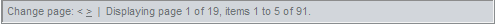

# Modifying Existing Skins


A skin is a set of images and a CSS file used by Telerik RadGrid for setting its appearance. Review [this section]() from the documentation to understand how to apply non-embedded/custom skins for the control.

## CSS Classes Description

Each CSS class should have a suffix with the name of the skin, e.g. "**_Vista**" before the Q1 2009 release of the product. The table below shows the classes used by the embedded Telerik RadGrid Default skin (the non-embedded skins css classes signature conforms to the same concepts):

**Prior to the Q1 2009 release of RadGrid for ASP.NET AJAX**


>caption  

| CSS Class | Description |
| ------ | ------ |
| **div.RadGrid_Default** |The default Telerik RadGrid wrapper **<div>** . All Telerik RadGrid elements are placed inside it. Rendering Telerik RadGrid in one tag helps further integrations with other controls (Telerik RadAjax and ASP.NET AJAX for example).|
| **.RadGrid_Default,.RadGrid_Default a** |A reference to any table cell (`<td>`) and link (`<a>`) inside the main class. Using these two classes you can skin the grid cells and links in Telerik RadGrid cells.|
| **.MasterTable_Default** |A class for customizing the master table view|
| **.MasterTable_Default td,.MasterTable_Default th** |References to any table `<td>` and table header `<th>` belonging to that master table|
| **.GridDataDiv_Default** |For skinning the grid in scrolling mode.|
| **th.GridHeader_Default,th.ResizeHeader_Default** |Header class `<th>` for customizing the Telerik RadGrid header.|
| **.GridHeaderOver_Default.GridHeader_Default a.GridHeaderDiv_Default** |For skinning the hovered header item. `<a>` element belonging to the header classFor skinning the header row when scrolling the grid.|
| **.GridRow_Default,.GridRow_Default td**  **.GridRowOver_Default** |For skinning the normal grid row. For skinning the hovered grid row.|
| **.GridAltRow_Default,.GridAltRow_Default td** |For skinning the alternate grid row (zebra style tables).|
| **.SelectedRow_Default,**  **.SelectedRow_Default**  **td** |Skinning the currently selected row.|
| **.ActiveRow_Default,.ActiveRow_Default td** |Active row class - the focused row skinning|
| **.GridEditRow_Default,.GridEditRow_Default td** |For skinning the row that is currently in edit mode.|
| **.GridEditForm_Default** |For skinning the edit form of the row that is currently in edit mode.|
| **.GridCommandRow_Default** |For skinning the CommandItem.|
| **.GridGroupFooter_Default,.GridGroupFooter_Default td** |For skinning the group footers (meaning with grouping feature enabled).Defaults to the *GroupFooter_[Skin]/GroupFooter_[Skin] td* classes.|
| **.GridFilterRow_Default** |For skinning the FilteringItem.|
| **.GridPager_Default,**  **.GridPager_Default**  **td** |Skinning the grid pager|
| **.GridFooter_Default,.GridFooter_Default td.GridFooterDiv_Default** |A reference to the grid footer.For skinning the grid footer when scrolling the grid.|
| **.GridFooter_Default a** |Reference to any link `<a>` belonging to the footer.|
| **.GridPager_Default a** |Reference to any link `<a>` belonging to the pager.|
| **.GridPager_Default a:hover,.GridFooter_Default a:hover** |Reference to any hovered link `<a>` in the pager or footer.|
| **tr.GroupHeader_Default td** |For skinning the group panel row (grouping must be enabled).|
| **.GroupPanel_Default** |For skinning the group panel (grouping must be enabled).|
| **.GroupPanelItems_Default** |Reference to items belonging to the group panel (grouping must be enabled).|
| **td.GridHeader_Default input** |Reference to the `<input>` element belonging to the grid header (grouping must be enabled)|
| **.GridCaption_Default** |Reference to the table caption in each level of the grid hierarchy|
| **.GridToolTip_Default** |For customizing the scroller when the virtual scrolling feature is enabled (`<Scrolling AllowScroll="True" EnableVirtualScrollPaging="True" UseStaticHeaders="True" />`). Applicable for the column resizer tooltip as well|
| **.GridRowSelector_Default** |For styling the colored rectangle when selecting multiple rows by dragging.|
| **.GridItemDropIndicator_Default** |Defines the drop indicator appearance when utilizing drag and drop of grid records.|

**After the Q1 2009 release of RadGrid for ASP.NET AJAX(note that the [SkinName] part is missing from the css classes names except for external grid elements)**


>caption  

| CSS Class | Description |
| ------ | ------ |
| **div.RadGrid_[SkinName]** |The default Telerik RadGrid wrapper `<div>`. All Telerik RadGrid elements are placed inside it. Rendering Telerik RadGrid in one tag helps further integrations with other controls (Telerik RadAjax and ASP.NET AJAX for example).|
| **.RadGrid_[SkinName],**  **.RadGridRTL_[SkinName],.RadGrid_[SkinName] a** |A reference to any table cell (`<td>`) and link (`<a>`) inside the main class. Using these two classes you can skin the grid cells and links in Telerik RadGrid cells.|
| **.rgMasterTable** |A class for customizing the master table view|
| **.rgClipCells** |An additional class applied to the master table view when its table layout is fixed.|
| **.rgMasterTable td,.rgMasterTable th** |References to any table `<td>` and table header `<th>` belonging to that master table|
| **.rgDataDiv** |For skinning the grid in scrolling mode.|
| **th.rgHeader,th.rgResizeCol** |Header class `<th>` for customizing the Telerik RadGrid header.|
| **.rgHeaderOver.rgHeaderDiv a.rgHeaderDiv** |For skinning the hovered header item.<a> element belonging to the header classFor skinning the header row when scrolling the grid.|
| **.rgRow,.rgRow td**  **.rgHoveredRow** |For skinning the normal grid row.For skinning the hovered grid row.|
| **.rgAltRow,.rgAltRow td** |For skinning the alternate grid row (zebra style tables).|
| **.rgSelectedRow,**  **.rgSelectedRow**  **td** |Skinning the currently selected row.|
| **.rgActiveRow,.rgActiveRow td** |Active row class - the focused row skinning|
| **.rgEditRow,.rgEditRow td** |For skinning the row that is currently in edit mode.|
| **.rgEditForm** |For skinning the edit form of the row that is currently in edit mode.|
| **.rgCommandRow** |For skinning the CommandItem.|
| **.rgFooter,.rgFooter td** |For skinning the group footers (meaning with grouping feature enabled).Defaults to the *GroupFooter_[Skin]/GroupFooter_[Skin] td* classes.|
| **.rgFilterRow** |For skinning the FilteringItem.|
| **.rgPager,**  **.rgPager**  **td** |Skinning the grid pager|
| **.rgFooter,.rgFooter td.rgFooterDiv** |A reference to the grid footer.For skinning the grid footer when scrolling the grid.|
| **.rgFooter a** |Reference to any link `<a>` belonging to the footer.|
| **.rgPager a** |Reference to any link `<a>` belonging to the pager.|
| **.rgPager a:hover,.rgFooter a:hover** |Reference to any hovered link `<a>` in the pager or footer.|
| **tr.rgGroupHeader td** |For skinning the group panel row (grouping must be enabled).|
| **.rgGroupPanel** |For skinning the group panel (grouping must be enabled).|
| **.rgGroupItem** |Reference to items belonging to the group panel (grouping must be enabled).|
| **td.rgHeader input** |Reference to the `<input>` element belonging to the grid header (grouping must be enabled)|
| **.rgCaption** |Reference to the table caption in each level of the grid hierarchy|
| **.GridToolTip_[SkinName]** |For customizing the scroller when the virtual scrolling feature is enabled (`<Scrolling AllowScroll="True" EnableVirtualScrollPaging="True" UseStaticHeaders="True" />`). Applicable for the column resizer tooltip as well|
| **.GridRowSelector_[SkinName]** |For styling the colored rectangle when selecting multiple rows by dragging.|
| **.GridItemDropIndicator_[SkinName]** |Defines the drop indicator appearance when utilizing drag and drop of grid records.|
| **.rgDetailTable** |A class for customizing the detail tables in hierarchical grid|
| **.GridReorderTop_[SkinName]** |A class to customize the embedded top image indicator when reordering grid columns|
| **.GridReorderBottom_[SkinName]** |A class to customize the embedded bottom image indicator when reordering grid columns|
| **.GridReorderTopImage_[SkinName]** |A class to customize the top image indicator when reordering grid columns and the embedded skins are disabled for the grid|
| **.GridReorderBottomImage_[SkinName]** |A class to customize the bottom image indicator when reordering grid columns and the embedded skins are disabled for the grid|
| **.rgVScroll** |A class to customize the appearance of the RadGrid virtual scroll|
| **.rgNoRecords** |A class to customize the visual appearance of the NoRecords template/text|
| **.GridDraggedRows_[SkinName]** |A class applied to the <div> element, which wraps the dragged rows. The same <div> element also has the "RadGrid" and "RadGrid_SkiName" classes.|

>tip To apply the old embedded skins of RadGrid for ASP.NET AJAX as external with versions of the grid after Q1 2009 (2009.1.311), download them from[this location](http://www.telerik.com/support/code-library/aspnet-ajax/skin-exchange)and follow the steps concerning how to register an external skin from[this](http://www.telerik.com/help/aspnet-ajax/skinregistration.html)and[this](http://www.telerik.com/help/aspnet-ajax/disabling_embedded_resources.html)topic.
>


Since RadGrid for ASP.NET AJAX uses internally **RadContextMenu** as a filtering menu, the styling of the filtering menu can be attained by accessing the **RadContextMenu** instance and utilizing its appearance mechanism.

To summarize, in order to modify an existing RadGrid skin, either take advantage of the css selectors "weight" as depicted in the [following blog post](http://blogs.telerik.com/aspnet-ajax/posts/08-06-17/how-to-override-styles-in-a-radcontrol-for-asp-net-ajax-embedded-skin.aspx) or:

1.Set the Skin property of the RadGrid to an existing skin name

2.Set the RadGrid property *EnableEmbeddedSkins="False"*

3.Manually create a link to the CSS on the page (or MasterPage) for both the RadGrid and RadMenu, for example:

````ASP.NET
<link href="~/Skins/Telerik/Grid.Telerik.css" rel="stylesheet" type="text/css" runat="server" />
<link href="~/Skins/Telerik/Menu.Telerik.css" rel="stylesheet" type="text/css" runat="server" />
````


Additionally, for skins which have different styling for normal/alternating rows, you can disable the zebra effect by setting the *ClientSettings -> EnableAlternatingItems* property of the grid to false.

## Telerik RadGrid HTML Structure

The following table shows how the grid generates its HTML structure:


>caption  

| 

````ASP.NET
  <pre xmlns="http://ddue.schemas.microsoft.com/authoring/2003/5">
<div class="RadGrid_WebBlue">
    <div>
      < input type="hidden" />
    </div>
    <script type="text/javascript" src=""></script>
    <script type="text/javascript" src=""></script>
    <span id="RadGrid1StyleSheetHolder"></span>
    <script type="text/javascript">
      // generated script block goes here
    </script>
    <table class="rgMasterTable">
      <colgroup>
        <col />
        <col />
        <col />
        <col />
        <col />
      </colgroup>
</pre>
````

 | Telerik RadGrid and MasterTableView definition. |
| ------ | ------ |
|

````ASP.NET
  <pre xmlns="http://ddue.schemas.microsoft.com/authoring/2003/5">
<thead>
    <tr>
      <th class="rgResizeCol">
      </th>
      <th class="rgHeader">
        <a href="">Table Header 1</a>
      </th>
      <th class="rgHeader">
        <a href="">Table Header 2</a>
      </th>
      <th class="rgHeader">
        <a href="">Table Header 3</a>
      </th>
      <th class="rgHeader">
        <a href="">Table Header 4</a>
      </th>
      <th class="rgHeader">
        <a href="">Table Header 5</a>
      </th>
      <th class="rgHeader">
        <a href="">Table Header 6</a>
      </th>
    </tr>
  </thead>
</pre>
````

||
|

````ASP.NET
  <pre xmlns="http://ddue.schemas.microsoft.com/authoring/2003/5">       
<tfoot>
    <tr class="rgPager">
      <td colspan="7">
        <span></span><a href=""></a>
      </td>
    </tr>
  </tfoot>
</pre>
````

||
|

````ASP.NET
  <pre xmlns="http://ddue.schemas.microsoft.com/authoring/2003/5">
<tbody>
    <tr class="rgRow">
      <td>
        Item
      </td>
      <td>
        Item
      </td>
      <td>
        Item
      </td>
    </tr>
    <tr class="rgAltRow">
      <td>
        Item
      </td>
      <td>
        Item
      </td>
      <td>
        Item
      </td>
    </tr>
    <tr class="rgHoveredRow">
      <td>
        Item
      </td>
      <td>
        Item
      </td>
      <td>
        Item
      </td>
    </tr>
  </tbody>
    </table>
    <script type="text/javascript">
      // generated script block goes here
    </script>
</div>
</pre>
````

||

## Creating a custom skin (basic steps)

The easiest way to create your own skin for RadGrid (as discussed previously in this article) is to copy one of our existing skins and modify its existing CSS settings.You can do this in five steps:

* Copy one of our existing skins (CSS and images). For example the Vista skin.

* Modify the corresponding CSS classes definitions in the CSS file.

* Change the urls for the images referenced in the CSS file.

* Register your CSS file in the HEAD section of your page.

* Set Skin="<MyCustomSkinName>" and EnableEmbeddedSkins="false" for RadGrid.

>tip  **Important:** RadGrid may create other UI controls as part of its elements (slider pager, filtering menu, date pickers in GridDateTimeColumns, etc.) and you will need to perform the same steps for these controls as well!
>


Review the [following online demo](http://demos.telerik.com/ASPNET/Prometheus/Grid/Examples/Styles/CustomSkin/DefaultCS.aspx)

of the product (the ASPX and CSS definitions mainly) for more details on the aforementioned approach to create a custom skin for RadGrid. You may also consider utilizing the [Telerik ThemeBuilder for ASP.NET AJAX](http://themebuilder.telerik.com/) tool to modify existing skins/create new custom skins.

## See Also

 * [Telerik ThemeBuilder for ASP.NET AJAX](http://themebuilder.telerik.com/)


 
