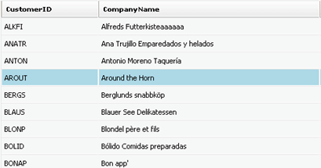

# Set Style on Mouse Over

You can style a row or header when a user moves the mouse over it. Each embedded **RadGrid** skin provides a class such as `GridRowOver_<SkinName>` for hovered rows.

> caption Example: Defining the embedded skin hover class

````CSS
.GridRowOver_[SkinName]
{
background-color: orange;
cursor:pointer;
}
````


To enable the built-in row hover style, set **ClientSettings.EnableRowHoverStyle** to `True`.

>note The built-in hover style depends on the **RadGrid** client-side object. For performance reasons, the client object is available only when certain client features or events are enabled. If the grid has no client features or events, attach an empty JavaScript function to a client event such as `OnRowClick`.


If you want to attain the same functionality without the built-in feature of RadGrid for ASP.NET AJAX or with disabled skins, the steps below show how to achieve this:

1. Create the Telerik RadGrid instance and the data source to which it will be bound.

2. Create a style class in the `head` section of the `.aspx` page to style the active row or header:

	> caption Example: Defining custom row and header hover styles

	````ASP.NET
	<style type="text/css">
	  .RowMouseOver td
	  {
	    background-color: lightblue !important;
	  }
	  .RowMouseOut
	  {
	    /*this style is taken from the corresponding skin's GridRow_[SkinName] class - GridRow_Default in our case*/
	    background: #f7f7f7;
	  }
	  .HeaderMouseOver
	  {
	    background-color: lightblue !important;
	  }
	  .HeaderMouseOut
	  {
	    /*this style is taken from the corresponding skin's th.GridHeader class - th.GridHeader_Default in our case*/
	    background: white url('Img/GridHeaderBg.gif') repeat-x bottom;
	  }
	</style>
	````


3. This approach relies on the **OnRowMouseOver**, **OnRowMouseOut**, **OnColumnMouseOver**, and **OnColumnMouseOut** client-side functions. Declare them in the **ClientSettings > ClientEvents** section of the grid declaration:

	> caption Example: Connecting RadGrid client events to hover handlers

	````ASP.NET
	<ClientSettings>
	    <ClientEvents OnRowMouseOver="RowMouseOver" OnRowMouseOut="RowMouseOut" OnColumnMouseOver="ColumnMouseOver"
	        OnColumnMouseOut="ColumnMouseOut" />
	</ClientSettings>
	````

4. Before the grid tag on the page or in the `head` section, include the client-side JavaScript functions:

	> caption Example: Handling RadGrid row and column hover events

	````JavaScript
	<script type="text/javascript">
	function RowMouseOver(sender, eventArgs) {
	  $get(eventArgs.get_id()).className = "RowMouseOver";
	}
	function RowMouseOut(sender, eventArgs) {
	  $get(eventArgs.get_id()).className = "RowMouseOut";
	}
	function ColumnMouseOver(sender, eventArgs) {
	  eventArgs.get_gridColumn().get_element().className = "HeaderMouseOver";
	}
	function ColumnMouseOut(sender, eventArgs) {
	  eventArgs.get_gridColumn().get_element().className = "HeaderMouseOut";
	}
	</script>
	````

After these steps have been performed, when the user hovers with the mouse over the control, the styles mentioned above will be applied, as shown in the following screenshot:

> caption Figure 1: RadGrid row styles applied on hover



## See Also

 * [Customizing Row Appearance]()

 * [Adding Tooltips for Grid Items]()

 * [Conditional Formatting]()
