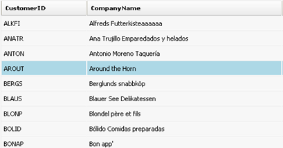

# Set style on mouse over


## 

Sometimes, it may be necessary to style a given row/header in Telerik RadGrid, whenever the user hovers with the mouse over it. With RadGrid this functionality is easily achievable. The control provides a CSS class like *GridRowOver_<SkinName>*. Such style is present under each embedded skin and defines the visual appearance of the hovered grid row. For example:

````XML
	.GridRowOver_[SkinName]
	{
	background-color: orange;
	cursor:pointer;
	}
````


To enable the hover style for the grid rows, merely set the **ClientSettings -> EnableRowHoverStyle** property of RadGrid to true.

>note This depends on RadGrid client-side object. For performance reasons, the RadGrid client object is available only when certain client features/events are enabled. If no client features/events are available in the grid but you still need this functionality, you can attach an empty javascript function to a client event (for example OnRowClick).
>


If you want to attain the same functionality without the built-in feature of RadGrid for ASP.NET AJAX or with disabled skins, the steps below show how to achieve this:

1. Create the Telerik RadGrid instance and the data source to which it will be bound.

2. Create a style class, in the head section of the .aspx code, which will be used to style the active row/header. This may look something like this:

````ASPNET
	  <style type="text/css">
	    .RowMouseOver td
	    {
	      background-color: lightblue !important;
	    }
	    .RowMouseOut
	    {
	      /*this style is taken from the corresponding skin's GridRow_[SkinName] class - GridRow_Default in our case*/
	      background: #f7f7f7;
	    }
	    .HeaderMouseOver
	    {
	      background-color: lightblue !important;
	    }
	    .HeaderMouseOut
	    {
	      /*this style is taken from the corresponding skin's th.GridHeader class - th.GridHeader_Default in our case*/
	      background: white url('Img/GridHeaderBg.gif') repeat-x bottom;
	    }
	  </style>
````


3. This particular approach relies on the **OnRowMouseOver**, **OnRowMouseOut**, **OnColumnMouseOver** and **OnColumnMouseOut** client-side functions, to use the style mentioned above. Declare these functions in the **ClientSettings ->ClientEvents** section of the grid declaration like this:

````ASPNET
	            <ClientSettings>
	                <ClientEvents OnRowMouseOver="RowMouseOver" OnRowMouseOut="RowMouseOut" OnColumnMouseOver="ColumnMouseOver"
	                    OnColumnMouseOut="ColumnMouseOut" />
	            </ClientSettings>
````


4. Before the grid tag on the page or in the head section, include the client-side JavaScript functions mentioned above:

````ASPNET
	  <script type="text/javascript">
	    function RowMouseOver(sender, eventArgs) {
	      $get(eventArgs.get_id()).className = "RowMouseOver";
	    }
	    function RowMouseOut(sender, eventArgs) {
	      $get(eventArgs.get_id()).className = "RowMouseOut";
	    }
	    function ColumnMouseOver(sender, eventArgs) {
	      eventArgs.get_gridColumn().get_element().className = "HeaderMouseOver";
	    }
	    function ColumnMouseOut(sender, eventArgs) {
	      eventArgs.get_gridColumn().get_element().className = "HeaderMouseOut";
	    }</script>
````


After these steps have been performed, when the user hovers with the mouse over the control, the styles mentioned above will be applied, as shown in the following screenshot:



# See Also

 * [Customizing Row Appearance]()

 * [Adding Tooltips for Grid Items]()

 * [Conditional Formatting]()
