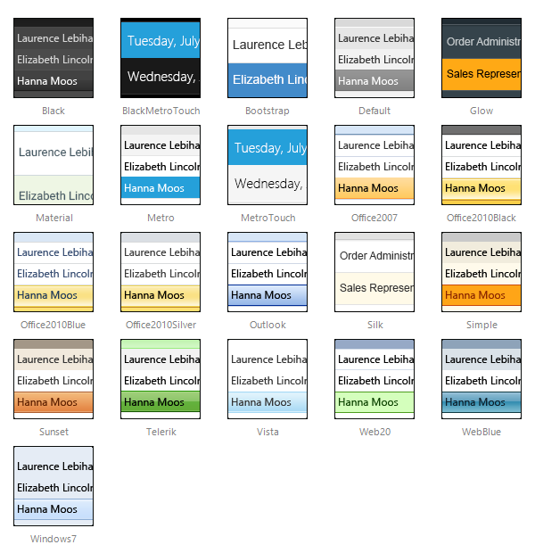

# Skins

In this article, we discuss the use of skins in **RadGrid**. You can see examples of the built-in skins, learn how to create custom skins, and see the major properties used to customize skins.

By default, all controls in the Telerik UI for ASP.NET suite have a polished look and feel, which is consistent across the whole product line.

All resources (scripts, skins, etc.) are implemented as Embedded WebResources in ASP.NET 3.5-4.8 for a very easy and convenient deployment. The only thing you need to do is drag **RadGrid** from your toolbox onto your web page (no external files will be required) and **RadGrid** will use its default skin.

You can change the applied grid skin by setting the **Skin** property to the name of the skin.

## Built-in Skins

The image below shows a thumbnail view of the embedded skins provided by Telerik. They are embedded in the Telerik.Web.UI.dll assembly as web resources. To use a built-in skin, the user only needs to set the **Skin** property of the control. Built-in skins are also provided in "C:\Program Files\Progress\UI for ASP.NET AJAX RX YYYY\Skins".
 

 @[template - Material skin is available only in Lightweight mode](/_templates/common/skins-notes.md#material-only-in-lightweight) 

Except setting the **Skin** property to one of the built-in skins you can use it in the following ways:

* If a skin is not explicitly defined, the **Default** skin from the embedded web resources will be used.

* You can use a predefined skin or your own skin. When following the second approach you need to set EnableEmbeddedSkins=false and define **Skin** property value (see the next paragraph for more details).

## Creating Custom Skins for RadGrid

A developer can create custom skins for use in **RadGrid**. They are not embedded so the control cannot register them automatically. If you use a custom skin, you need to set the **Skin** and the **EnableEmbeddedSkins** properties of the control to **false**. Otherwise, the following exception will be thrown saying that there is no embedded skin matching the **Skin** property:

> Telerik.Web.UI.RadGrid with ID='RadGrid1' was unable to find embedded skin with name **'MySkin'**. Please, make sure that you spelled the skin name correctly, or if you want to use a custom skin, set EnableEmbeddedSkins=false.

For more information about how to create a custom skin with the help of the [Telerik Theme Builder](https://themebuilder.telerik.com/aspnet-ajax), see [this video](https://www.youtube.com/watch?v=0kiuagrNvac) or the [Sass Theme Builder Overview]() article.

The steps to apply the new custom skin are described in the [Skin Registration]() article.

The [Custom Skin demo](https://demos.telerik.com/aspnet-ajax/grid/examples/styles/custom-skin/defaultcs.aspx) shows what you can achieve with custom skins.

## Modifying Skins

You can modify the built-in skins for RadGrid. The required steps are described in the [Modifying Built-in Skins]() article.

The skins created in the [Telerik Theme Builder](https://themebuilder.telerik.com/aspnet-ajax) can be imported via its interface and modified as many times as you wish - see [Importing a Theme]() for the full procedure.

## Properties (Applicable When Not Using an Embedded or External Skin)

You can customize the appearance of the **RadGrid** control by setting the style properties for the different parts of the control. **Table 1** lists the various style properties.

>caption  

|  **Style Property**  |  **Description**  |
| ------ | ------ |
| **AlternatingItemStyle** |Specifies the style for alternating items in the **RadGrid** control.|
| **EditItemStyle** |Specifies the style for the item being edited in the **RadGrid** control.|
| **FooterStyle** |Specifies the style for the footer section in the **RadGrid** control.|
| **HeaderStyle** |Specifies the style for the header section in the **RadGrid** control.|
| **ItemStyle** |Specifies the style for the items in the **RadGrid** control.|
| **PagerStyle** |Specifies the style for the page selection section of the **RadGrid** control.|
| **SelectedItemStyle** |Specifies the style for the selected item in the **RadGrid** control.|
| **GroupHeaderItemStyle** |Specifies the style for the group header in the **RadGrid** control.|

## See Also

 * [Controlling Visual Appearance Overview]()
 * [Sass Theme Builder Overview article]()
 * [Telerik ThemeBuilder for ASP.NET AJAX](https://themebuilder.telerik.com/)
 * [Custom Skin demo](https://demos.telerik.com/aspnet-ajax/grid/examples/styles/custom-skin/defaultcs.aspx)
 * [How to Load Skins from External Assemblies article]()
 * [How to load skins from external assemblies code library](https://www.telerik.com/support/code-library/how-to-load-skins-from-external-assemblies)
 * [HTML Output]()
 * [Modifying Existing Skins]()

