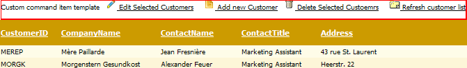

# Styling the CommandItem

## 

In order to show the command item, you should set **CommandItemDisplay** property of **GridTableView**. It can take four values: **None**, **Top**, **Bottom**, **TopAndBottom** corresponding to the place where it will appear. The command item content can be customized using the template of a **GridTableView.CommandItemTemplate**.

>tip If you are using the RadGrid skinning and you want to customize the look and feel of the CommandItemTemplate you should alter the .GridCommandRow_[Your_Skin] class, where Your_Skin is the specific Skin you use. You should also be aware that applying changes to the CommandItemTemplate declaratively will not override the properties set in the Skin!
>

## See Also

 * [Command Item Template]()
