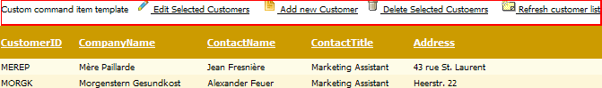

# Styling the CommandItem

To display the command item, set the **CommandItemDisplay** property of **GridTableView**. The property accepts **None**, **Top**, **Bottom**, or **TopAndBottom**. Customize the command item content with **GridTableView.CommandItemTemplate**.

> caption Figure 1: RadGrid CommandItemTemplate

>note If you are using the RadGrid skinning and you want to customize the look and feel of the CommandItemTemplate you should alter the .GridCommandRow_[Your_Skin] class, where Your_Skin is the specific Skin you use. You should also be aware that applying changes to the CommandItemTemplate declaratively will not override the properties set in the Skin!
>

## See Also

 * [Command Item Template]()
