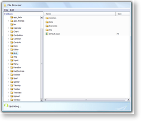

# File Browser


## 

The [following example](http://demos.telerik.com/aspnet-ajax/Controls/Examples/Integration/FileBrowser/DefaultCS.aspx) demonstrates how RadSplitter, RadTreeView, RadGrid and RadMenu can be integrated with the RadAjax framework. The example features the following components:

* RadSplitter - allows resizing of the content panes

* RadTreeView - displays the folder structure

* RadGrid - displays the selected folder contents

* RadMenu - contains commands

* RadAjax Manager - manages the Ajax requests

This is a typical example for "File browser" type of application for web.

>tabbedCode

````JavaScript
	    var loadingPanel = null;
	    function clientNodeClicked(sender, args) {
	      if (!loadingPanel) {
	        loadingPanel = $find("AjaxLoadingPanel1");
	      }
	      loadingPanel.show("RadGrid1"); Directories.GetFilesAndFolders(sender.get_selectedNode().get_value(), updateGrid);
	    }
	    function updateGrid(result) {
	      var tableView = $find("RadGrid1").get_masterTableView(); tableView.set_dataSource(result); tableView.dataBind();
	      if (loadingPanel) {
	        loadingPanel.hide("RadGrid1");
	      }
	    }
	    function rowDataBound(sender, args) {
	      var value = args.get_dataItem()["Name"]; 
	      args.get_item().get_cell("Name").innerHTML = String.format('{1}', getImageByFileExt(value), value);
	    }
	    function getImageByFileExt(fileName) {
	      var image = "File.gif"; var extension = fileName.split(".")[fileName.split(".").length - 1];
	      switch (extension) {
	        case "dll": case "pdb": image = "File.gif"; break;
	        case "cs": image = "cs.gif"; break;
	        case "css": image = "css.gif"; break;
	        case "html": image = "html.gif"; break;
	        case "resx": image = "resx.gif"; break;
	        case "vb": image = "vb.gif"; break;
	        case "config": case "xml": case "asmx": image = "xml.gif"; break;
	        case "ascx": case "aspx": image = "ascx.gif"; break;
	        case "gif": case "jpg": image = "gif.gif"; break;
	        default: image = "mailfolder.gif"; break;
	      }
	      return image;
	    }
````


````ASPNET
	  <telerik:RadScriptManager ID="RadScriptManager1" runat="server">
	    <Services>
	      <asp:ServiceReference Path="Directories.asmx" />
	    </Services>
	  </telerik:RadScriptManager>
	  <telerik:RadStyleSheetManager ID="RadStyleSheetManager1" runat="server" />
	  <!-- content start -->
	  <div class="wrapper">
	    <div class="wrapper2">
	      <h3 class="browser">
	        File Browser</h3>
	      <div class="wrapper3">
	        <telerik:RadMenu ID="RadMenu1" runat="server" Skin="Vista" Width="708px" BorderWidth="0">
	          <ExpandAnimation Duration="100" />
	          <CollapseAnimation Duration="100" />
	          <Items>
	            <telerik:RadMenuItem Text="File" runat="server">
	              <Items>
	                <telerik:RadMenuItem Text="New Node" runat="server" ImageUrl="Img/new.gif" Enabled="false" />
	                <telerik:RadMenuItem Text="Delete Node" runat="server" ImageUrl="Img/delete.gif"
	                  Enabled="false" />
	                <telerik:RadMenuItem Text="Rename Node" runat="server" ImageUrl="Img/rename.gif"
	                  Enabled="false" />
	              </Items>
	            </telerik:RadMenuItem>
	            <telerik:RadMenuItem ID="RadMenuItem4" Text="Edit" runat="server">
	              <Items>
	                <telerik:RadMenuItem Text="Copy Node" runat="server" ImageUrl="Img/copy.gif" Enabled="false" />
	                <telerik:RadMenuItem Text="Paste Node" runat="server" ImageUrl="Img/paste.gif" Enabled="false" />
	              </Items>
	            </telerik:RadMenuItem>
	          </Items>
	        </telerik:RadMenu>
	        <div class="innerWrapper">
	          <telerik:RadSplitter ID="RadSplitterBrowser" runat="server" Height="500px" Width="708px"
	            BorderSize="0" BorderStyle="None" Skin="Vista">
	            <telerik:RadPane ID="RadPaneTreeView" runat="server" Height="500px" Width="222px">
	              <div class="leftPaneHeader">
	              </div>
	              <telerik:RadTreeView ID="RadTreeView1" OnClientNodeClicked="clientNodeClicked" runat="server"
	                Skin="Vista" Width="100%" Height="476px" AccessKey="T">
	                <WebServiceSettings Path="Directories.asmx" Method="GetDirectories" />
	                <DataBindings>
	                  <telerik:RadTreeNodeBinding ImageUrlField="ImageUrl" TextField="Text" ValueField="Value" />
	                </DataBindings>
	              </telerik:RadTreeView>
	            </telerik:RadPane>
	            <telerik:RadSplitBar ID="RadSplitBar1" runat="server" />
	            <telerik:RadPane ID="RadPaneGrid" runat="server" Width="480px">
	              <telerik:RadGrid ID="RadGrid1" runat="server" AutoGenerateColumns="False" GridLines="None"
	                Width="100%" Height="498px" Skin="Vista">
	                <MasterTableView Width="100%">
	                  <Columns>
	                    <telerik:GridTemplateColumn HeaderText="Name" SortExpression="Name" UniqueName="Name">
	                      <ItemTemplate>
	                        <asp:Image ID="icon" runat="server" />
	                        <asp:Label ID="itemLabel" runat="server" Text='<%# Eval("Name") %>'></asp:Label>
	                      </ItemTemplate>
	                    </telerik:GridTemplateColumn>
	                    <telerik:GridTemplateColumn HeaderText="Size" SortExpression="Size" UniqueName="Size">
	                    </telerik:GridTemplateColumn>
	                  </Columns>
	                </MasterTableView>
	                <ClientSettings ReorderColumnsOnClient="True">
	                  <Selecting AllowRowSelect="True" />
	                  <Resizing AllowColumnResize="True" />
	                  <Scrolling AllowScroll="True" UseStaticHeaders="True" ScrollHeight="99.9%" />
	                  <ClientEvents OnRowDataBound="rowDataBound" />
	                </ClientSettings>
	                <HeaderStyle BorderColor="DarkGray" BorderStyle="Solid" BorderWidth="1px" />
	              </telerik:RadGrid>
	            </telerik:RadPane>
	          </telerik:RadSplitter>
	        </div>
	      </div>
	      <div class="footer">
	        <telerik:RadAjaxLoadingPanel ID="AjaxLoadingPanel1" runat="server" Height="75px"
	          Width="275px" Transparency="60" BackColor="Gray" ForeColor="White">
	          <asp:Image ID="Image1" runat="server" AlternateText="Loading..." ImageUrl="~/Controls/Examples/Integration/FileBrowser/Img/LoadingProgressBar.gif"
	            CssClass="UpdateImage" />
	          <span style="position: relative; top: -6px;">Updating...</span>
	        </telerik:RadAjaxLoadingPanel>
	      </div>
	    </div>
	  </div>
````


````C#
	    protected void Page_Load(object sender, EventArgs e)
	    {
	        RadGrid1.NeedDataSource += new GridNeedDataSourceEventHandler(RadGrid1_NeedDataSource);
	        RadGrid1.ItemDataBound += new GridItemEventHandler(RadGrid1_ItemDataBound);
	        if (!IsPostBack)
	        {
	            RadTreeView1.DataSource = new Directories().BindDirectory(Server.MapPath("~/"));
	            RadTreeView1.DataBind();
	            foreach (RadTreeNode node in RadTreeView1.Nodes)
	            {
	                node.ExpandMode = TreeNodeExpandMode.WebService;
	            }
	            RadTreeView1.Nodes[0].Selected = true;
	        }
	    }
	    void RadGrid1_NeedDataSource(object source, GridNeedDataSourceEventArgs e)
	    {
	        RadGrid1.DataSource = new Directories().GetFilesAndFolders(Server.MapPath("~/Ajax"));
	    }
	    void RadGrid1_ItemDataBound(object sender, GridItemEventArgs e)
	    {
	        if (e.Item is GridDataItem)
	        {
	            Directories.Info info = (Directories.Info)e.Item.DataItem;
	            System.Web.UI.WebControls.Image icon = (System.Web.UI.WebControls.Image)e.Item.FindControl("icon");
	            icon.ImageUrl = "Img/" + GetImageForExtension(info.Name);
	            icon.AlternateText = "icon";
	            icon.ImageAlign = System.Web.UI.WebControls.ImageAlign.AbsMiddle;
	            icon.Style.Add("vertical-align", "middle");
	            icon.BorderWidth = Unit.Pixel(0);
	            if (info.Size != null)
	            {
	                ((GridDataItem)e.Item)["Size"].Text = info.Size.ToString();
	            }
	            else
	            {
	                ((GridDataItem)e.Item)["Size"].Text = "&nbsp;";
	            }
	        }
	    }
	    private string GetImageForExtension(string fileName)
	    {
	        string image = "File.gif";
	        switch (Path.GetExtension(fileName))
	        {
	            case ".cs":
	                image = "cs.gif";
	                break;
	            case ".css":
	                image = "css.gif";
	                break;
	            case ".html":
	                image = "html.gif";
	                break;
	            case ".resx":
	                image = "resx.gif";
	                break;
	            case ".vb":
	                image = "vb.gif";
	                break;
	            case ".xml":
	                image = "xml.gif";
	                break;
	            case ".ascx":
	            case ".aspx":
	                image = "ascx.gif";
	                break;
	            case ".gif":
	            case ".jpg":
	                image = "gif.gif";
	                break;
	            case "":
	                image = "mailfolder.gif";
	                break;
	        }
	        return image;
	    }
````


````VB.NET
	    Protected Sub Page_Load(ByVal sender As Object, ByVal e As EventArgs)
	        AddHandler RadGrid1.NeedDataSource, AddressOf RadGrid1_NeedDataSource
	        AddHandler RadGrid1.ItemDataBound, AddressOf RadGrid1_ItemDataBound
	        If Not IsPostBack Then
	            RadTreeView1.DataSource = New Directories().BindDirectory(Server.MapPath("~/"))
	            RadTreeView1.DataBind()
	            For Each node As RadTreeNode In RadTreeView1.Nodes
	                node.ExpandMode = TreeNodeExpandMode.WebService
	            Next
	            RadTreeView1.Nodes(0).Selected = True
	        End If
	    End Sub
	    Sub RadGrid1_NeedDataSource(ByVal source As Object, ByVal e As GridNeedDataSourceEventArgs)
	        RadGrid1.DataSource = New Directories().GetFilesAndFolders(Server.MapPath("~/"))
	    End Sub
	    Sub RadGrid1_ItemDataBound(ByVal sender As Object, ByVal e As GridItemEventArgs)
	        If TypeOf e.Item Is GridDataItem Then
	            Dim info As Directories.Info = DirectCast(e.Item.DataItem, Directories.Info)
	            Dim icon As System.Web.UI.WebControls.Image = DirectCast(e.Item.FindControl("icon"), System.Web.UI.WebControls.Image)
	            icon.ImageUrl = "Img/" + GetImageForExtension(info.Name)
	            icon.AlternateText = "icon"
	            icon.ImageAlign = System.Web.UI.WebControls.ImageAlign.AbsMiddle
	            icon.Style.Add("vertical-align", "middle")
	            icon.BorderWidth = Unit.Pixel(0)
	            If Not info.Size.Equals(Nothing) Then
	                CType(e.Item, GridDataItem)("Size").Text = info.Size.ToString()
	            Else
	                CType(e.Item, GridDataItem)("Size").Text = " "
	            End If
	        End If
	    End Sub
	    Private Function GetImageForExtension(ByVal fileName As String) As String
	        Dim image As String = "File.gif"
	        Select Case Path.GetExtension(fileName)
	            Case ".cs"
	                image = "cs.gif"
	                Exit Select
	            Case ".css"
	                image = "css.gif"
	                Exit Select
	            Case ".html"
	                image = "html.gif"
	                Exit Select
	            Case ".resx"
	                image = "resx.gif"
	                Exit Select
	            Case ".vb"
	                image = "vb.gif"
	                Exit Select
	            Case ".xml"
	                image = "xml.gif"
	                Exit Select
	            Case ".ascx", ".aspx"
	                image = "ascx.gif"
	                Exit Select
	            Case ".gif", ".jpg"
	                image = "gif.gif"
	                Exit Select
	            Case ""
	                image = "mailfolder.gif"
	                Exit Select
	        End Select
	        Return image
	    End Function
````


>end
