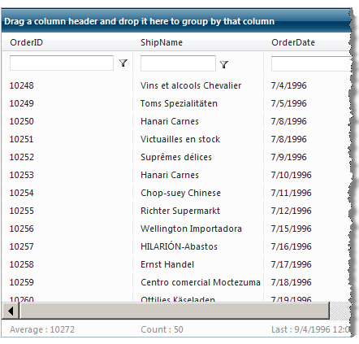
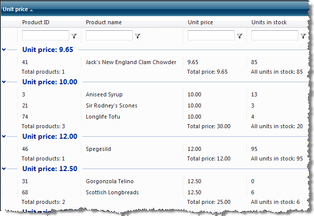

# Aggregates


## 

The __GridBoundColumn__ object has an __Aggregate__ property that you can set to specify a function for aggregating the values that the column displays. The __Aggregate__ property can be set to any of the following values: "Sum", "Min", "Max", "Last", "First", "Count", "Avg", or "Custom". When you set the __Aggregate__ property to "Custom", the grid raises an __OnCustomAggregate__ event, where you can calculate the aggregate in server-side code and assign the result to the __Result__ property of the event arguments object.

````ASPNET
	  <telerik:GridBoundColumn Aggregate="Count" DataField="CustomerID" DataType="System.String"
	    HeaderText="CustomerID" SortExpression="CustomerID" UniqueName="CustomerID">
	  </telerik:GridBoundColumn>
````


The grid calculates aggregated values if the __ShowFooter__ property is set to __True__. The grid footer displays aggregates that are calculated based on all the data from the data source, except for any values that are excluded by a [filter expression]().




When [grouping]() is enabled in the column, you can display group aggregates by setting the __ShowGroupFooter__ property to __True__:




