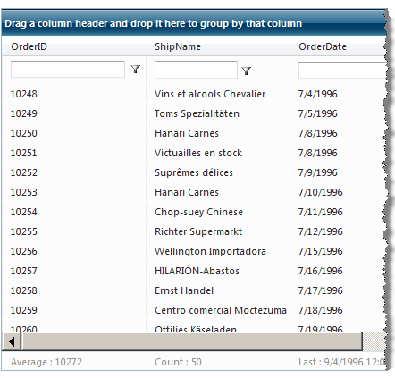
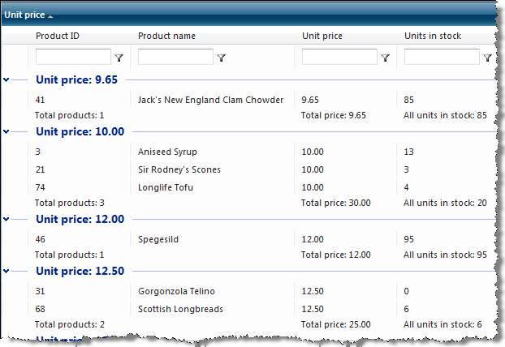

# Aggregates

The **GridBoundColumn** object has an **Aggregate** property that you can set to specify a function for aggregating the values that the column displays. The **Aggregate** property can be set to any of the following values: "Sum", "Min", "Max", "Last", "First", "Count", "Avg", or "Custom". When you set the **Aggregate** property to "Custom", the grid raises an **OnCustomAggregate** event, where you can calculate the aggregate in server-side code and assign the result to the **Result** property of the event arguments object.

````ASP.NET
<telerik:GridBoundColumn Aggregate="Count" DataField="CustomerID" DataType="System.String"
  HeaderText="CustomerID" SortExpression="CustomerID" UniqueName="CustomerID">
</telerik:GridBoundColumn>
````


The grid calculates aggregated values if the **ShowFooter** property is set to **True**. The grid footer displays aggregates that are calculated based on all the data from the data source, except for any values that are excluded by a [filter expression]().


> caption Figure 1: Grid footer displaying an aggregate value


When [grouping]() is enabled in the column, you can display group aggregates by setting the **ShowGroupFooter** property to **True**:


> caption Figure 2: Grid group footer displaying aggregate values

## See Also

- [Grouping overview]()
- [Using columns]()
- [Data items]()


