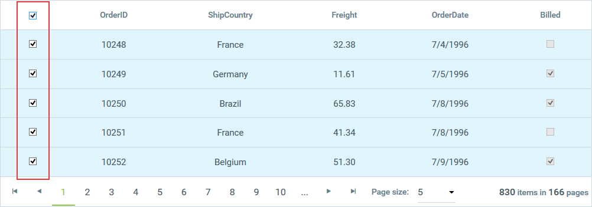
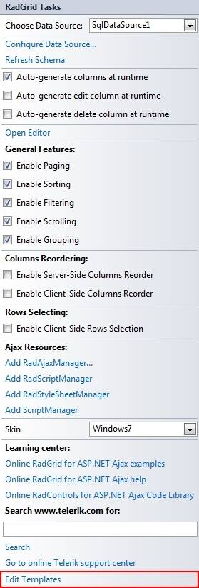
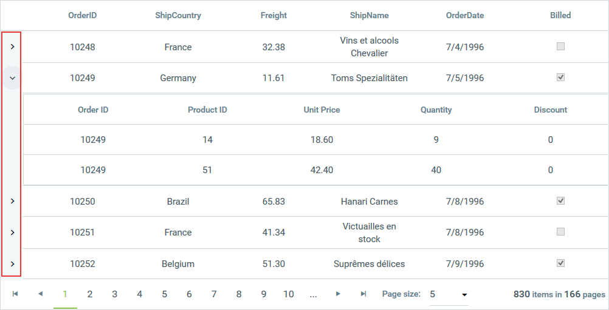

# Column Types


**RadGrid** supports two main types of columns:

* **Data columns**, which display the data you bind to the grid or contain controls that operate on the data in the grid.

* **Structure columns**, which facilitate some feature of the grid, such as grouping or resizing.

>important RadGrid does not support DataFields or UniqueNames containing spaces. Please modify the names of the fields in your data source accordingly before passing it to the grid.
>

## Data Columns

Data columns display data or contain controls that operate on the data. They can be automatically generated, created at design time using the [RadGrid Property Builder](), or added dynamically at runtime to the **Columns** property collection.

>note Note that by default the header text of the auto generated columns is the name of the data field split by capital letters. To control this behavior you can use the **EnableSplitHeaderText** property. Its default value is true. If you set it to false, the header text will be the same as the name of the data field.
>

Automatically-generated columns are added at runtime when the **AutoGenerateColumns** of the table view is set to **true**. When you use automatically-generated columns, a column is added for every field of the [data source]() to which the table view is bound. These columns can be accessed using the **AutoGeneratedColumns** property collection.

>note Automatically-generated columns are aware of the data type of the field they display (similar to the way the ASP.NET **GridView** control works).
>


Explicitly-created columns (columns created in the **Property Builder** or at runtime) are added to the **Columns** property collection. They appear in the table view in the order in which they are declared and before any automatically-generated columns (unless you order the columns programmatically).

>caution Automatically generated columns are created for every field in the data source. If you have explicitly created columns as well, this can result in duplicated columns.
>


The following excerpt shows a **RadGrid** declaration with explicitly-created columns. This method of declaring the columns is called column binding:

````ASP.NET
<telerik:RadGrid RenderMode="Lightweight" ID="RadGrid1" runat="server">
  ...
  <MasterTableView DataSourceID="ProductsDataSource" TableLayout="Auto">
    ...
    <Columns>
      <telerik:GridBoundColumn DataField="ProductID" DataType="System.Int32" HeaderText="Product ID"
        SortExpression="ProductID" UniqueName="ProductID">
      </telerik:GridBoundColumn>
      <telerik:GridBoundColumn DataField="ProductName" HeaderText="Product Name" SortExpression="ProductName"
        UniqueName="ProductName">
      </telerik:GridBoundColumn>
      <telerik:GridBoundColumn DataField="UnitPrice" DataType="System.Decimal" HeaderText="Unit Price"
        SortExpression="UnitPrice" UniqueName="UnitPrice">
      </telerik:GridBoundColumn>
    </Columns>
    ...
  </MasterTableView>
</telerik:RadGrid>
````


## Column Types

There are several different column types. Different column types support different editors, different filtering options, and so on.

Every data column type has the following Boolean properties:

* **Exportable** - Determines whether the column should be included into the exported file or not.

* **Display** - Determines whether the column is displayed in browser mode. When **Display** is **False**, the column is rendered in the browser but all the cells are styled with "*display: none*", so that they are not visible to the user. **Display** does not affect whether the column editor is visible in an edit form, but if the table view uses an in-place editor, the column editor does not appear.

* **Visible** - Determines whether the column is rendered in browser mode. When **Visible** is **False**, the column is not even rendered in the browser. **Visible** does not affect whether the column editor is visible in an edit form, but if the table view uses an in-place editor, the column editor does not appear.

In addition, editable column types (column types that implement the **IGridEditableColumn** interface)have a **ReadOnly** property that determines whether the column editor is visible in the [edit form](). When **ReadOnly** is **True**, the column editor does not appear in the edit form. **ReadOnly** does not affect whether the column is visible in browser mode.

>note None of these three properties prevents you from accessing the column cell's content server-side using the **UniqueName** of the column.
>


>note As of Q1 2013, a column with the **Visible** property set to **False** is no longer able to access the column cell's content. You can find additional information in this [forum thread.](https://www.telerik.com/community/forums/aspnet-ajax/grid/breaking-change-hidden-column-cell-text-is-not-persisted-in-viewstate.aspx)
>


In order to provide more control over the editing process, every editable column also has an **InsertVisiblityMode** property that determines whether an editor will be displayed in the insert item. You can set the property to one of three values:

* **Default** - The visibility is dependent on the **ReadOnly** property.

* **AlwaysVisible** - The editor is always visible in the insert item.

* **AlwaysHidden** - An editor is not shown in the insert item.

With explicitly-created columns, you can choose the column type you consider most appropriate. The different column types for data columns are listed in **Table 1**:

**Table 1**: Click on a column type to jump to its section for more information.


| [GridAutoCompleteColumn](#gridautocompletecolumn) | [GridClientSelectColumn](#gridclientselectcolumn) | [GridTemplateColumn](#gridtemplatecolumn) |
| ------ | ------ | ------ |
|[GridBoundColumn](#gridboundcolumn)|[GridDragDropColumn](#griddragdropcolumn)|[GridAttachmentColumn](#gridattachmentcolumn)|
|[GridButtonColumn](#gridbuttoncolumn)|[GridDropDownColumn](#griddropdowncolumn)|[GridRatingColumn](#gridratingcolumn)|
|[GridEditCommandColumn](#grideditcommandcolumn)|[GridDateTimeColumn](#griddatetimecolumn)|[GridRowIndicatorColumn](#gridrowindicatorcolumn)|
|[GridHyperLinkColumn](#gridhyperlinkcolumn)|[GridNumericColumn](#gridnumericcolumn)|[GridGroupSplitterColumn](#gridgroupsplittercolumn)|
|[GridImageColumn](#gridimagecolumn)|[GridMaskedColumn](#gridmaskedcolumn)|[GridExpandColumn](#gridexpandcolumn)|
|[GridBinaryImageColumn](#gridbinaryimagecolumn)|[GridHTMLEditorColumn](#gridhtmleditorcolumn)||
|[GridCheckBoxColumn](#gridcheckboxcolumn)|[GridCalculatedColumn](#gridcalculatedcolumn)||

>note
[At the bottom end of the article](#specific-properties-and-generated-controls) you can find a detailed table containing the specific properties and generated controls for each column type
>

## GridAutoCompleteColumn

When in browser mode, the column looks and behaves like **GridBoundColumn**. It renders text inside the cell, depending on the DataField of the column and the data source of the owner GridTableView. In insert/edit mode, it displays **RadAutoCompleteBox** for each edited cell in the column.

To configure the column you can use these properties, valid for most of the other columns as well:

* **EmptyDataText** - Sets or gets default text when the column is empty. Default value is "\&nbsp;"

* **AllowSorting** - Gets or sets whether the column data can be sorted.

* **AllowFiltering** - A Boolean property that specifies whether filtering will be enabled for the column.

* **DataField** - Set the column in the grid's data source containing values to be	displayed and used for the **RadAutoCompleteBox** initially in edit mode.

Further configuration of the **RadAutoCompleteBox** used in edit mode is possible using these properties exposed in both	**GridAutoCompleteColumn** and in **GridAutoCompleteColumnEditor**, which is the default editor for the column:

* **InputType** - Gets or sets a value indicating how the **RadAutoCompleteBox** items should be displayed—as tokens or as text.

* **Filter** - Gets or sets a value indicating whether the **RadAutoCompleteBox** should apply “Contains” or “StartsWith” filter logic.

* **AllowCustomEntry** - Gets or sets a value indicating whether the user will be able to add a custom text not present within the raw data in order to create a custom entry.

* **SelectionMode** - Gets a value indicating whether the user can select multiple entries.

* **AllowTokenEditing** - Gets a value indicating whether the text of the **RadAutoCompleteBox** Tokens can be edited when a user double-clicks it.

* **Delimiter** - Gets or sets a value indicating what delimiter should be used when the control displays the selected items as text (**InputType** = Text).

* **DataTextField** - Gets or sets the **DataTextField** of the **RadAutoCompleteBox**.

* **DataValueField** - Gets or sets the **DataValueField** of the **RadAutoCompleteBox**.

You can find more information about the properties of	**RadAutoCompleteBox** in the help topics of the control:[InputType](https://www.telerik.com/help/aspnet-ajax/autocompletebox-input-types.html),	[Filter](https://www.telerik.com/help/aspnet-ajax/autocompletebox-filtering.html),	[AllowCustomEntry](https://www.telerik.com/help/aspnet-ajax/autocompletebox-items-selection.html),	[SelectionMode](https://www.telerik.com/help/aspnet-ajax/autocompletebox-selection-mode.html), and [AllowTokenEditing](https://www.telerik.com/help/aspnet-ajax/autocompletebox-token-editing.html).

You can find information about binding **RadAutoCompleteBox** in this help article:[RadAutoCompleteBox - Data Binding Overview](https://www.telerik.com/help/aspnet-ajax/autocompletebox-databinding-overview.html).

## GridBoundColumn

**GridBoundColumn** displays a table view column bound to a field in the data source of the table view that contains it. To bind this column type to a field, set its **DataField** property to the name of a field.

This column supports editing of its data (it implements the **IGridEditableColumn** interface) and provides, by default, **GridTextBoxColumnEditor** as a column editor to allow editing the text for each cell. It also exposes the **HtmlEncode** property (its default value is **False**) which specifies whether the text in the corresponding cell will be encoded automatically or not when displayed in the browser. You can find more information about the nature of HTML encoding here:

[https://msdn.microsoft.com/en-us/library/system.web.httpserverutility.htmlencode.aspx](https://msdn.microsoft.com/en-us/library/system.web.httpserverutility.htmlencode.aspx)

Moreover, the built-in **GridBoundColumn** has an **EmptyDataText** property, which specifies the text that will be displayed in the column cell when it has an empty/null value retrieved from the data source.

The following declaration shows a **GridBoundColumn**:

````ASP.NET
<telerik:GridBoundColumn DataField="UnitPrice" DataType="System.Decimal" HeaderText="Unit Price"
  SortExpression="UnitPrice" UniqueName="UnitPrice">
</telerik:GridBoundColumn>
````


## GridButtonColumn

**GridButtonColumn** displays a button for each entry in the column. This button can then perform some command.

There are two types of button columns with pre-defined commands:

* **Select** - When a button in this column is pressed, the entire row is selected.

* **Delete** - When a button in this column is pressed, the entire row is deleted.

In addition, you can add a generic button column and specify what command it performs by setting the **CommandName** (and**CommandArgument**) properties. For details on using commands, see [Command Reference (Event Bubbling in Telerik RadGrid)]().

In addition to specifying the command a button performs, you can specify the type of button the column displays. The available buttons types are: **PushButton**, **LinkButton** and **ImageButton**. **Image 1** shows a grid with each of these types of button columns:

**Image 1**: **GridButtonColumn** with different types of buttons


## GridEditCommandColumn

Initially, the **GridEditCommandColumn** displays only an Edit button as shown in **Image 2**.

**Image 2**: Edit link displayed in **GridEditCommandColumn**


When the user presses the Edit button, if the table view is configured for in-line editing, the Update and Cancel buttons appear in place of the Edit button and the cells on the row become editable.

**Image 3**: **RadGrid** row in edit mode


>note The previous images showed an Edit command column that uses a link button. Like the **GridButtonColumn** , the **GridEditCommandColumn** can also use an image button or a push button.
>


## GridHyperLinkColumn

Each cell in a **GridHyperLinkColumn** contains a predefined hyperlink.

To specify the text of the link, you can do one of the following:

* Set the **Text** property to a static value. When you use this method, every link appears the same in the entire column.

* Set the **DataTextField** property to a field that supplies the text for the link. When you use this method, you can format the text that comes from the database by setting the **DataTextFormatString** property.

To specify the target of the hyperlink, set the **DataNavigateUrlFields** property. You can specify multiple fields if the target of the hyperlink is determined by more than one field in the database. You can then combine the navigate URL fields by specifying a format string as the value of the **DataNavigateUrlFormatString** property. Additionally, you can set the **ImageUrl** property to override the text property of the hyperlink column and render an image.

The following example shows the declaration of a **GridHyperLinkColumn**:

````ASP.NET
<telerik:GridHyperLinkColumn DataTextFormatString="Search Google for '{0}'" DataNavigateUrlFields="CompanyName"
  UniqueName="CompanyName" DataNavigateUrlFormatString="http://www.google.com/search?hl=en&amp;q={0}&amp;btnG=Google+Search"
  DataTextField="CompanyName">
</telerik:GridHyperLinkColumn>
````


## GridImageColumn

Each cell in a **GridImageColumn** contains an image. To specify the image URL of that image, you can do one of the following:

* Set the **ImageUrl** property to a static value. When you use this method, every image appears the same in the entire column.

* Set the **DataImageUrlFields** property to a field in the source that can be used to supply the image path and format it by setting the **DataImageUrlFormatString** property. You can specify multiple fields if the image URL is determined by more than one field in the database.

* Set the **DataAlternateTextField** property to specify by which field in the grid source the column will be sorted/filtered. For the filtering, you must also explicitly set the **DataType** property of the column to the type of the field specified through the **DataAlternateTextField** property (**System.String** in the common case). You can also apply formatting using the **DataAlternateTextFormatString** property.

>note Note that if you specify a sort expression directly through the **SortExpression** property of the column, it will have a higher priority and	will override the sort/filter criteria of the **DataAlternateTextField** property.
>


Other commonly used properties for that column are **AlternateText**, **ImageAlign**, **ImageWidth**, **ImageHeight**, etc. The following example shows the declaration of a GridImageColumn from [this online demo](https://demos.telerik.com/aspnet-ajax/grid/examples/generalfeatures/columntypes/defaultcs.aspx) of the product:

````ASP.NET
<telerik:GridImageColumn DataType="System.String" DataImageUrlFields="CustomerID"
  DataImageUrlFormatString="IMG/{0}.jpg" AlternateText="Customer image" DataAlternateTextField="ContactName"
  ImageAlign="Middle" ImageHeight="110px" ImageWidth="90px" HeaderText="Image Column"
  FooterText="ImageColumn footer">
</telerik:GridImageColumn>
````


## GridBinaryImageColumn

Each cell in a **GridBinaryImageColumn** contains an image streamed from a binary image source field (specified through the **DataField** property of the column). When used, this column will show a **RadBinaryImage** control in view mode and **RadUpload** or**RadAsyncUpload** in edit mode to upload an image. The type of upload is determined by the **UploadControlType** property. Additionally, you can persist the binary data when an item is opened for edit by setting the **PersistBinaryDataOnEdit** property to **true**. This will force the control to pass the old binary image to the data source so it could be persisted and not deleted.

The image will be sized automatically to **ImageHeight** and **ImageWidth** pixel values if the **ResizeMode** property of the column is different than **None**. Possible values for the **ResizeMode** property of the column are:

* **Crop** (the image will be trimmed)

* **Fit** (the image will be sized to fit the given dimensions)

* **None** (default)

Additionally, you can set the **DataAlternateTextField** property to specify by which field in the grid source the column will be sorted/filtered. For the filtering, you must also explicitly set the **DataType** property of the column to the type of the field specified through the **DataAlternateTextField** property (**System.String** in the common case). You can also apply formatting using the**DataAlternateTextFormatString** property.

>note Note that if you directly specify a sort expression through the **SortExpression** property of the column, it will have higher priority and will override the sort/filter criteria of the **DataAlternateTextField** property.
>


Other commonly used properties for that column are **AlternateText**, **ImageAlign**, **ImageWidth**,**ImageHeight**, **DefaultImageUrl** (to set the default image when a null value is returned from the source), etc. The following example shows the declaration of a **GridBinaryImageColumn** from [this online demo](https://demos.telerik.com/aspnet-ajax/controls/examples/integration/raduploadinajaxifiedgrid/defaultcs.aspx?product=grid) of the product.

````ASP.NET
<telerik:GridBinaryImageColumn DataField="Data" HeaderText="Image" UniqueName="Upload"
  ImageHeight="60px" ImageWidth="60px" ResizeMode="Fit">
</telerik:GridBinaryImageColumn>
````


## GridCheckBoxColumn

**GridCheckBoxColumn** displays a check box to represent a Boolean value. Bind this column type to a Boolean field by setting its**DataField** property. If this column type is bound to a data value that is not Boolean, the grid throws an exception.

When the grid is in browser mode, or if the column is read-only, the check box is disabled. When the column is editable, the check box is enabled.**GridCheckBoxColumn** implements the **IGridEditableColumn** interface, and by default, it provides a **GridCheckBoxListColumnEditor** for editing items.

The following example shows the declaration of a **GridCheckBoxColumn**:

````ASP.NET
<telerik:GridCheckBoxColumn UniqueName="BoolField" HeaderText="CheckBox Column" DataField="BoolField"
  AllowSorting="true">
</telerik:GridCheckBoxColumn>
````


>note See the section below for a comparison between **GridCheckBoxColumn** and a template column that contains a check box.
>

**GridCheckBoxColumn** also provides **StringTrueValue** and **StringFalseValue** properties to use when binding the column to a String type field, which may contain "Yes" or "No", "1" or "0", etc.

````ASP.NET
<telerik:GridCheckBoxColumn DataField="StringField" DataType="System.Boolean"
    FilterControlAltText="Filter StringField column" HeaderText="StringField"
    SortExpression="StringField" UniqueName="StringField" StringFalseValue="No"
    StringTrueValue="Yes">
</telerik:GridCheckBoxColumn>
````

## GridClientSelectColumn

**GridClientSelectColumn** also displays a check box control for each cell in the column. Unlike **GridCheckBoxColumn**, however, this column type does not represent a Boolean data value. Instead, it acts a bit like a **GridButtonColumn** with its **CommandName** set to "Select" or "Deselect". This column type lets users select or deselect grid rows automatically by selecting or clearing each check box. To allow selection through the client select column only, the **ClientSettings.Selecting.UseClientSelectColumnOnly** property should be set to **True** (default value is **False**).

>caution When using **GridClientSelectColumn** , you must set the grid's **ClientSettings.Selecting.AllowRowSelect** property to **True** .
>


If the grid's **AllowMultiRowSelection** property is **True**, a check box is displayed in the column header as well as the rows of the grid. When the user clicks the check box in the header, the check box in every row of the current page of the grid changes to match the checked state of the check box in the header (and the row is selected or deselected, accordingly):

**Image 4**: **RadGrid** rows selected with **GridClientSelectColumn**


## GridDragDropColumn

When [Items Drag-and-Drop](https://www.telerik.com/help/aspnet-ajax/drag-drop-grid-items.html) is enabled in **RadGrid**, defining a **GridDragDropColumn** in the **Columns** collectionof the respective **GridTableView** will make the data items inside draggable only when grabbed by the drag handle inside the column cells.

**Image 5**: Dragging a row using **GridDragDropColumn**


## GridDropDownColumn

When in browser mode, **GridDropDownColumn** looks and behaves like a standard **GridBoundColumn**. When in edit mode, however, it displays a drop-down control for each edited cell in the column. This column type is useful for lookup fields from data tables. To bind this column type:

* Set the **DataField** property to the name of a field in the data source of the table view that contains the column.

* Set the **DataSourceID** property to the **ID** of a data source control for the lookup list. If the data source contains multiple tables, set the **ListDataMember** property to the name of the lookup table.

* Set the **ListTextField** property to the name of the field in the lookup table that provides the text of items in the drop-down control.

* Set the **ListValueField** property to the name of the field in the lookup table that supplies the value for the field specified by the **DataField** property.

For more information on configuring **GridDropDownColumn**, see [Customize/Configure GridDropDownColumn]().

**GridDropDownColumn** is editable (implements the **IGridEditableColumn** interface) and provides, by default,	**GridDropDownListColumnEditor** as its column editor. You can use the **DropDownControlType** property to specify whether	the column editor uses a **RadComboBox** or a standard **DropDownList** as the column editor. The default editor is	**RadComboBox**.

````ASP.NET
<telerik:GridDropDownColumn UniqueName="DropDownListColumn" ListTextField="ContactName"
  ListValueField="ContactName" DataSourceID="SqlDataSource2" HeaderText="DropDown Column"
  DataField="ContactName" DropDownControlType="RadComboBox" AllowSorting="true">
</telerik:GridDropDownColumn>
````


>note See the **[GridTemplateColumn](#gridtemplatecolumn)** section below for a comparison between **GridDropDownColumn** and a template column thatcontains a drop-down list.
>


## GridDateTimeColumn

When in browser mode, **GridDateTimeColumn** looks and behaves like a standard **GridBoundColumn**. When in edit mode,however, it displays a **RadDateInput**, **RadDatePicker**, **RadTimePicker**, or**RadDateTimePicker** control. This column type is for date and time values. Its **DataField** property must identify afield with a valid data type (DateTime).

This column type is editable (implements the **IGridEditableColumn** interface) and by default provides**GridDateTimeColumnEditor** as its column editor. You can use the **PickerType** property to specify the type of dataselection control the editor uses. The default editor/filter control (when filtering is enabled) is **RadDatePicker**.

>note The control for editable cells in this column type can be accessed through the editor's **TextBoxControl** property (when using **RadDateInput** editor) or the **PickerControl** property (for **RadDatePicker** , **RadDateTimePicker** or **RadTimePicker** editors).
>


````ASP.NET
<telerik:GridDateTimeColumn DataField="OrderDate" HeaderText="GridDateTimeColumn"
  UniqueName="OrderDate" PickerType="DatePicker" />
````


>note See the **[GridTemplateColumn](#gridtemplatecolumn)** section below for a comparison between **GridDateTimeColumn** and a template column that contains a **RadDatePicker** , **RadTimePicker** , **RadDateTimePicker** or **RadDateInput** control.
>

>tip If you want to change properties of a `GridDateTimeColumn` editor related to the calendar or time view, use their `SharedCalendar` or `SharedTimeView` properties.

````C#
protected void RadGrid1_ItemDataBound(object sender, GridItemEventArgs e)
{
    if (e.Item is GridEditableItem && e.Item.IsInEditMode)
    {
        GridEditableItem item = e.Item as GridEditableItem;
        var picker = (RadTimePicker)item["Times"].Controls[0];
        picker.SharedCalendar.EnableKeyboardNavigation = true;
        picker.SharedTimeView.EnableKeyboardNavigation = true;
    }
}
````

## GridNumericColumn

When in browser mode, **GridNumericColumn** looks and behaves like a standard **GridBoundColumn**. When in edit mode, however, it displays a **RadNumericTextBox** control. This column type is for numeric values. Its **DataField** property must identify a field with a valid data type (Number or Decimal).

This column type is editable (implements the **IGridEditableColumn** interface) and by default provides **GridNumericColumnEditor** as its column editor.

When the property **DbValueFactor** is set, it determines the multiplication factor applied by **RadNumericTextBox** in edit/insert mode. In this case, the value is represented as a percentage according to the aforementioned factor. **DbValueFactor** is used along with the **NumericType** property, which should be set to **Percent**. It is useful mostly when storing percent values as floating point numbers in the database. The default value of the property is **1**.

````ASP.NET
<telerik:GridNumericColumn DataField="Freight" HeaderText="GridNumericColumn" UniqueName="Freight">
</telerik:GridNumericColumn>
````


>note See the **[GridTemplateColumn](#gridtemplatecolumn)** section below for a comparison between **GridNumericColumn** and a template column that contains a **RadNumericTextBox** control.
>


## GridMaskedColumn

When in browser mode, **GridMaskedColumn** looks and behaves like a standard **GridBoundColumn**. When in edit mode, however, it displays a **RadMaskedTextBox** control. This column type is for values that fit a specific format. Use the **Mask** property to specify an edit mask that defines the valid values. The **DataField** property must identify a field with a valid data type (values conform to the mask).

This column type is editable (implements the **IGridEditableColumn** interface) and by default provides **GridMaskedColumnEditor** as its column editor.

````ASP.NET
<telerik:GridMaskedColumn UniqueName="PhoneNumber" HeaderText="Phone" DataField="PhoneNumber"
  Mask="(###) ###-####" />
````


>note See the **[GridTemplateColumn](#gridtemplatecolumn)** section below for a comparison between **GridMaskedColumn** and a template column that contains a masked text box.
>


## GridHTMLEditorColumn

**GridHTMLEditorColumn** is for columns whose values are a string of HTML. It uses **RadEditor** to allow WYSIWYG editing of HTML values. The **DataField** property must identify a field with a valid data type (string of HTML).

This column type is editable (implements the **IGridEditableColumn** interface) and by default provides **GridHTMLEditorColumnEditor** as its column editor.

````ASP.NET
<telerik:GridHTMLEditorColumn UniqueName="Blurb" DataField="Blurb" HeaderText="GridHTMLEditorColumn">
</telerik:GridHTMLEditorColumn>
````


>note See the **[GridTemplateColumn](#gridtemplatecolumn)** section below for a comparison between **GridHTMLEditorColumn** and a template column that contains a **RadEditor** control.
>


## GridCalculatedColumn

**GridCalculatedColumn** displays a value that is calculated based on one or more fields and an expression that indicates how to calculate the display value. Use the **DataFields** property to list all the fields that are used to calculate the column value. The **Expression** property then specifies how the field values are to be combined, using parameters based on the order of the fields listed in the **DataFields** property:

````ASP.NET
	  <telerik:GridCalculatedColumn HeaderText="Total Cost" UniqueName="TotalCost" DataType="System.Double"
	    DataFields="UnitPrice, NumberOrdered" Expression="{0}*{1}" />
````


The following table lists the operators you can use in the expression of a calculated column (complete information about the *DataColumn.Expression* property and supported operators/functions can be found [here](https://msdn.microsoft.com/en-us/library/system.data.datacolumn.expression.aspx)).


|  **Operator**  |  **Meaning**  |
| ------ | ------ |
|+|Sums the values in the specified columns' cells|
|-|Subtracts the values in the specified columns' cells|
|*|Multiplies the values in the specified columns' cells|
|/|Divides the values in the specified columns' cells|

## GridTemplateColumn

**GridTemplateColumn** displays each cell in the column in accordance with a specified template. This lets you provide custom controls in the column. You can view and set the templates for this column type using the **Edit Templates** command on the **RadGrid** [Smart Tag]().

**Image 5**: Set templates for **GridTemplateColumn** using Smart Tag


>note You can also create the template columns programmatically and bind the controls in the code-behind.
>


>caution Please keep in mind that when adding a template column, it is also recommended that you declare an **ItemTemplate** . If you do not need an **ItemTemplate** , you can simply omit its contents and leave it empty. However, it should be declared, as some internal operations in the grid control rely on its presence.
>


The **Edit Templates** command opens the template editor, where you can set the template as common HTML. The template editor displays four design surfaces:

* **ItemTemplate** - The template that appears in column cells in browser mode.

* **EditItemTemplate** - The template that appears in column cells in edit mode.

* **HeaderTemplate** - A template for the column header.

* **FooterTemplate** - A template for the column footer.

**Image 6**: Template editor for **GridTemplateColumn**


See [Getting Started]() for a tutorial that includes creating and binding a template column.

With the Q2 2012 release, **GridTemplateColumn** exposes a **ClientItemTemplate** that allows the rendering of pure HTML into the column cell and the evaluation of Kendo-like expressions. The template is used with client-side binding and has a binding context, which has the fields of the data item object, as well as some additional properties listed below:


>caption  

| Property | Description |
| ------ | ------ |
| **owner** |The current **RadGrid** instance. Can be used for calling methods of the component.|
| **format(value, format)** |A formatting function that can format **Date** and **Number** values. This function is based on the MS AJAX **String.localeFormat(format, value)** function.|
| **item** |The original JSON data object that the template is binding to.|
| **index** |The index of the currently data-binding item in the current page.|
| **dataIndex** |The index of the item in the set of all **RadGrid** data. This field has a meaning only when paging is enabled. It indicates the page-invariant index of the item.|
| **isSelected** |Indicates if the current grid row is selected.|

The following syntax of the binding expressions is supported:


>caption  

| Format | Name | Description |
| ------ | ------ | ------ |
| **#= ... #** | **Data** |Evaluates the JavaScript code expression or a string property from the data item and outputs the result in the template.|
| **# ... #** | **Code** |Evaluates the JavaScript code expression inside. Does not output value.|
| **#: ... #** | **HTML-encode** |Same as the data expression, but HTML-encodes the result.|

**GridCheckBoxColumn**, **GridDropDownColumn**, **GridDateTimeColumn**, **GridNumericColumn**, **GridMaskedColumn**, and **GridHTMLEditorColumn** all behave similarly to a **GridTemplateColumn** with a check box, drop-down control, date selection control, **RadNumericTextBox**, **RadMaskedTextBox**, or **RadEditor** control in the template, respectively. However, there are some important differences when using **GridTemplateColumn**. These are listed in the following table:


>caption  

|  **GridTemplateColumn**  |  **Other column types**  |
| ------ | ------ |
|In order to bind the controls inside the template, you must use a data binding expression on the appropriate control property. The example below shows how to do this for a **CheckBox** column.|Each column type can be bound directly to the grid data source by setting the **DataField** property.|
|In edit mode, the editor is **GridTemplateColumnEditor** .|The column type generates an editor of the appropriate type (see the section for the specific column type). These editors make it easier to access the data when the column is in edit mode.|
|Check boxes in an **ItemTemplate** can be selected and cleared, even when the column is in browser mode.|In browser mode, the check box in **GridCheckBoxColumn** is disabled so that it acts as a display-only control.|
|Drop-down controls in the item template must be explicitly populated. This lets you populate a lookup list statically, when the data does not come from a lookup table.| **GridDropDownColumn** automatically populates its drop-down list from a lookup list based on the **DataSourceID** , **ListDataMember** , **ListTextField** and **ListValueField** properties.|

````ASP.NET
<telerik:GridTemplateColumn HeaderText="Check/UnCheck" UniqueName="TemplateColumn">
  <EditItemTemplate>
      <asp:CheckBox id="editChkBox" runat="server"
      Checked='<%# Bind("Bool") %>'>
      </asp:CheckBox>
  </EditItemTemplate>
  <ItemTemplate>
      <asp:CheckBox id="defaultChkBox" runat="server"
      Checked='<%# Eval("Bool") %>'>
      </asp:CheckBox>
  </ItemTemplate>
</telerik:GridTemplateColumn>
````


## GridAttachmentColumn

When you have attachments saved in your data source as a blob of binary data, **GridAttachmentColumn** provides you an easy way to upload to and download straight from your data source. In normal mode, **GridAttachmentColumn** displays a button to download the attachment associated with the respective data record. In edit mode, a **RadUpload** or **RadAsyncUpload** control provides the user the ability to upload an attachment into the data source. The type of upload control used is determined by the **UploadControlType** property.

````ASP.NET
<telerik:GridAttachmentColumn DataSourceID="SqlDataSource2" MaxFileSize="1048576"
  EditFormHeaderTextFormat="Upload File:" HeaderText="Download" AttachmentDataField="BinaryData"
  AttachmentKeyFields="ID" FileNameTextField="FileName" DataTextField="FileName"
  UniqueName="AttachmentColumn">
</telerik:GridAttachmentColumn>
````


**GridAttachmentColumn** works with an automatic data source control (specified through the **DataSourceID** property) that retrieves the attachment from the underlying data source.

Here are some of the column's properties that need to be properly set up for successful download:

* **AttachmentKeyFields** - Specifies the field names from **RadGrid**'s data source that are used to populate the attachment data source select parameters.

* **AttachmentDataField** - Specifies the field from **GridAttachmentColumn's** data source where the attachment is stored as binary data.

* **FileName** - Specifies the file name of the downloaded attachment.

* **FileNameTextField** - Specifies the name of the field from **RadGrid's** data source, the values of which will be used as file names of the downloaded attachments.

* **FileNameTextFormatString** - Specifies the format string used to format the value of the field specifies by the **FileNameTextField** property.

In normal mode, **GridAttachmentColumn** displays a download button in its cells. When configuring the download button, you can use properties already well-known from the **GridButtonColumn: ButtonType**, **ButtonCssClass**, **ImageUrl** (for ButtonType="ImageButton"), **Text**, **DataTextField** and **DataTextFormatString**.

In edit mode, a **RadUpload** control is provided for uploading files to the column's data source. **GridAttachmentColumn** provides the following properties related to the **RadUpload** properties:

* **AllowedFileExtensions** - Specifies the allowed file extensions.

* **MaxFileSize** - Specifies the maximum allowed file size in bytes.

When a download button is clicked in a **GridAttachmentColumn**, **RadGrid** fires the **ItemCommand** event that can be used to either cancel the downloading, or to implement custom download logic. The event argument object can be cast to type **GridDownloadAttachmentCommandEventArgs**, providing additional properties related to the downloaded attachment.

* **AttachmentColumn** - Reference to the **GridAttachmentColumn** instance from which the download event is fired.

* **AttachmentKeyValues** - A **Dictionary<string, object>** collection containing the data key values for the attachment's data source, as well as additional data.

* **FileName** - The file name that will be given to the downloaded attachment.

````C#
if (e.CommandName == RadGrid.DownloadAttachmentCommandName)
{
    e.Canceled = true;
    GridDownloadAttachmentCommandEventArgs args = e as GridDownloadAttachmentCommandEventArgs;
    string fileName = args.FileName;
    int attachmentId = (int)args.AttachmentKeyValues["ID"];
}
````


The **ItemCommand** event that bubbles in **RadGrid** can also be fired using **GridItem.FireCommandEvent(string commandName, object commandArgument)** on the server, or using **GridTableView.fireCommand(name, argument)** on the client. For the server method, the **commandArgument** object is the **AttachmentKeyValues** property in the event argument that needs to be specified, while, on the client, **argument** is the JSON equivalent of the same key/value collection.

````C#
protected void DownloadButton_Click(object sender, EventArgs e)
{
    int attachmentId = Int32.Parse(FileNamesComboBox.SelectedValue);
    string fileName = FileNamesComboBox.SelectedItem.Text;
    Dictionary<string, object> parameters = new Dictionary<string, object>();
    parameters["ColumnUniqueName"] = "AttachmentColumn";
    parameters["FileName"] = fileName;
    parameters["ID"] = attachmentId;
    RadGrid1.Items[0].FireCommandEvent(RadGrid.DownloadAttachmentCommandName, parameters);
}
````


````JavaScript
var parameters = {};
parameters.ColumnUniqueName = "AttachmentColumn";
parameters.FileName = combo.get_text();
parameters.ID = +combo.get_value();
var json = Sys.Serialization.JavaScriptSerializer.serialize(parameters);
masterTable.fireCommand("DownloadAttachment", json);
````


>caution The **AttachmentKeyValues** contains all entries for all the attachment keys, as well as two additional entries. The first contains the attachment's file name (with key "FileName"), while the second (with key "ColumnUniqueName" is the **UniqueName** of the **GridAttachmentColumn** instance. Omitting to specify the first entry will result in the attachment to be streamed as a file with a default name, while omitting to specify the **UniqueName** of the **GridAttachmentColumn** instance will cause the event to be fired from the first found **GridAttachmentColumn** in the parent **GridTableView's** columns collection. If more than one **GridAttachmentColumn** instance exists in the columns collection, specifying the correct column's unique name is essential.
>


For more information on **GridAttachmentColumn**, please refer to the [online demo.](https://demos.telerik.com/aspnet-ajax/grid/examples/generalfeatures/gridattachmentcolumn/defaultcs.aspx)

## GridRatingColumn

The **GridRatingColumn** renders a **RadRating** control and provides different options for configuration.

* **ItemCount** - Gets or sets the number of items **RadRating** shows. The default value is 5.

* **SelectionMode** - Gets or sets the **SelectionMode** (Single or Continuous) property of the **RadRating** control.

* **Precision** - Gets or sets the **Precision** property of the **RadRating** control (whether users can select an exact portion, half or whole item).

* **IsDirectionReversed** - Gets or sets the **IsDirectionReversed** property of the **RadRating** control.

* **AllowRatingInViewMode** - Gets or sets a value indicating whether users are allowed to rate data items in view mode. The default value is **False** (**RadRating** is rendered **ReadOnly** in view mode).

To retrieve or modify the value of the rating control in a given **RadGrid** item programmatically, you can use two options:

1. Find the **RadRating** control programmatically. The ID of the rating control in each column cell is **Rating_[ColumnUniqueName]**, where **[ColumnUniqueName]** is the UniqueName of the **GridRatingColumn** instance.

1. Use the **GridRatingColumnEditor** instance for your rating column. This column editor type provides the read-only **Value** property that returns the current rating value, and the **RatingControl** property, returning a reference to the **RadRating** control in the current grid item.

>note As the **GridRatingColumn** renders a **RadRating** control both in view and edit mode, the **GridRatingColumnEditor** is always initialized. This means that you can access the editor using:
>GridEditableItem.EditManager.GetColumnEditor([ColumnUniqueName])
>even when the item is **not** in edit mode, including when you want to access a modified rating value on postback with **AllowRatingInViewMode = true** .
>Simirlary, GridEditableItem.ExtractValues(Hashtable values) will also return the modified rating value both in view and edit mode.
>


For a live demonstration, please check out the [GridRatingColumn online demo](https://demos.telerik.com/aspnet-ajax/grid/examples/generalfeatures/gridratingcolumn/defaultcs.aspx)

## Structure Columns

The columns that are created automatically to facilitate some functionality are called **Structure Columns**. These columns are added to the beginning of the rows of a table view and cannot be moved. There are three types of structure columns: **GridRowIndicatorColumn**, **GridGroupSplitterColumn** and **GridExpandColumn**.

## GridRowIndicatorColumn

This column appears when [row resizing]() is enabled. It provides an easy location for users to click in order to resize the respective row. This column always appears immediately before the first data column. The figure below shows how you could click to drag the row’s height to be taller or shorter.

**Image 7**: Using **GridRowIndicatorColumn** to change the height of a row in **RadGrid**


## GridGroupSplitterColumn

The **GridGroupSplitterColumn** appears when [grouping]() is enabled. It contains controls that allow users to expand and collapse groups of rows. This column always appears first.

**Image 8**: **GridGroupSplitterColumn** example


## GridExpandColumn

The **GridExpandColumn** appears when the grid has a hierarchical structure. It lets the user expand and collapse detail tables in the grid. The expand column is always placed in front of all other grid content columns unless the grouping is enabled. In those cases, GridExpandColumn is after the **GridGroupSplitterColumn**.

**Image 9**: **GridExpandColumn** example



## Specific Properties and Generated Controls

The base class of every column provided by RadGrid is **GridColumn**. Depending on its specific purpose and functionality, each individual column exposes additional properties, which can prove useful when configuring its settings.

| Column Type                   |   View Mode Control  | Default Edit Control | Specific Properties                                                                                                                                                                                                                                                                                              |
|-------------------------------|:--------------------:|:--------------------:|------------------------------------------------------------------------------------------------------------------------------------------------------------------------------------------------------------------------------------------------------------------------------------------------------------------|
| GridEditableColumn (abstract) |           —          |           —          | ColumnEditorID, ColumnEditor, ConvertEmptyStringToNull, ForceExtractValue, ReadOnly, DefaultInsertValue, InsertVisiblityMode, AllowSorting, AllowFiltering, UseNativeEditorsInMobileMode                                                                                                                         |
| GridAttachmentColumn          |    GridLinkButton    |       RadUpload      | **GridEditableColumn** + AttachmentKeyFields, AttachmentDataField, FileNameTextField, FileNameTextFormatString, FileName, DataSourceID, AllowedFileExtensions, MaxFileSize, ButtonType, ButtonCssClass, DataTextField, DataTextFormatString, Text, ImageUrl, UploadControlType                                       |
| GridAutoCompleteColumn        |        Literal       |  RadAutoCompleteBox  | **GridEditableColumn** + DataField, DataSourceID, InputType, Filter, AllowCustomEntry, SelectionMode, AllowTokenEditing, Delimiter, DataTextField, DataValueField, EmptyDataText                                                                                                                                     |
| GridBinaryImageColumn         |    RadBinaryImage    |       RadUpload      | **GridEditableColumn** + AlternateText, ImageWidth, ImageHeight, ImageAlign, DataAlternateTextField, DataAlternateTextFormatString, DataField, ResizeMode, DefaultImageUrl, SavedImageName, AutoAdjustImageControlSize                                                                                               |
| GridBoundColumn               |       Plain Text      |        TextBox       | **GridEditableColumn** + DataField, DataFormatString, AutoPostBackOnFilter, Aggregate, FooterAggregateFormatString, HtmlEncode, EmptyDataText, MaxLength                                                                                                                                                             |
| GridButtonColumn              |    GridLinkButton    |           —          | Text, DataTextFormatString, DataTextField, CommandName, CommandArgument, ButtonType, ButtonCssClass, ImageUrl, ConfirmText, ConfirmTitle, ConfirmTextFields, ConfirmTextFormatString, ShowInEditForm, ConfirmDialogType, ConfirmDialogWidth, ConfirmDialogHeight                                                 |
| GridCalculatedColumn          |       Plain Text      |           —          | AllowFiltering, AllowSorting, Expression, Aggregate, DataFields, DataFormatString, FooterAggregateFormatString                                                                                                                                                                                                   |
| GridCheckBoxColumn            |  CheckBox (disabled) |       CheckBox       | **GridEditableColumn** + DataField, AutoPostBackOnFilter, ToolTip, StringTrueValue, StringFalseValue                                                                                                                                                                                                                 |
| GridClientDeleteColumn        |    GridLinkButton    |           —          | **GridButtonColumn**                                                                                                                                                                                                                                                                                                 |
| GridClientSelectColumn        |       CheckBox       |           —          | **GridButtonColumn**                                                                                                                                                                                                                                                                                                 |
| GridDateTimeColumn            |       Plain Text      |     RadDatePicker    | **GridBoundColumn** + PickerType, MaxDate, MinDate, EditDataFormatString, FilterDateFormat, EnableRangeFiltering, EnableTimeIndependentFiltering                                                                                                                                                                     |
| GridDragDropColumn            |      WebControl      |           —          | DragImageUrl, DragImageToolTip                                                                                                                                                                                                                                                                                   |
| GridDropDownColumn            |        Literal       |      RadComboBox     | **GridEditableColumn** + DataField, ListValueField, ListDataMember, ListTextField, ListTextFormatString, DataSourceID, EnableEmptyListItem, EmptyListItemText, EmptyListItemValue, AutoPostBackOnFilter, DropDownControlType, AllowAutomaticLoadOnDemand, ShowMoreResultsBox, AllowVirtualScrolling, ItemsPerRequest |
| GridEditCommandColumn         |    GridLinkButton    |           —          | ButtonType, CancelText, EditText, FooterText, UpdateText, InsertText, EditImageUrl, UpdateImageUrl, CancelImageUrl, InsertImageUrl                                                                                                                                                                               |
| GridExpandColumn              |        Button        |           —          | CommandName, ButtonType, ExpandImageUrl, CollapseImageUrl                                                                                                                                                                                                                                                        |
| GridGroupSplitterColumn       |           —          |           —          | ExpandImageUrl, CollapseImageUrl                                                                                                                                                                                                                                                                                 |
| GridHTMLEditorColumn          |       Plain Text      |       RadEditor      | **GridBoundColumn**                                                                                                                                                                                                                                                                                                  |
| GridHyperLinkColumn           |       HyperLink      |           —          | DataNavigateUrlFields, DataNavigateUrlFormatString, DataTextField, DataTextFormatString, NavigateUrl, ImageUrl, Target, Text, AllowFiltering                                                                                                                                                                     |
| GridImageColumn               |         Image        |           —          | DataImageUrlFields, DataImageUrlFormatString, ImageUrl, AllowFiltering, AllowSorting, AlternateText, ImageWidth, ImageHeight, ImageAlign, DataAlternateTextField, DataAlternateTextFormatString                                                                                                                  |
| GridMaskedColumn              |       Plain Text      |   RadMaskedTextBox   | **GridBoundColumn** + Mask, DisplayMask                                                                                                                                                                                                                                                                              |
| GridNumericColumn             |       Plain Text      |   RadNumericTextBox  | **GridBoundColumn** + NumericType, DbValueFactor, AllowRounding, KeepNotRoundedValue, DecimalDigits, MaxValue, MinValue, ShowSpinButtons, AllowOutOfRangeAutoCorrect, NumericDataType                                                                                                                                |
| GridRatingColumn              | RadRating (disabled) |       RadRating      | **GridEditableColumn** + DataField, ItemCount, SelectionMode, Precision, IsDirectionReversed, AllowRatingInViewMode                                                                                                                                                                                                  |
| GridRowIndicatorColumn        |           —          |           —          | —                                                                                                                                                                                                                                                                                                                |
| GridTemplateColumn            |        Custom        |        Custom        | **GridEditableColumn** + DataField, AutoPostBackOnFilter, Aggregate, EditItemTemplate*, InsertItemTemplate*, ClientItemTemplate*, FooterTemplate*, HeaderTemplate*, ItemTemplate*, InitializeTemplatesFirst, FooterAggregateFormatString                                                                             |
