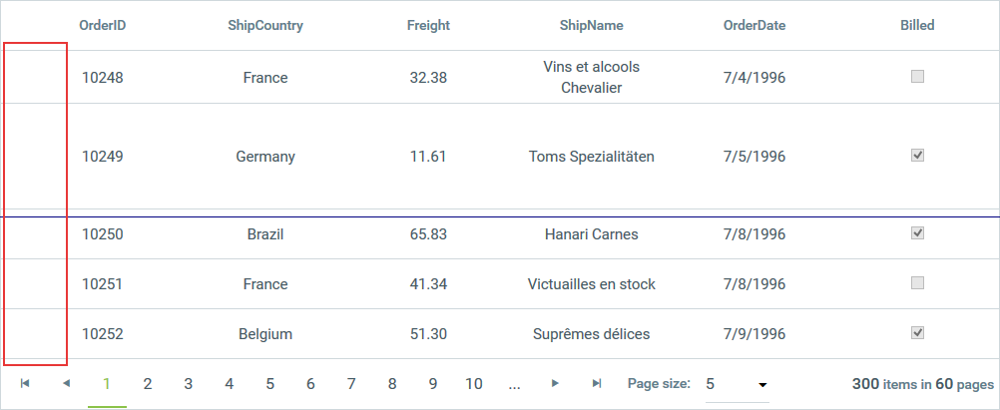

# Column Types


__RadGrid__ supports two main types of columns:

* __Data columns__, which display the data you bind to the grid or contain controls that operate on the data in the grid.

* __Structure columns__, which facilitate some feature of the grid, such as grouping or resizing.

## Data Columns

Data columns display data or contain controls that operate on the data. They can be automatically generated, created at design time using the [RadGrid Property Builder](), or added dynamically at runtime to the __Columns__ property collection.

Automatically-generated columns are added at runtime when the __AutoGenerateColumns__ of the table view is set to __true__. When you use automatically-generated columns, a column is added for every field of the [data source]() to which the table view is bound. These columns can be accessed using the __AutoGeneratedColumns__ property collection.

>note Automatically-generated columns are aware of the data type of the field they display (similar to the way the ASP.NET __GridView__ control works).
>


Explicitly-created columns (columns created in the __Property Builder__ or at runtime) are added to the __Columns__ property collection. They appear in the table view in the order in which they are declared and before any automatically-generated columns (unless you order the columns programmatically).

>caution Automatically generated columns are created for every field in the data source. If you have explicitly created columns as well, this can result in duplicated columns.
>


The following excerpt shows a __RadGrid__ declaration with explicitly-created columns. This method of declaring the columns is called column binding:

````ASPNET
	  <telerik:RadGrid ID="RadGrid1" runat="server">
	    ...
	    <MasterTableView DataSourceID="ProductsDataSource" TableLayout="Auto">
	      ...
	      <Columns>
	        <telerik:GridBoundColumn DataField="ProductID" DataType="System.Int32" HeaderText="Product ID"
	          SortExpression="ProductID" UniqueName="ProductID">
	        </telerik:GridBoundColumn>
	        <telerik:GridBoundColumn DataField="ProductName" HeaderText="Product Name" SortExpression="ProductName"
	          UniqueName="ProductName">
	        </telerik:GridBoundColumn>
	        <telerik:GridBoundColumn DataField="UnitPrice" DataType="System.Decimal" HeaderText="Unit Price"
	          SortExpression="UnitPrice" UniqueName="UnitPrice">
	        </telerik:GridBoundColumn>
	      </Columns>
	      ...
	    </MasterTableView>
	  </telerik:RadGrid>
````


## Column Types

There are several different column types. Different column types support different editors, different filtering options, and so on.

Every data column type has the following Boolean properties:

* __Exportable__ - Determines whether the column should be included into the exported file or not.

* __Display__ - Determines whether the column is displayed in browser mode. When __Display__ is __False__, the column is rendered in the browser but all the cells are styled with "*display: none*", so that they are not visible to the user.__Display__ does not affect whether the column editor is visible in an edit form, but if the table view uses an in-place editor, the column editor does not appear.

* __Visible__ - Determines whether the column is rendered in browser mode. When __Visible__ is __False__, the column is not even rendered in the browser. __Visible__ does not affect whether the column editor is visible in an edit form, but if the table view uses an in-place editor, the column editor does not appear.

In addition, editable column types (column types that implement the __IGridEditableColumn__ interface)have a __ReadOnly__ property that determines whether the column editor is visible in the[edit form](). When __ReadOnly__is __True__, the column editor does not appear in the edit form. __ReadOnly__does not affect whether the column is visible in browser mode.

>note None of these three properties prevents you from accessing the column cell's content server-side using the __UniqueName__ of the column.
>


>note As of Q1 2013, a column with the __Visible__ property set to __False__ is no longer able to access the column cell's content. You can find additional information in this[forum thread.](http://www.telerik.com/community/forums/aspnet-ajax/grid/breaking-change-hidden-column-cell-text-is-not-persisted-in-viewstate.aspx)
>


In order to provide more control over the editing process, every editable column also has an __InsertVisiblityMode__ propertythat determines whether an editor will be displayed in the insert item. You can set the property to one of three values:

* __Default__ - The visibility is dependent on the __ReadOnly__ property.

* __AlwaysVisible__ - The editor is always visible in the insert item.

* __AlwaysHidden__ - An editor is not shown in the insert item.

With explicitly-created columns, you can choose the column type you consider most appropriate. The different column types for data columns are listed in __Table 1__:

__Table 1__: Click on a column type to jump to its section for more information.


| [GridAutoCompleteColumn](#gridautocompletecolumn) | [GridClientSelectColumn](#gridclientselectcolumn) | [GridTemplateColumn](#gridtemplatecolumn) |
| ------ | ------ | ------ |
|[GridBoundColumn](#gridboundcolumn)|[GridDragDropColumn](#griddragdropcolumn)|[GridAttachmentColumn](#gridattachmentcolumn)|
|[GridButtonColumn](#gridbuttoncolumn)|[GridDropDownColumn](#griddropdowncolumn)|[GridRatingColumn](#gridratingcolumn)|
|[GridEditCommandColumn](#grideditcommandcolumn)|[GridDateTimeColumn](#griddatetimecolumn)|[GridRowIndicatorColumn](#gridrowindicatorcolumn)|
|[GridHyperLinkColumn](#gridhyperlinkcolumn)|[GridNumericColumn](#gridnumericcolumn)|[GridGroupSplitterColumn](#gridgroupsplittercolumn)|
|[GridImageColumn](#gridimagecolumn)|[GridMaskedColumn](#gridmaskedcolumn)|[GridExpandColumn](#gridexpandcolumn)|
|[GridBinaryImageColumn](#gridbinaryimagecolumn)|[GridHTMLEditorColumn](#gridhtmleditorcolumn)||
|[GridCheckBoxColumn](#gridcheckboxcolumn)|[GridCalculatedColumn](#gridcalculatedcolumn)||

## GridAutoCompleteColumn

When in browser mode, the column looks and behaves like __GridBoundColumn__. It renders text inside the cell, depending on the DataField of the column and the data source of the owner GridTableView. In insert/edit mode, it displays __RadAutoCompleteBox__ foreach edited cell in the column.

To configure the column you can use these properties, valid for most of the other columns as well:

* __EmptyDataText__ - Sets or gets default text when the column is empty. Default value is "&nbsp;"

* __AllowSorting__ - Gets or sets whether the column data can be sorted.

* __AllowFiltering__ - A Boolean property that specifies whether filtering will be enabled for the column.

* __DataField__ - Set the column in the grid's data source containing values to be	displayed and used for the __RadAutoCompleteBox__ initially in edit mode.

Further configuration of the __RadAutoCompleteBox__ used in edit mode is possible using these properties exposed in both	__GridAutoCompleteColumn__ and in __GridAutoCompleteColumnEditor__, which is the default editor for the column:

* __InputType__ - Gets or sets a value indicating how the __RadAutoCompleteBox__ items should be displayed—as tokens or as text.

* __Filter__ - Gets or sets a value indicating whether the __RadAutoCompleteBox__ should apply “Contains” or “StartsWith” filter logic.

* __AllowCustomEntry__ - Gets or sets a value indicating whether the user will be able to add a custom text not present within the raw data in orderto create a custom entry.

* __SelectionMode__ - Gets a value indicating whether the user can select multiple entries.

* __AllowTokenEditing__ - Gets a value indicating whether the text of the __RadAutoCompleteBox__ Tokens can be editedwhen a user double-clicks it.

* __Delimiter__ - Gets or sets a value indicating what delimiter should be used when the control displays the selected items as text (__InputType__ = Text).

* __DataTextField__ - Gets or sets the __DataTextField__ of the __RadAutoCompleteBox__.

* __DataValueField__ - Gets or sets the __DataValueField__ of the __RadAutoCompleteBox__.

You can find more information about the properties of	__RadAutoCompleteBox__ in the help topics of the control:[InputType](http://www.telerik.com/help/aspnet-ajax/autocompletebox-input-types.html),	[Filter](http://www.telerik.com/help/aspnet-ajax/autocompletebox-filtering.html),	[AllowCustomEntry](http://www.telerik.com/help/aspnet-ajax/autocompletebox-items-selection.html),	[SelectionMode](http://www.telerik.com/help/aspnet-ajax/autocompletebox-selection-mode.html), and [AllowTokenEditing](http://www.telerik.com/help/aspnet-ajax/autocompletebox-token-editing.html).

You can find information about binding __RadAutoCompleteBox__ in this help article:[RadAutoCompleteBox - Data Binding Overview](http://www.telerik.com/help/aspnet-ajax/autocompletebox-databinding-overview.html).

## GridBoundColumn

__GridBoundColumn__ displays a table view column bound to a field in the data source of the table view that contains it. To bind this column type to a field, set its __DataField__ property to the name of a field.

This column supports editing of its data (it implements the __IGridEditableColumn__ interface) and provides, by default, __GridTextBoxColumnEditor__ as a column editor to allow editing the text for each cell. It also exposes the __HtmlEncode__ property (its default value is __False__) which specifies whether the text in the corresponding cell will be encoded automatically or not when displayed in the browser. You can find more information about the nature of HTML encoding here:

[http://msdn.microsoft.com/en-us/library/system.web.httpserverutility.htmlencode.aspx](http://msdn.microsoft.com/en-us/library/system.web.httpserverutility.htmlencode.aspx)

Moreover, the built-in __GridBoundColumn__ has an __EmptyDataText__ property, which specifies the text that will be displayed in the column cell when it has an empty/null value retrieved from the data source.

The following declaration shows a __GridBoundColumn__:

````ASPNET
	  <telerik:GridBoundColumn DataField="UnitPrice" DataType="System.Decimal" HeaderText="Unit Price"
	    SortExpression="UnitPrice" UniqueName="UnitPrice">
	  </telerik:GridBoundColumn>
````


## GridButtonColumn

__GridButtonColumn__ displays a button for each entry in the column. This button can then perform some command.

There are two types of button columns with pre-defined commands:

* __Select__ - When a button in this column is pressed, the entire row is selected.

* __Delete__ - When a button in this column is pressed, the entire row is deleted.

In addition, you can add a generic button column and specify what command it performs by setting the __CommandName__ (and__CommandArgument__) properties. For details on using commands, see[Command Reference (Event Bubbling in Telerik RadGrid)]().

In addition to specifying the command a button performs, you can specify the type of button the column displays. The available buttons types are:__PushButton__, __LinkButton__ and __ImageButton__. __Image 1__ shows a grid with each ofthese types of button columns:

__Image 1__: __GridButtonColumn__ with different types of buttons

## GridEditCommandColumn

Initially, the __GridEditCommandColumn__ displays only an Edit button as shown in __Image 2__.

__Image 2__: Edit link displayed in __GridEditCommandColumn__

When the user presses the Edit button, if the table view is configured for in-line editing, the Update and Cancel buttons appear in place of the Edit button andthe cells on the row become editable.

__Image 3__: __RadGrid__ row in edit mode

>note The previous images showed an Edit command column that uses a link button. Like the __GridButtonColumn__ , the __GridEditCommandColumn__ can also use an image button or a push button.
>


## GridHyperLinkColumn

Each cell in a __GridHyperLinkColumn__ contains a predefined hyperlink.

To specify the text of the link, you can do one of the following:

* Set the __Text__ property to a static value. When you use this method, every link appears the same in the entire column.

* Set the __DataTextField__ property to a field that supplies the text for the link. When you use this method, you can format the text that comes from the database by setting the __DataTextFormatString__ property.

To specify the target of the hyperlink, set the __DataNavigateUrlFields__ property. You can specify multiple fields if the target of the hyperlink is determined by more than one field in the database. You can then combine the navigate URL fields by specifying a format string as the value of the __DataNavigateUrlFormatString__ property. Additionally, you can set the __ImageUrl__ property to override the text property of the hyperlink column and render an image.

The following example shows the declaration of a __GridHyperLinkColumn__:

````ASPNET
	  <telerik:GridHyperLinkColumn DataTextFormatString="Search Google for '{0}'" DataNavigateUrlFields="CompanyName"
	    UniqueName="CompanyName" DataNavigateUrlFormatString="http://www.google.com/search?hl=en&amp;q={0}&amp;btnG=Google+Search"
	    DataTextField="CompanyName">
	  </telerik:GridHyperLinkColumn>
````


## GridImageColumn

Each cell in a __GridImageColumn__ contains an image. To specify the image URL of that image, you can do one of the following:

* Set the __ImageUrl__ property to a static value. When you use this method, every image appears the same in the entire column.

* Set the __DataImageUrlFields__ property to a field in the source that can be used to supply the image path and format it by setting the __DataImageUrlFormatString__ property. You can specify multiple fields if the image URL is determined by more than one field in the database.

* Set the __DataAlternateTextField__ property to specify by which field in the grid source the column will be sorted/filtered. For the filtering, you must also explicitly set the __DataType__ property of the column to the type of the field specified through the __DataAlternateTextField__ property (__System.String__ in the common case). You can also apply formatting using the __DataAlternateTextFormatString__ property.

>note Note that if you specify a sort expression directly through the __SortExpression__ property of the column, it will have a higher priority and	will override the sort/filter criteria of the __DataAlternateTextField__ property.
>


Other commonly used properties for that column are __AlternateText__, __ImageAlign__, __ImageWidth__, __ImageHeight__, etc. The following example shows the declaration of a GridImageColumn from [this online demo](http://demos.telerik.com/aspnet-ajax/grid/examples/generalfeatures/columntypes/defaultcs.aspx) of the product:

````ASPNET
	  <telerik:GridImageColumn DataType="System.String" DataImageUrlFields="CustomerID"
	    DataImageUrlFormatString="IMG/{0}.jpg" AlternateText="Customer image" DataAlternateTextField="ContactName"
	    ImageAlign="Middle" ImageHeight="110px" ImageWidth="90px" HeaderText="Image Column"
	    FooterText="ImageColumn footer">
	  </telerik:GridImageColumn>
````


## GridBinaryImageColumn

Each cell in a __GridBinaryImageColumn__ contains an image streamed from a binary image source field (specified through the __DataField__ property of the column). When used, this column will show a __RadBinaryImage__ control in view mode and __RadUpload__ or__RadAsyncUpload__ in edit mode to upload an image. The type of upload is determined by the __UploadControlType__ property. Additionally, you can persist the binary data when an item is opened for edit by setting the __PersistBinaryDataOnEdit__ property to __true__. This will force the control to pass the old binary image to the data source so it could be persisted and not deleted.

The image will be sized automatically to __ImageHeight__ and __ImageWidth__ pixel values if the __ResizeMode__ property of the column is different than __None__. Possible values for the __ResizeMode__ property of the column are:

* __Crop__ (the image will be trimmed)

* __Fit__ (the image will be sized to fit the given dimensions)

* __None__ (default)

Additionally, you can set the __DataAlternateTextField__ property to specify by which field in the grid source the column will besorted/filtered. For the filtering, you must also explicitly set the __DataType__ property of the column to the type of the field specifiedthrough the __DataAlternateTextField__ property (__System.String__ in the common case). You can also apply formatting using the__DataAlternateTextFormatString__ property.

>note Note that if you directly specify a sort expression through the __SortExpression__ property of the column, it will have higher priority and will override the sort/filter criteria of the __DataAlternateTextField__ property.
>


Other commonly used properties for that column are __AlternateText__, __ImageAlign__, __ImageWidth__,__ImageHeight__, __DefaultImageUrl__ (to set the default image when a null value is returned from the source), etc. The followingexample shows the declaration of a __GridBinaryImageColumn__ from [this online demo](http://demos.telerik.com/aspnet-ajax/controls/examples/integration/raduploadinajaxifiedgrid/defaultcs.aspx?product=grid) of the product.

````ASPNET
	  <telerik:GridBinaryImageColumn DataField="Data" HeaderText="Image" UniqueName="Upload"
	    ImageHeight="60px" ImageWidth="60px" ResizeMode="Fit">
	  </telerik:GridBinaryImageColumn>
````


## GridCheckBoxColumn

__GridCheckBoxColumn__ displays a check box to represent a Boolean value. Bind this column type to a Boolean field by setting its__DataField__ property. If this column type is bound to a data value that is not Boolean, the grid throws an exception.

When the grid is in browser mode, or if the column is read-only, the check box is disabled. When the column is editable, the check box is enabled.__GridCheckBoxColumn__ implements the __IGridEditableColumn__ interface, and by default, it provides a__GridCheckBoxListColumnEditor__ for editing items.

The following example shows the declaration of a __GridCheckBoxColumn__:

````ASPNET
	  <telerik:GridCheckBoxColumn UniqueName="BoolField" HeaderText="CheckBox Column" DataField="BoolField"
	    AllowSorting="true">
	  </telerik:GridCheckBoxColumn>
````


>note See the ____ section below for a comparison between __GridCheckBoxColumn__ and a template column that contains a check box.
>


## GridClientSelectColumn

__GridClientSelectColumn__ also displays a check box control for each cell in the column. Unlike __GridCheckBoxColumn__, however, this column type does not represent a Boolean data value. Instead, it acts a bit like a __GridButtonColumn__ with its __CommandName__ set to "Select" or "Deselect". This column type lets users select or deselect grid rows automatically by selecting or clearing each check box. To allow selection through the client select column only, the __ClientSettings.Selecting.UseClientSelectColumnOnly__ property should be set to __True__ (default value is __False__).

>caution When using __GridClientSelectColumn__ , you must set the grid's __ClientSettings.Selecting.AllowRowSelect__ property to __True__ .
>


If the grid's __AllowMultiRowSelection__ property is __True__, a check box is displayed in the column header as well as the rows of the grid. When the user clicks the check box in the header, the check box in every row of the current page of the grid changes to match the checked state of the check box in the header (and the row is selected or deselected, accordingly):

__Image 4__: __RadGrid__ rows selected with __GridClientSelectColumn__

## GridDragDropColumn

When [Items Drag-and-Drop](http://www.telerik.com/help/aspnet-ajax/drag-drop-grid-items.html) is enabled in __RadGrid__, defining a __GridDragDropColumn__ in the __Columns__ collectionof the respective __GridTableView__ will make the data items inside draggable only when grabbed by the drag handle inside the column cells.

__Image 5__: Dragging a row using __GridDragDropColumn__

## GridDropDownColumn

When in browser mode, __GridDropDownColumn__ looks and behaves like a standard __GridBoundColumn__. When in edit mode, however, it displays a drop-down control for each edited cell in the column. This column type is useful for lookup fields from data tables. To bind this column type:

* Set the __DataField__ property to the name of a field in the data source of the table view that contains the column.

* Set the __DataSourceID__ property to the __ID__ of a data source control for the lookup list. If the data source contains multiple tables, set the __ListDataMember__ property to the name of the lookup table.

* Set the __ListTextField__ property to the name of the field in the lookup table that provides the text of items in the drop-down control.

* Set the __ListValueField__ property to the name of the field in the lookup table that supplies the value for the field specified by the __DataField__ property.

For more information on configuring __GridDropDownColumn__, see [Customize/Configure GridDropDownColumn]().

__GridDropDownColumn__ is editable (implements the __IGridEditableColumn__ interface) and provides, by default,	__GridDropDownListColumnEditor__ as its column editor. You can use the __DropDownControlType__ property to specify whether	the column editor uses a __RadComboBox__ or a standard __DropDownList__ as the column editor. The default editor is	__RadComboBox__.

````ASPNET
	  <telerik:GridDropDownColumn UniqueName="DropDownListColumn" ListTextField="ContactName"
	    ListValueField="ContactName" DataSourceID="SqlDataSource2" HeaderText="DropDown Column"
	    DataField="ContactName" DropDownControlType="RadComboBox" AllowSorting="true">
	  </telerik:GridDropDownColumn>
````


>note See the __[GridTemplateColumn](#gridtemplatecolumn)__ section below for a comparison between __GridDropDownColumn__ and a template column thatcontains a drop-down list.
>


## GridDateTimeColumn

When in browser mode, __GridDateTimeColumn__ looks and behaves like a standard __GridBoundColumn__. When in edit mode,however, it displays a __RadDateInput__, __RadDatePicker__, __RadTimePicker__, or__RadDateTimePicker__ control. This column type is for date and time values. Its __DataField__ property must identify afield with a valid data type (DateTime).

This column type is editable (implements the __IGridEditableColumn__ interface) and by default provides__GridDateTimeColumnEditor__ as its column editor. You can use the __PickerType__ property to specify the type of dataselection control the editor uses. The default editor/filter control (when filtering is enabled) is __RadDatePicker__.

>note The control for editable cells in this column type can be accessed through the editor's __TextBoxControl__ property (when using __RadDateInput__ editor) or the __PickerControl__ property (for __RadDatePicker__ , __RadDateTimePicker__ or __RadTimePicker__ editors).
>


````ASPNET
	  <telerik:GridDateTimeColumn DataField="OrderDate" HeaderText="GridDateTimeColumn"
	    UniqueName="OrderDate" PickerType="DatePicker" />
````


>note See the __[GridTemplateColumn](#gridtemplatecolumn)__ section below for a comparison between __GridDateTimeColumn__ and a template column that contains a __RadDatePicker__ , __RadTimePicker__ , __RadDateTimePicker__ or __RadDateInput__ control.
>


## GridNumericColumn

When in browser mode, __GridNumericColumn__ looks and behaves like a standard __GridBoundColumn__. When in edit mode, however, it displays a __RadNumericTextBox__ control. This column type is for numeric values. Its __DataField__ property must identify a field with a valid data type (Number or Decimal).

This column type is editable (implements the __IGridEditableColumn__ interface) and by default provides __GridNumericColumnEditor__ as its column editor.

When the property __DbValueFactor__ is set, it determines the multiplication factor applied by __RadNumericTextBox__ in edit/insert mode. In this case, the value is represented as a percentage according tothe aforementioned factor. __DbValueFactor__ is used along with the __NumericType__ property, which should be set to__Percent__. It is useful mostly when storing percent values as floating point numbers in the database. Thedefault value of the property is __1__.

````ASPNET
	  <telerik:GridNumericColumn DataField="Freight" HeaderText="GridNumericColumn" UniqueName="Freight">
	  </telerik:GridNumericColumn>
````


>note See the __[GridTemplateColumn](#gridtemplatecolumn)__ section below for a comparison between __GridNumericColumn__ and a template column that contains a __RadNumericTextBox__ control.
>


## GridMaskedColumn

When in browser mode, __GridMaskedColumn__ looks and behaves like a standard __GridBoundColumn__. When in edit mode, however, it displays a __RadMaskedTextBox__ control. This column type is for values that fit a specific format. Use the __Mask__ property to specify an edit mask that defines the valid values. The __DataField__ property must identify a field with a valid data type (values conform to the mask).

This column type is editable (implements the __IGridEditableColumn__ interface) and by default provides __GridMaskedColumnEditor__ as its column editor.

````ASPNET
	  <telerik:GridMaskedColumn UniqueName="PhoneNumber" HeaderText="Phone" DataField="PhoneNumber"
	    Mask="(###) ###-####" />
````


>note See the __[GridTemplateColumn](#gridtemplatecolumn)__ section below for a comparison between __GridMaskedColumn__ and a template column that contains a masked text box.
>


## GridHTMLEditorColumn

__GridHTMLEditorColumn__ is for columns whose values are a string of HTML. It uses __RadEditor__ to allow WYSIWYG editing of HTML values. The __DataField__ property must identify a field with a valid data type (string of HTML).

This column type is editable (implements the __IGridEditableColumn__ interface) and by default provides __GridHTMLEditorColumnEditor__ as its column editor.

````ASPNET
	  <telerik:GridHTMLEditorColumn UniqueName="Blurb" DataField="Blurb" HeaderText="GridHTMLEditorColumn">
	  </telerik:GridHTMLEditorColumn>
````


>note See the __[GridTemplateColumn](#gridtemplatecolumn)__ section below for a comparison between __GridHTMLEditorColumn__ and a template column that contains a __RadEditor__ control.
>


## GridCalculatedColumn

__GridCalculatedColumn__ displays a value that is calculated based on one or more fields and an expression that indicates how to calculate the display value. Use the __DataFields__ property to list all the fields that are used to calculate the column value. The __Expression__ property then specifies how the field values are to be combined, using parameters based on the order of the fields listed in the __DataFields__ property:

````ASPNET
	  <telerik:GridCalculatedColumn HeaderText="Total Cost" UniqueName="TotalCost" DataType="System.Double"
	    DataFields="UnitPrice, NumberOrdered" Expression="{0}*{1}" />
````


The following table lists the operators you can use in the expression of a calculated column (complete information about the *DataColumn.Expression* property and supported operators/functions can be found [here](http://msdn.microsoft.com/en-us/library/system.data.datacolumn.expression.aspx)).


|  __Operator__  |  __Meaning__  |
| ------ | ------ |
|+|Sums the values in the specified columns' cells|
|-|Subtracts the values in the specified columns' cells|
|*|Multiplies the values in the specified columns' cells|
|/|Divides the values in the specified columns' cells|

## GridTemplateColumn

__GridTemplateColumn__ displays each cell in the column in accordance with a specified template. This lets you provide custom controls in the column. You can view and set the templates for this column type using the __Edit Templates__ command on the __RadGrid__[ Smart Tag]().

__Image 5__: Set templates for __GridTemplateColumn__ using Smart Tag

>note You can also create the template columns programmatically and bind the controls in the code-behind.
>


>caution Please keep in mind that when adding a template column, it is also recommended that you declare an __ItemTemplate__ . If you do not need an __ItemTemplate__ , you can simply omit its contents and leave it empty. However, it should be declared, as some internal operations in the grid control rely on its presence.
>


The __Edit Templates__ command opens the template editor, where you can set the template as common HTML. The template editor displays four design surfaces:

* __ItemTemplate__ - The template that appears in column cells in browser mode.

* __EditItemTemplate__ - The template that appears in column cells in edit mode.

* __HeaderTemplate__ - A template for the column header.

* __FooterTemplate__ - A template for the column footer.

__Image 6__: Template editor for __GridTemplateColumn__

See [Getting Started]() for a tutorial that includes creating and binding a template column.

With the Q2 2012 release, __GridTemplateColumn__ exposes a __ClientItemTemplate__ that allows the rendering of pure HTML into the column cell and theevaluation of Kendo-like expressions. The template is used with client-side binding and has a binding context, which has the fields of the data itemobject, as well as some additional properties listed below:


>caption  

| Property | Description |
| ------ | ------ |
| __owner__ |The current __RadGrid__ instance. Can be used for calling methods of the component.|
| __format(value, format)__ |A formatting function that can format __Date__ and __Number__ values. This function is based on the MS AJAX __String.localeFormat(format, value)__ function.|
| __item__ |The original JSON data object that the template is binding to.|
| __index__ |The index of the currently data-binding item in the current page.|
| __dataIndex__ |The index of the item in the set of all __RadGrid__ data. This field has a meaning only when paging is enabled. It indicates the page-invariant index of the item.|
| __isSelected__ |Indicates if the current grid row is selected.|

The following syntax of the binding expressions is supported:


>caption  

| Format | Name | Description |
| ------ | ------ | ------ |
| __#= ... #__ | __Data__ |Evaluates the JavaScript code expression or a string property from the data item and outputs the result in the template.|
| __# ... #__ | __Code__ |Evaluates the JavaScript code expression inside. Does not output value.|
| __#: ... #__ | __HTML-encode__ |Same as the data expression, but HTML-encodes the result.|

__GridCheckBoxColumn__, __GridDropDownColumn__, __GridDateTimeColumn__, __GridNumericColumn__, __GridMaskedColumn__, and __GridHTMLEditorColumn__ all behave similarly to a __GridTemplateColumn__ with a check box, drop-down control, date selection control, __RadNumericTextBox__, __RadMaskedTextBox__, or __RadEditor__ control in the template, respectively. However, there are some important differences when using __GridTemplateColumn__. These are listed in the following table:


>caption  

|  __GridTemplateColumn__  |  __Other column types__  |
| ------ | ------ |
|In order to bind the controls inside the template, you must use a data binding expression on the appropriate control property. The example below shows how to do this for a __CheckBox__ column.|Each column type can be bound directly to the grid data source by setting the __DataField__ property.|
|In edit mode, the editor is __GridTemplateColumnEditor__ .|The column type generates an editor of the appropriate type (see the section for the specific column type). These editors make it easier to access the data when the column is in edit mode.|
|Check boxes in an __ItemTemplate__ can be selected and cleared, even when the column is in browser mode.|In browser mode, the check box in __GridCheckBoxColumn__ is disabled so that it acts as a display-only control.|
|Drop-down controls in the item template must be explicitly populated. This lets you populate a lookup list statically, when the data does not come from a lookup table.| __GridDropDownColumn__ automatically populates its drop-down list from a lookup list based on the __DataSourceID__ , __ListDataMember__ , __ListTextField__ and __ListValueField__ properties.|

````ASPNET
	  <telerik:GridTemplateColumn HeaderText="Check/UnCheck" UniqueName="TemplateColumn">
	    <EditItemTemplate>    
	        <asp:CheckBox id="editChkBox" runat="server"      
	        Checked='<%# Bind("Bool") %>'>     
	        </asp:CheckBox>   
	    </EditItemTemplate>
	    <ItemTemplate>      
	        <asp:CheckBox id="defaultChkBox" runat="server"      
	        Checked='<%# Eval("Bool") %>'>    
	        </asp:CheckBox>   
	    </ItemTemplate>
	  </telerik:GridTemplateColumn>
````


## GridAttachmentColumn

When you have attachments saved in your data source as a blob of binary data, __GridAttachmentColumn__ provides you an easy way to upload to and download straight from your data source. In normal mode, __GridAttachmentColumn__ displays a button to download the attachment associated with the respective data record. In edit mode, a __RadUpload__ or __RadAsyncUpload__ control provides the user the ability to upload an attachment into the data source. The type of upload control used is determined by the __UploadControlType__ property.

````ASPNET
	  <telerik:GridAttachmentColumn DataSourceID="SqlDataSource2" MaxFileSize="1048576"
	    EditFormHeaderTextFormat="Upload File:" HeaderText="Download" AttachmentDataField="BinaryData"
	    AttachmentKeyFields="ID" FileNameTextField="FileName" DataTextField="FileName"
	    UniqueName="AttachmentColumn">
	  </telerik:GridAttachmentColumn>
````


__GridAttachmentColumn__ works with an automatic data source control (specified through the __DataSourceID__ property) that retrieves the attachment from the underlying data source.

Here are some of the column's properties that need to be properly set up for successful download:

* __AttachmentKeyFields__ - Specifies the field names from __RadGrid__'s data source that are used to populate the attachment data source select parameters.

* __AttachmentDataField__ - Specifies the field from __GridAttachmentColumn's__ data source where the attachment is stored as binary data.

* __FileName__ - Specifies the file name of the downloaded attachment.

* __FileNameTextField__ - Specifies the name of the field from __RadGrid's__ data source, the values of which will be used as file names of the downloaded attachments.

* __FileNameTextFormatString__ - Specifies the format string used to format the value of the field specifies by the __FileNameTextField__ property.

In normal mode, __GridAttachmentColumn__ displays a download button in its cells. When configuring the download button, you can use properties already well-known from the __GridButtonColumn: ButtonType__, __ButtonCssClass__, __ImageUrl__ (for ButtonType="ImageButton"), __Text__, __DataTextField__ and __DataTextFormatString__.

In edit mode, a __RadUpload__ control is provided for uploading files to the column's data source. __GridAttachmentColumn__ provides the following properties related to the __RadUpload__ properties:

* __AllowedFileExtensions__ - Specifies the allowed file extensions.

* __MaxFileSize__ - Specifies the maximum allowed file size in bytes.

When a download button is clicked in a __GridAttachmentColumn__, __RadGrid__ fires the __ItemCommand__ event that can be used to either cancel the downloading, or to implement custom download logic. The event argument object can be cast to type __GridDownloadAttachmentCommandEventArgs__, providing additional properties related to the downloadedattachment.

* __AttachmentColumn__ - Reference to the __GridAttachmentColumn__ instance from which the download event is fired.

* __AttachmentKeyValues__ - A __Dictionary<string, object>__ collection containing the data key values for the attachment's data source, as well as additional data__*__.

* __FileName__ - The file name that will be given to the downloaded attachment.

````C#
	if (e.CommandName == RadGrid.DownloadAttachmentCommandName)
	{
	    e.Canceled = true;
	    GridDownloadAttachmentCommandEventArgs args = e as GridDownloadAttachmentCommandEventArgs;
	    string fileName = args.FileName;
	    int attachmentId = (int)args.AttachmentKeyValues["ID"];
	}			
````


The __ItemCommand__ event that bubbles in __RadGrid__ can also be fired using __GridItem.FireCommandEvent(string commandName, object commandArgument)__ on the server, or using __GridTableView.fireCommand(name, argument)__ on the client. For the server method, the __commandArgument__ object is the __AttachmentKeyValues__ property in the event argument that needs to be specified, while, on the client, __argument__ is the JSON equivalent of the same key/value collection.

````C#
	protected void DownloadButton_Click(object sender, EventArgs e)
	{
	    int attachmentId = Int32.Parse(FileNamesComboBox.SelectedValue);
	    string fileName = FileNamesComboBox.SelectedItem.Text;
	    Dictionary<string, object> parameters = new Dictionary<string, object>();
	    parameters["ColumnUniqueName"] = "AttachmentColumn";
	    parameters["FileName"] = fileName;
	    parameters["ID"] = attachmentId;
	    RadGrid1.Items[0].FireCommandEvent(RadGrid.DownloadAttachmentCommandName, parameters);
	}			
````


````JavaScript
	       var parameters = {};
	       parameters.ColumnUniqueName = "AttachmentColumn";
	       parameters.FileName = combo.get_text();
	       parameters.ID = +combo.get_value();
	       var json = Sys.Serialization.JavaScriptSerializer.serialize(parameters);
	       masterTable.fireCommand("DownloadAttachment", json);
````


>caution * The __AttachmentKeyValues__ contains all entries for all the attachment keys, as well as two additional entries. The first contains the attachment's file name (with key "FileName"), while the second (with key "ColumnUniqueName" is the __UniqueName__ of the __GridAttachmentColumn__ instance. Omitting to specify the first entry will result in the attachment to be streamed as a file with a default name, while omitting to specify the __UniqueName__ of the __GridAttachmentColumn__ instance will cause the event to be fired from the first found __GridAttachmentColumn__ in the parent __GridTableView's__ columns collection. If more than one __GridAttachmentColumn__ instance exists in the columns collection, specifying the correct column's unique name is essential.
>


For more information on __GridAttachmentColumn__, please refer to the [online demo.](http://demos.telerik.com/aspnet-ajax/grid/examples/generalfeatures/gridattachmentcolumn/defaultcs.aspx)

## GridRatingColumn

The __GridRatingColumn__ renders a __RadRating__ control and provides different options for conficuration.

* __ItemCount__ - Gets or sets the number of items __RadRating__ shows. The default value is 5.

* __SelectionMode__ - Gets or sets the __SelectionMode__ (Single or Continuous) property of the __RadRating__ control.

* __Precision__ - Gets or sets the __Precision__ property of the __RadRating__ control (whether users can select an exact portion, half or whole item).

* __IsDirectionReversed__ - Gets or sets the __IsDirectionReversed__ property of the __RadRating__ control.

* __AllowRatingInViewMode__ - Gets or sets a value indicating whether users are allowed to rate data items in view mode. The default value is __False__ (__RadRating__ is rendered __ReadOnly__ in view mode).

To retrieve or modify the value of the rating control in a given __RadGrid__ item programmatically, you can use two options:

1. Find the __RadRating__ control programmatically. The ID of the rating control in each column cell is __Rating_[ColumnUniqueName]__, where __[ColumnUniqueName]__ is the UniqueName of the __GridRatingColumn__ instance.

1. Use the __GridRatingColumnEditor__ instance for your rating column. This column editor type provides the read-only __Value__ property that returns the current rating value, and the __RatingControl__ property, returning a reference to the __RadRating__ control in the current grid item.

>note As the __GridRatingColumn__ renders a __RadRating__ control both in view and edit mode, the __GridRatingColumnEditor__ is always initialized. This means that you can access the editor using:
>GridEditableItem.EditManager.GetColumnEditor([ColumnUniqueName])
>even when the item is __not__ in edit mode, including when you want to access a modified rating value on postback with __AllowRatingInViewMode = true__ .
>Simirlary, GridEditableItem.ExtractValues(Hashtable values) will also return the modified rating value both in view and edit mode.
>


For a live demonstration, please check out the [GridRatingColumn online demo](http://demos.telerik.com/aspnet-ajax/grid/examples/generalfeatures/gridratingcolumn/defaultcs.aspx)

## Structure Columns

The columns that are created automatically to facilitate some functionality are called __Structure Columns__. These columns are added to the beginning of the rows of a table view and cannot be moved. There are threetypes of structure columns: __GridRowIndicatorColumn__, __GridGroupSplitterColumn__ and __GridExpandColumn__.

## GridRowIndicatorColumn

This column appears when [row resizing]() is enabled. It provides an easy location for users to click in order to resize the respective row. This column always appears immediately before the first data column. The figure below shows how you could click to drag the row’s height to be taller or shorter.

__Image 7__: Using __GridRowIndicatorColumn__ to change the height of a row in __RadGrid__

## GridGroupSplitterColumn

The __GridGroupSplitterColumn__ appears when [grouping]() is enabled. It contains controls that allow users to expand and collapse groups of rows. This column always appears first.

__Image 8__: __GridGroupSplitterColumn__ example

## GridExpandColumn

The __GridExpandColumn__ appears when the grid has a hierarchical structure. It lets the user expand and collapse detail tables in the grid. The expand column is always placed in front of all other grid content columns unless the grouping is enabled. In those cases, GridExpandColumn is after the __GridGroupSplitterColumn__.

You can also manually add other instances of this type of column (the last column in the first __DetailTable__ in the image below):

__Image 9__: Automatically and manually added instances of __GridExpandColumn__
