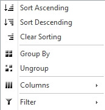

# Header Context Menu

This article explains how to enable and use the context menu for the header items of a RadGrid. It consists of the following sections:

* [Overview and how to enable the context menu](#overview=and=how=to=enable=the=context=menu)
* [Using header context menu for filtering](#using-header-context-menu-for-filtering)
* [Using HeaderContextMenu for showing column aggregates](#using-headercontextmenu-for-showing-column-aggregates)
* [Add items to HeaderContextMenu in order to set DataFormatString for the columns](#add-items-to-headercontextmenu-in-order-to-set-dataformatstring-for-the-columns)
* [Localize HeaderContextMenu items](#localize-headercontextmenu-items)
* [Set Custom CssClass to the HeaderContextMenu](#set-custom-cssclass-to-the-headercontextmenu)

## Overview and how to enable the context menu

The context menu can be enabled by setting the **EnableHeaderContextMenu** property of the corresponding **GridTableView** or column to **true** (the default value is false). The menu can be enabled/disabled for an entire **GridTableView** or for specific column only.


````ASP.NET
<MasterTableView CommandItemDisplay="Top" DataKeyNames="ID" EnableHeaderContextMenu="true">
    <Columns>
        <telerik:GridBoundColumn DataField="ID" HeaderText="ID" UniqueName="ID" EnableHeaderContextMenu="false">
        </telerik:GridBoundColumn>
        <telerik:GridBoundColumn DataField="Name" HeaderText="Name" UniqueName="Name">
        </telerik:GridBoundColumn>
        <telerik:GridBoundColumn DataField="Description" HeaderText="Description" UniqueName="Description">
        </telerik:GridBoundColumn>
    </Columns>
</MasterTableView>
````


[ This online demo ](http://demos.telerik.com/ASPNET/Prometheus/Grid/Examples/GeneralFeatures/HeaderContextMenu/DefaultCS.aspx) illustrates how to use a header context menu in RadGrid for ASP.NET AJAX. It is quite useful if you would like to process operations like sorting or grouping on a per-column basis or show/hide some of the grid columns based on the end user's preferences.



The header context menu exposes the following default options:

* Sort the column data in ascending/descending/none order.

* Group/ungroup the column data in case the grouping feature of the control is enabled.

* Show/hide grid columns client-side by changing the state of the checkboxes beside each column name.This feature can be seen drilling down to the second menu group under the 'Columns' option).

* Filter the column data on two conditions related with a logical AND operator.


Note that the items from the menu will be displayed dynamically depending on the grid configuration. For example, if the grouping feature is disabled the 'Group By'/'Ungroup' options will be hidden, or if you choose not to use natural sorting (AllowNaturalSort=false) the 'Clear Sorting' item will be absent.

The code snippets from the example are below:

````ASP.NET
<telerik:RadScriptManager ID="RadScriptManager1" runat="server">
</telerik:RadScriptManager>
<telerik:RadAjaxManager ID="RadAjaxManager1" runat="server">
  <AjaxSettings>
    <telerik:AjaxSetting AjaxControlID="RadGrid1">
      <UpdatedControls>
        <telerik:AjaxUpdatedControl ControlID="RadGrid1" />
      </UpdatedControls>
    </telerik:AjaxSetting>
  </AjaxSettings>
</telerik:RadAjaxManager>
<telerik:RadGrid RenderMode="Lightweight" ID="RadGrid1" Skin="Office2007" ShowGroupPanel="True" ShowStatusBar="true"
  runat="server" DataSourceID="SqlDataSource1" Width="95%" AutoGenerateColumns="False"
  PageSize="3" AllowSorting="True" AllowMultiRowSelection="False" AllowPaging="True"
  GridLines="None">
  <PagerStyle Mode="NextPrevAndNumeric"></PagerStyle>
  <MasterTableView Width="100%" DataSourceID="SqlDataSource1" DataKeyNames="CustomerID"
    AllowMultiColumnSorting="True" EnableHeaderContextMenu="true" TableLayout="Fixed">
    <DetailTables>
      <telerik:GridTableView DataKeyNames="OrderID" DataSourceID="SqlDataSource2" Width="100%"
        runat="server" EnableHeaderContextMenu="false" TableLayout="Fixed">
        <ParentTableRelation>
          <telerik:GridRelationFields DetailKeyField="CustomerID" MasterKeyField="CustomerID" />
        </ParentTableRelation>
        <DetailTables>
          <telerik:GridTableView DataKeyNames="OrderID" DataSourceID="SqlDataSource3" Width="100%"
            runat="server" EnableHeaderContextMenu="true" TableLayout="Fixed">
            <ParentTableRelation>
              <telerik:GridRelationFields DetailKeyField="OrderID" MasterKeyField="OrderID" />
            </ParentTableRelation>
            <Columns>
              <telerik:GridBoundColumn SortExpression="UnitPrice" HeaderText="Unit Price" DataField="UnitPrice"
                UniqueName="UnitPrice">
              </telerik:GridBoundColumn>
              <telerik:GridBoundColumn SortExpression="Quantity" HeaderText="Quantity" DataField="Quantity"
                UniqueName="Quantity">
              </telerik:GridBoundColumn>
              <telerik:GridBoundColumn SortExpression="Discount" HeaderText="Discount" DataField="Discount"
                UniqueName="Discount">
              </telerik:GridBoundColumn>
            </Columns>
            <GroupByExpressions>
              <telerik:GridGroupByExpression>
                <SelectFields>
                  <telerik:GridGroupByField FieldAlias="Quantity" FieldName="Quantity" FormatString=""
                    HeaderText=""></telerik:GridGroupByField>
                </SelectFields>
                <GroupByFields>
                  <telerik:GridGroupByField FieldAlias="Quantity" FieldName="Quantity" FormatString=""
                    HeaderText=""></telerik:GridGroupByField>
                </GroupByFields>
              </telerik:GridGroupByExpression>
            </GroupByExpressions>
          </telerik:GridTableView>
        </DetailTables>
        <Columns>
          <telerik:GridBoundColumn SortExpression="OrderID" HeaderText="OrderID" DataField="OrderID"
            UniqueName="OrderID">
          </telerik:GridBoundColumn>
          <telerik:GridBoundColumn SortExpression="OrderDate" HeaderText="Date Ordered" DataField="OrderDate"
            UniqueName="OrderDate">
          </telerik:GridBoundColumn>
          <telerik:GridBoundColumn SortExpression="EmployeeID" HeaderText="EmployeeID" DataField="EmployeeID"
            UniqueName="EmployeeID">
          </telerik:GridBoundColumn>
        </Columns>
      </telerik:GridTableView>
    </DetailTables>
    <Columns>
      <telerik:GridBoundColumn SortExpression="CustomerID" HeaderText="CustomerID" DataField="CustomerID"
        UniqueName="CustomerID">
      </telerik:GridBoundColumn>
      <telerik:GridBoundColumn SortExpression="ContactName" HeaderText="Contact Name" DataField="ContactName"
        UniqueName="ContactName" Groupable="false">
      </telerik:GridBoundColumn>
      <telerik:GridBoundColumn SortExpression="CompanyName" HeaderText="Company" DataField="CompanyName"
        UniqueName="CompanyName">
      </telerik:GridBoundColumn>
    </Columns>
  </MasterTableView>
  <ClientSettings ReorderColumnsOnClient="True" AllowDragToGroup="True" AllowColumnsReorder="True">
    <Resizing AllowRowResize="True" AllowColumnResize="True"></Resizing>
  </ClientSettings>
</telerik:RadGrid><br />
<br />
<asp:SqlDataSource ID="SqlDataSource1" ConnectionString="<%$ ConnectionStrings:NorthwindConnectionString %>"
  ProviderName="System.Data.SqlClient" SelectCommand="SELECT * FROM Customers" runat="server">
</asp:SqlDataSource>
<asp:SqlDataSource ID="SqlDataSource2" ConnectionString="<%$ ConnectionStrings:NorthwindConnectionString %>"
  ProviderName="System.Data.SqlClient" SelectCommand="SELECT * FROM Orders Where CustomerID = @CustomerID"
  runat="server">
  <SelectParameters>
    <asp:SessionParameter Name="CustomerID" SessionField="CustomerID" Type="string" />
  </SelectParameters>
</asp:SqlDataSource>
<asp:SqlDataSource ID="SqlDataSource3" ConnectionString="<%$ ConnectionStrings:NorthwindConnectionString %>"
  ProviderName="System.Data.SqlClient" SelectCommand="SELECT * FROM [Order Details] where OrderID = @OrderID"
  runat="server">
  <SelectParameters>
    <asp:SessionParameter Name="OrderID" SessionField="OrderID" Type="Int32" />
  </SelectParameters>
</asp:SqlDataSource>
````

>tip With R3 2019 version RadGrid provides the **SortHeaderContextMenuColumns** property. When enabled, it instructs the menu to present its Columns list in a sorted fashion. 

The text of Columns menu items is generated using the HeaderText property of the corresponding grid column. This property on the other hand is generated (by default) from the UniqueName of the column. If the HeaderText property is set explicitly in the column's definition to be empty, then the menu generates the item text using the UniqueName property. And if the `SortHeaderContextMenuColumns` grid property is enabled, the Columns menu items are ordered accordingly.

## Using header context menu for filtering

As of Q1 2010 RadGrid is equipped with a new filtering menu. It will be a sub-part of RadGrid's header context menu and will allow for filtering the grid's data on two conditions related with a logical AND operator. To switched on/off header context filter menu a new property has been introduced into the RadGrid control -**RadGrid.EnableHeaderContextFilterMenu/GridTableView.EnableHeaderContextFilterMenu**. In addition, it is important that **RadGrid.EnableHeaderContextMenu/GridTableView.EnableHeaderContextMenu** and **RadGrid.AllowFilteringByColumn/GridTableView.AllowFilteringByColumn** properties be set to true in order for the header context filter menu to be available. For the purpose of supporting this extension to RadGrid's filtering mechanism, each **GridColumn** will feature an additional current filter function/value properties that are set to contain the second filter condition data. These properties are called **AndCurrentFilterFunction**/**AndCurrentFilterValue:**

````ASP.NET
<telerik:GridBoundColumn CurrentFilterFunction="GreaterThan" CurrentFilterValue="2.5"
  AndCurrentFilterFunction="LessThan" AndCurrentFilterValue="5.0" DataField="Freight"
  DataType="System.Decimal" HeaderText="Freight" SortExpression="Freight" UniqueName="Freight">
</telerik:GridBoundColumn>
````


In spite of having been created to allow for filtering the grid on two conditions, the new menu will give the freedom to set only one of those. The condition for which no data has been set will beignored and RadGrid will filter its data only on the one for which a filter function and a filter value have been set. The filtering menu remains independent for each column - this means that the filtering menu options vary by the column's DataType and the properties of the special controls will depend on any other specific column properties such as Mask, DecimalDegits, PickerType etc.

The new filter menu can be used along-side the classic one. In this case, the GridTableView.IsFilterItemExpanded property should be set to **true** (the default value). When the two filter menus are switched on simultaneously, the data set for the first filter condition of the header context filter menu will be also set as filter data for the classic one and vice versa.If you want to use just the header context filter menu, then just set GridTableView.IsFilterItemExpanded property to **false** leaving, as mentioned above, the RadGrid.GridTableView/GridTableView.AllowFilteringByColumn property to **true**.

For more information on RadGrid header filtering menu, refer to [this blog post](http://blogs.telerik.com/tsvetoslavkovachev/posts/10-02-08/new_filtering_menu_for_radgrid_for_asp_net_ajax.aspx) and see the live example [here](http://demos.telerik.com/aspnet-ajax/Grid/Examples/GeneralFeatures/HeaderContextFilterMenu/defaultcs.aspx).

## Using HeaderContextMenu for showing column aggregates

From Q3 2010 on, RadGrid also enables showing column aggregates by using the HeaderContextMenu. You can turn the Aggregates submenu on and off by using the **RadGrid.EnableHeaderContextAggregatesMenu / GridTableView.RadGrid.EnableHeaderContextAggregatesMenu** property. This would be meaningful only if **RadGrid.EnableHeaderContextMenu / GridTableView.EnableHeaderContextMenu** is set to **true**.

The Aggregates menu will show the applicable aggregates for the current column, thus offering the user a choice which one to view. Apart from the ready to use aggregates, the menu also exposes an option for a custom one, which can be handled manually. You can declare your own aggregates in the column definitions and yet use the HeaderContextAggregatesMenu, as it will overwrite the aggregate shown in the footer.


````ASP.NET
<telerik:RadGrid RenderMode="Lightweight" AutoGenerateColumns="false" ID="RadGrid1" DataSourceID="SqlDataSource1"
  ShowFooter="True" runat="server" GridLines="None" EnableLinqExpressions="false"
  OnCustomAggregate="RadGrid1_CustomAggregate">
  <MasterTableView>
    <Columns>
      <telerik:GridBoundColumn DataField="Discontinued" FooterText=" " HeaderText="Discontinued"
        SortExpression="Discontinued" UniqueName="Discontinued">
      </telerik:GridBoundColumn>
    </Columns>
  </MasterTableView></telerik:RadGrid>
````
````C#
protected void RadGrid1_CustomAggregate(object sender, GridCustomAggregateEventArgs e)
{
    DataTable table;
    if (RadGrid1.MasterTableView.FilterExpression != String.Empty)
    {
        table = GetDataTable(SqlDataSource1.SelectCommand.ToString() + " WHERE " + RadGrid1.MasterTableView.FilterExpression);
    }
    else
    {
        table = GetDataTable(SqlDataSource1.SelectCommand.ToString());
    }
    int discontinued = 0;
    int notDiscontinued = 0;
    foreach (DataRow row in table.Rows)
    {
        if ((bool)row["Discontinued"])
        {
            discontinued++;
        }
        else
        {
            notDiscontinued++;
        }
    }
    e.Result = discontinued.ToString() + " items discontinued, " + notDiscontinued.ToString() + " not";
}
````
````VB
Protected Sub RadGrid1_CustomAggregate(ByVal sender As Object, ByVal e As Web.UI.GridCustomAggregateEventArgs) Handles RadGrid1.CustomAggregate
    Dim table As DataTable
    If Not RadGrid1.MasterTableView.FilterExpression Is [String].Empty Then
        table = GetDataTable(SqlDataSource1.SelectCommand.ToString() & " WHERE " & RadGrid1.MasterTableView.FilterExpression)
    Else
        table = GetDataTable(SqlDataSource1.SelectCommand.ToString())
    End If
    Dim discontinued As Integer = 0
    Dim notDiscontinued As Integer = 0
    For Each row As DataRow In table.Rows
        If DirectCast(row("Discontinued"), Boolean) Then
            discontinued += 1
        Else
            notDiscontinued += 1
        End If
    Next
    e.Result = discontinued.ToString() & " items discontinued, " & notDiscontinued.ToString() & " not"
End Sub
````


Note that in order to be able to show the aggregates, you need to have **ShowFooter** property of RadGrid / the respective GridTableView, or **ShowGroupFooter** (when grouping is enabled)set to **true**.

## Add items to HeaderContextMenu in order to set DataFormatString for the columns

You can modify the header context menu by add new items to the menu. To accomplish this task you need to reference RadGrid's HeaderContextMenu in the PreRenderComplete event handler. Thus you will be able to modify the Items collection of RadMenu. To add an item, you should create a new RadMenuItem instance and include it in the RadMenu's Items collection. The important point here is to add two attributes - "TableID" and "ColumnName". Those properties are required because on postback the grid retrieves the sent values in order to set new string format for the respective column (determined by the value of the ColumnName attribute)

Here is a code snippet illustrating the approach depicted above:


````C#
protected override void OnPreRenderComplete(EventArgs e)
{
    RadContextMenu menu = RadGrid1.HeaderContextMenu;
    RadMenuItem item = new RadMenuItem();
    item.Text = "Format";
    item.Attributes["ColumnName"] = string.Empty;
    item.Attributes["TableID"] = string.Empty;
    BuildColumnsMenu(item, RadGrid1.MasterTableView);
    menu.Items.Add(item);
    base.OnPreRenderComplete(e);
}
````
````VB
Protected Overloads Overrides Sub OnPreRenderComplete(ByVal e As EventArgs)
    Dim menu As RadContextMenu = RadGrid1.HeaderContextMenu
    Dim item As New RadMenuItem()
    item.Text = "Format"
    item.Attributes("ColumnName") = String.Empty
    item.Attributes("TableID") = String.Empty
    BuildColumnsMenu(item, RadGrid1.MasterTableView)
    menu.Items.Add(item)
    MyBase.OnPreRenderComplete(e)
End Sub
````


As you may noticed from this point you need to assign the correct values for the newly added attributes. This is done with the **BuildColumnsMenu() method.** Below is a code excerpt which demonstrates how to do that:


````C#
private void BuildColumnsMenu(IRadMenuItemContainer columnsParentItem, GridTableView tableView)
{
    if (tableView.EnableHeaderContextMenu)
    {
        foreach (GridColumn gridColumn in tableView.RenderColumns)
        {
            if (gridColumn is GridGroupSplitterColumn || gridColumn is GridExpandColumn || gridColumn is GridRowIndicatorColumn || !gridColumn.Visible)
                continue;
            PrepareItem(gridColumn, columnsParentItem);
        }
    }
}
private void PrepareItem(GridColumn column, IRadMenuItemContainer columnsParentItem)
{
    if (column.DataType == typeof(int))
    {
        RadMenuItem columnItem = new RadMenuItem();
        columnItem.Attributes["ColumnName"] = column.UniqueName;
        columnItem.Attributes["TableID"] = column.Owner.UniqueID;
        columnItem.Value = string.Format("{0}", "{0:D}");
        columnItem.Text = "Format D";
        columnItem.PostBack = true;
        columnsParentItem.Items.Add(columnItem);
        columnItem = new RadMenuItem();
        columnItem.Attributes["ColumnName"] = column.UniqueName;
        columnItem.Attributes["TableID"] = column.Owner.UniqueID;
        columnItem.Value = string.Format("{0}", "{0:D8}");
        columnItem.Text = "Format D8";
        columnItem.PostBack = true;
        columnsParentItem.Items.Add(columnItem);
    }
    else if (column.DataType == typeof(DateTime))
    {
        RadMenuItem columnItem = new RadMenuItem();
        columnItem.Attributes["ColumnName"] = column.UniqueName;
        columnItem.Attributes["TableID"] = column.Owner.UniqueID;
        columnItem.Value = string.Format("{0}", "{0:MM/dd/yyyy}");
        columnItem.Text = "Format MM/dd/yyyy";
        columnItem.PostBack = true;
        columnsParentItem.Items.Add(columnItem);
        columnItem = new RadMenuItem();
        columnItem.Attributes["ColumnName"] = column.UniqueName;
        columnItem.Attributes["TableID"] = column.Owner.UniqueID;
        columnItem.Value = string.Format("{0}", "{0:yyyy/MM/dd}");
        columnItem.Text = "Format yyyy/MM/dd";
        columnItem.PostBack = true;
        columnsParentItem.Items.Add(columnItem);
    }
}
````
````VB
Private Sub BuildColumnsMenu(ByVal columnsParentItem As IRadMenuItemContainer, ByVal tableView As GridTableView)
    If tableView.EnableHeaderContextMenu Then
        For Each gridColumn As GridColumn In tableView.RenderColumns
            If TypeOf gridColumn Is GridGroupSplitterColumn OrElse TypeOf gridColumn Is GridExpandColumn OrElse TypeOf gridColumn Is GridRowIndicatorColumn OrElse Not gridColumn.Visible Then
                Continue For
            End If
            PrepareItem(gridColumn, columnsParentItem)
        Next
    End If
End Sub

Private Sub PrepareItem(ByVal column As GridColumn, ByVal columnsParentItem As IRadMenuItemContainer)
    If column.DataType = GetType(Integer) Then
        Dim columnItem As New RadMenuItem()
        columnItem.Attributes("ColumnName") = column.UniqueName
        columnItem.Attributes("TableID") = column.Owner.UniqueID
        columnItem.Value = String.Format("{0}", "{0:D}")
        columnItem.Text = "Format D"
        columnItem.PostBack = True
        columnsParentItem.Items.Add(columnItem)

        columnItem = New RadMenuItem()
        columnItem.Attributes("ColumnName") = column.UniqueName
        columnItem.Attributes("TableID") = column.Owner.UniqueID
        columnItem.Value = String.Format("{0}", "{0:D8}")
        columnItem.Text = "Format D8"
        columnItem.PostBack = True
        columnsParentItem.Items.Add(columnItem)
    ElseIf column.DataType = GetType(DateTime) Then
        Dim columnItem As New RadMenuItem()
        columnItem.Attributes("ColumnName") = column.UniqueName
        columnItem.Attributes("TableID") = column.Owner.UniqueID
        columnItem.Value = String.Format("{0}", "{0:MM/dd/yyyy}")
        columnItem.Text = "Format MM/dd/yyyy"
        columnItem.PostBack = True
        columnsParentItem.Items.Add(columnItem)

        columnItem = New RadMenuItem()
        columnItem.Attributes("ColumnName") = column.UniqueName
        columnItem.Attributes("TableID") = column.Owner.UniqueID
        columnItem.Value = String.Format("{0}", "{0:yyyy/MM/dd}")
        columnItem.Text = "Format yyyy/MM/dd"
        columnItem.PostBack = True
        columnsParentItem.Items.Add(columnItem)
    End If
End Sub
````


With this implementation you will also need to wire the HeaderContextMenu.ItemClick event as follows:


````C#
protected void Page_Load(object sender, EventArgs e)
{
    RadGrid1.HeaderContextMenu.ItemClick += new RadMenuEventHandler(HeaderContextMenu_ItemClick);
}

protected void HeaderContextMenu_ItemClick(object sender, RadMenuEventArgs e)
{
    string tableID = e.Item.Attributes["TableID"];
    string columnName = e.Item.Attributes["ColumnName"];
    string format = e.Item.Value;
    GridTableView tableView = (GridTableView)this.Page.FindControl(tableID);
    GridBoundColumn column = (GridBoundColumn)tableView.GetColumn(columnName);
    column.DataFormatString = format;
    RadGrid1.Rebind();
}
````
````VB
Protected Sub Page_Load(ByVal sender As Object, ByVal e As EventArgs) Handles Me.Load
    AddHadler(RadGrid1.HeaderContextMenu.ItemClick, AddressOf Me.HeaderContextMenu_ItemClick)
End Sub

Sub HeaderContextMenu_ItemClick(ByVal sender As Object, ByVal e As RadMenuEventArgs)
    Dim tableID As String = e.Item.Attributes("TableID")
    Dim columnName As String = e.Item.Attributes("ColumnName")
    Dim format As String = e.Item.Value
    Dim tableView As GridTableView = DirectCast(Me.Page.FindControl(tableID), GridTableView)
    Dim column As GridBoundColumn = DirectCast(tableView.GetColumn(columnName), GridBoundColumn)
    column.DataFormatString = format
    RadGrid1.Rebind()
End Sub
````


Finally, we need to wire the *OnHeaderShowing* client event. In its event handler you need to hide all items which are not related with the visible columns. The following code snippet shows how to achieve this:


````ASP.NET
<ClientSettings>
    <ClientEvents OnHeaderMenuShowing="HeaderShowing" />
</ClientSettings>
````
````JavaScript
function HeaderShowing(sender, args) {
    args.get_menu().findItemByText("Format").get_items().forEach(function (item) {
        if (item.get_attributes().getAttribute("ColumnName") != args.get_gridColumn()._data.UniqueName)
            item.set_visible(false);
        else
            item.set_visible(true);
    });
}
````


## Localize HeaderContextMenu items

In some cases you might want to set custom texts for the grid HeaderContextMenu items. For that purpose you can handle the menu ItemCreated event as below:


````ASP.NET
<telerik:RadGrid RenderMode="Lightweight" ID="RadGrid1" runat="server" AllowFilteringByColumn="True" AllowPaging="True"
  AllowSorting="True" EnableHeaderContextFilterMenu="true" EnableHeaderContextMenu="true">
</telerik:RadGrid>
````
````C#
protected void Page_Load(object sender, EventArgs e)
{
    RadGrid1.HeaderContextMenu.ItemCreated += new Telerik.Web.UI.RadMenuEventHandler(HeaderContextMenu_ItemCreated);
}
protected void HeaderContextMenu_ItemCreated(object sender, Telerik.Web.UI.RadMenuEventArgs e)
{
    switch (e.Item.Value)
    {
        case "SortAsc":
            e.Item.Text = "Sort ascending";
            break;
        case "SortDesc":
            e.Item.Text = "Sort descending";
            break;
        case "SortNone":
            e.Item.Text = "Clear sorting";
            break;
        case "GroupBy":
            e.Item.Text = "Group by";
            break;
        case "UnGroupBy":
            e.Item.Text = "Ungroup";
            break;
        case "ColumnsContainer":
            e.Item.Text = "Show/Hide columns";
            break;
        case "FilterMenuParent":
            e.Item.Text = "Filter";
            break;
        case "FilterMenuContainer":
            Button btnClearFilter = e.Item.FindControl("HCFMClearFilterButton") as Button;
            //clear filter button       
            btnClearFilter.Text = "Clear filter";
            LiteralControl lcShowRows = e.Item.Controls[1] as LiteralControl;
            lcShowRows.Text = "<label class=\"rgHCMShow\">Show rows that:</label>";
            LiteralControl lcAnd = e.Item.Controls[5] as LiteralControl;
            lcAnd.Text = "<label class=\"rgHCMShow\">And also</label>";
            Button btnFilter = e.Item.FindControl("HCFMFilterButton") as Button;
            //filter button    
            btnFilter.Text = "Apply filters";
            break;
    }
}
````
````VB
Protected Sub Page_Load(ByVal sender As Object, ByVal e As EventArgs) Handles Me.Load
    AddHandler RadGrid1.HeaderContextMenu.ItemCreated, AddressOf Me.HeaderContextMenu_ItemCreated
End Sub
Private Sub HeaderContextMenu_ItemCreated(ByVal sender As Object, ByVal e As Telerik.Web.UI.RadMenuEventArgs)
    Select Case e.Item.Value
        Case "SortAsc"
            e.Item.Text = "Sort ascending"
            Exit Select
        Case "SortDesc"
            e.Item.Text = "Sort descending"
            Exit Select
        Case "SortNone"
            e.Item.Text = "Clear sorting"
            Exit Select
        Case "GroupBy"
            e.Item.Text = "Group by"
            Exit Select
        Case "UnGroupBy"
            e.Item.Text = "Ungroup"
            Exit Select
        Case "ColumnsContainer"
            e.Item.Text = "Show/Hide columns"
            Exit Select
        Case "FilterMenuParent"
            e.Item.Text = "Filter"
            Exit Select
        Case "FilterMenuContainer"
            Dim btnClearFilter As Button = TryCast(e.Item.FindControl("HCFMClearFilterButton"), Button) 'clear filter button
            btnClearFilter.Text = "Clear all filters"
            Dim lcShowRows As LiteralControl = TryCast(e.Item.Controls(1), LiteralControl)
            lcShowRows.Text = "<label class=""rgHCMShow"">Show rows that:</label>"
            Dim lcAnd As LiteralControl = TryCast(e.Item.Controls(5), LiteralControl)
            lcAnd.Text = "<label class=""rgHCMShow"">And also</label>"
            Dim btnFilter As Button = TryCast(e.Item.FindControl("HCFMFilterButton"), Button) 'filter button
            btnFilter.Text = "Apply filters"
            Exit Select
    End Select
End Sub
````

## Set Custom CssClass to the HeaderContextMenu

If you want to override the CSS rules of a header context menu, you have several options.

### Override the built in rules

You can cascade through the built-in class of the menu - `.GridContextMenu` and write additional selectors as needed. Here are a few examples:

````CSS
div.GridContextMenu .rmItem { /*change menu item color*/
color: red;
}
.GridContextMenu { /*change z-index which is an inline attribute*/
    z-index: 123456 !important;
}
````

### Add the custom class with JavaScript

You can use the `OnClientLoad` event of the menu to do that. Here is an example that adds a custom class from the server code. You can, of course, attach the event handlre in the markup and define the function together with the rest of your page scripts.

````C#
protected void Page_Load(object sender, EventArgs e)
{
    RadGrid1.HeaderContextMenu.OnClientLoad = string.Format("function(s,e){{$telerik.$(s.get_contextMenuElement()).addClass('{0}')}}", "myCustomClass");
}
````
````VB
Protected Sub Page_Load(ByVal sender As Object, ByVal e As EventArgs) Handles Me.Load
    RadGrid1.HeaderContextMenu.OnClientLoad = String.Format("function(s,e){{$telerik.$(s.get_contextMenuElement()).addClass('{0}')}}", "myCustomClass")
End Sub
````

### Add the custom class in the rendered markup

The grid changes the CssClass of the context menu contorl while rendering in order to add the `.GridContextMenu` class, and so the CssClass property gets overriden. To use it, you must hook to the `OnPreRenderComplete` event of the page:

````C#
protected override void OnPreRenderComplete(EventArgs e)
{
    base.OnPreRenderComplete(e);
    RadGrid1.HeaderContextMenu.CssClass += " myHeaderContextMenuClass";
}
````
````VB
Protected Overrides Sub OnPreRenderComplete(ByVal e As EventArgs)
    MyBase.OnPreRenderComplete(e)
    RadGrid1.HeaderContextMenu.CssClass += " myHeaderContextMenuClass"
End Sub
````


