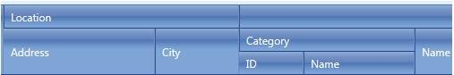

# Multicolumn Headers


The **MultiColumn Headers** of the RadGrid represent a tree-like structure where one or more columns can be grouped together by a common header. That common header in its turn can be child of another upper MultiColumn header which can also span both columns and other headers. On-line example demonstrating this functionality is available [here](https://demos.telerik.com/aspnet-ajax/grid/examples/columns-rows/columns/multi-column-headers/defaultcs.aspx).

## Structure rules

* A **MultiColumn Header** can be a child of only one other multicolumn header.

* A **MultiColumn Header** must span at least one column.

* A **MultiColumn Header** should be defined only for a single row header per level. Hence a multicolumn header always has **RowSpan=1**.

* A column can have as a parent only one **MultiColumn Header**.

* Each column header can span only a single column. Hence a column header always has **ColSpan=1**.

* A column surrounded (in order of definition) by other columns with common multi header cannot have a different multicolumn header on **the same or higher row level** than the columns that surround it. This rule ensures proper rendering and avoids overlapping of multicolumn headers.

## Definition

In order to define the MultiColumn Headers in RadGrid **Column Groups** should be set.
	
````ASP.NET
<ColumnGroups>
<telerik:GridColumnGroup HeaderText="Product Details" Name="ProductDetails"/>
<telerik:GridColumnGroup HeaderText="Location" Name="Location"/>
<telerik:GridColumnGroup HeaderText="Category" Name="Category" ParentGroupName="ProductDetails"/>
<telerik:GridColumnGroup HeaderText="Order Details" Name="OrderDetails" ParentGroupName="ProductDetails"/>
</ColumnGroups>
````


In order to add the needed column in the MultiColumn Header the **ColumnGroupName** property should be used:

	
````ASP.NET
<telerik:GridBoundColumn UniqueName="Address" DataField="Address" ColumnGroupName="Location" HeaderText="Address"/>
````       


The above definition will be presented in the following output:


## API Model

The described feature is presented by some additional properties related to the **GridTableView** and **GridColumn** objects. The **GridColumn** provides new **ColumnGroupName** property which is string type and sets the name of the multicolumn header (GridColumnGroup) to which the current column belongs. As for the **GridTableView**, two new properties are added. These properties are **HasMultiHeaders** which is boolean type and **ColumnGroups** which holds a collection of the multiheaders in the GridTableView and is **GridColumnGroupCollection** type.

The **GridColumnGroupCollection** type is a new type that implements StateManager and IComparable interface. This type presents the follwoing properties:


|  **Property**  |  **Type**  |  **Description**  |
| ------ | ------ | ------ |
| **HeaderText** | **String** |The text that will serve as a caption of the multicolumn header cell.|
| **Name** | **String** |The name that uniquely identifies each multicolumn header. Used to associate columns to it.|
| **ParentGroupName** | **String** |Holds the name of the parent multicolumn header of the current header. If not specified the multiheader is no the top level.|
| **HeaderStyle** | **TableItemStyle** |Defines styles for each multicolumn header style. See Styling section below for more info.|
| **ColSpan** | **Int** |Public ReadOnly. Return the number of spanned columns by the multicolumn header. Min value is 1.|
| **Visible** | **Bool** |Public ReadOnly. Returns whether a multicolumn header cell will be rendered as visible or not. True if at least one of its children (gridcolumn or columngroup) is visible, otherwise false.|
| **CompareTo** | **Int** |Implemetns standard comparison operation and also allows comparison between GridColumnGroups and ordinary GridColumns. Used to determine the proper order of the cells in each multiheader.|


