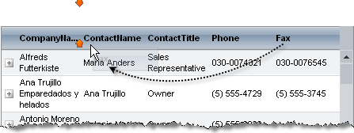

# Reordering


You can allow users to set the order of the grid columns by dragging and dropping them. Just set the **ClientSettings.AllowColumnsReorder** property to **True**. When the user drags a column header to a new location, the grid indicates where the column will be inserted when it is dropped:



Additionally, in case you enabled scrolling and have a horizontal scroll for navigation, the grid would be "smart" to auto-scroll when you drag columns and reach the end of the visible region (when you attempt to reorder the column with another outside of the visible area).

There are two possible modes for column reordering: client and server-side. If you want to reorder columns on client, set the **ClientSettings.ReorderColumnsOnClient** property to **True**.

* When columns are reordered on the client, The **ClientSettings.ColumnsReorderMethod** property determines what happens when the user drops a column in a new position.

	*  When **ColumnsReorderMethod** is "**Swap**" (the default), the dragged column switches places with the column that is currently in the target position. 

	* When **ColumnsReorderMethod** is "**Reorder**", all the columns between the dragged column's start position and its drop position shift over to make room for the dragged column. 

	Changes do not persist on the server until after a postback.

* When columns are reordered on the server, the grid uses the "swap" method multiple times to re-order columns.

>note The **GridExpandColumn** and **GridRowIndicatorColumn** are always in front of the data columns, so column indexes on the server start at index **2**.

>important When enabling column reordering, the table view's **EnableColumnViewState** property must be set to **True** (the default value).


## Reordering columns programmatically

When columns are created programmatically, they appear in the same order that they were added to the **Columns** collection. You can reorder columns dynamically in server-side code using any of the following methods:

* The **SwapColumns(String,String)** method accepts the **UniqueNames** for two columns to swap:

	**C#**
		
		grid.MasterTableView.SwapColumns("City","ContactName");			

	**VB**

		grid.MasterTableView.SwapColumns("City","ContactName")			


* The **SwapColumns(Int32,Int32)** method accepts the indexes of two columns to swap:

	**C#**
     
		grid.MasterTableView.SwapColumns(3, 4);				

	**VB**

		grid.MasterTableView.SwapColumns(3, 4)


* The **OrderIndex** property lets you change the position of columns to move them to a specific location:

	>caution When using the **OrderIndex** property to reorder columns, make sure that you assign values so that no two columns have the same index and no index is omitted.

	**C#**

		GridColumnCollection cols = grid.MasterTableView.Columns;
		GridColumn c = cols.FindByUniqueNameSafe(columnName);
		if (c != null){ 
		    int start = c.OrderIndex; 
		    for (int i= start; i < cols.Count; i++)  
		    { 
		        c = cols[i]; 
		        if (i < cols.Count - 1)   
		            c.OrderIndex = i+1;
		        else     
		            c.OrderIndex = start;  
		    }
		}			

	**VB**

		Dim cols As GridColumnCollection = grid.MasterTableView.Columns
		Dim c As GridColumn = cols.FindByUniqueNameSafe(columnName)
		If c IsNot Nothing Then
		Dim start As Integer = c.OrderIndex
		    For i As Integer = start To cols.Count - 1
			    c = cols(i)
			    If i < cols.Count - 1 Then
				    c.OrderIndex = i + 1
			    Else
				    c.OrderIndex = start
			    End If
		    Next
		End If


## Reordering columns with viewstate disabled

When working with disabled viewstate (see [Optimizing ViewState usage]()), **RadGrid** must rebind on each page load to maintain its state. Because of this, client-side column reordering does not work as expected in this mode. If you want to enable column re-ordering when working with **EnableViewState = false** for the grid, ensure that you set **ClientSettings.ReorderCoumnsOnClient** to **False** in order to reorder the grid columns on the server.


## Getting the user action

You can know which column the user dragged and at which index they dropped it, both on the server and on the client. Here are two examples:

>caption Get the user action on the server (the target index is the Source column index because the action has not occurred yet, because the event is cancellable)

````ASP.NET
<asp:Label ID="Label1" Text="" runat="server" />
<telerik:RadGrid RenderMode="Lightweight" ID="RadGrid2" DataSourceID="SqlDataSource1" runat="server" AllowPaging="True"
    GridLines="None" PageSize="10" OnColumnsReorder="RadGrid2_ColumnsReorder">
    <ClientSettings AllowColumnsReorder="true" ReorderColumnsOnClient="false">
        <%--<ClientEvents OnColumnSwapped="ColumnSwapped" />--%>
        <%--<Resizing AllowRowResize="True" EnableRealTimeResize="True" ResizeGridOnColumnResize="True"
            AllowColumnResize="True"></Resizing>--%>
    </ClientSettings>
    <PagerStyle Mode="NextPrevAndNumeric"></PagerStyle>
</telerik:RadGrid>
<asp:SqlDataSource ID="SqlDataSource1" ConnectionString="<%$ ConnectionStrings:NorthwindConnectionString %>"
    ProviderName="System.Data.SqlClient" SelectCommand="SELECT TOP 25 CustomerID, CompanyName, ContactName, ContactTitle, Address, PostalCode FROM Customers"
    runat="server"></asp:SqlDataSource>
````

````C#
protected void RadGrid2_ColumnsReorder(object sender, GridColumnsReorderEventArgs e)
{
    //the ExpandCollapseColumn and RowIndicatorColumn are at the beginning of the column list so you must subtract their number to get a 0-based value
    //the OrderIndex will be the actual position of the column and will be with 2 larger than 0 because of these columns
    string info = string.Format("Column {0} was moved to index {1}<br />", e.Target.UniqueName, e.Source.OrderIndex - 2);
 
    Label1.Text = info;
}
````
````VB
Protected Sub RadGrid2_ColumnsReorder(ByVal sender As Object, ByVal e As GridColumnsReorderEventArgs)
    'the ExpandCollapseColumn and RowIndicatorColumn are at the beginning of the column list so you must subtract their number to get a 0-based value
    'the OrderIndex will be the actual position of the column and will be with 2 larger than 0 because of these columns
    Dim info As String = String.Format("Column {0} was moved to index {1}<br />", e.Target.UniqueName, e.Source.OrderIndex - 2)
    Label1.Text = info
End Sub
````

>caption Get the user action on the client (the new column index is already the destination index because the action has occured, the OnColumnSwapping event behaves like the server event and you need to use the source column index)

````ASP.NET
<script>
	function ColumnSwapped(sender, eventArgs) {
		alert("Column with name: " + eventArgs.get_gridTargetColumn().get_uniqueName() + " was dragged to position: " +
			eventArgs.get_gridTargetColumn().get_element().cellIndex);
	}
</script>
<telerik:RadGrid RenderMode="Lightweight" ID="RadGrid2" DataSourceID="SqlDataSource1" runat="server" AllowPaging="True"
	GridLines="None" PageSize="10">
	<ClientSettings AllowColumnsReorder="true" ReorderColumnsOnClient="true">
		<ClientEvents OnColumnSwapped="ColumnSwapped" />
	</ClientSettings>
	<PagerStyle Mode="NextPrevAndNumeric"></PagerStyle>
</telerik:RadGrid>
<asp:SqlDataSource ID="SqlDataSource1" ConnectionString="<%$ ConnectionStrings:NorthwindConnectionString %>"
    ProviderName="System.Data.SqlClient" SelectCommand="SELECT TOP 25 CustomerID, CompanyName, ContactName, ContactTitle, Address, PostalCode FROM Customers"
    runat="server"></asp:SqlDataSource>
````

>note When **ColumnsReorderMethod** is "**Reorder**", the event will fire for each two columns that are swapped while reordering, so it will fire multiple times and discerning the exact user action is difficult.

## See Also

 * [Optimizing ViewState usage]()
