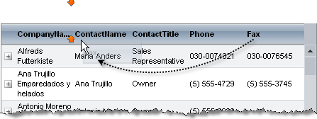

# Reordering


You can allow users to set the order of the grid columns by dragging and dropping them. Just set the **ClientSettings.AllowColumnsReorder** property to **True**. When the user drags a column header to a new location, the grid indicates where the column will be inserted when it is dropped:


Additionally, in case you enabled scrolling and have a horizontal scroll for navigation, the grid would be "smart" to auto-scroll when you drag columns and reach the end of the visible region (when you attempt to reorder the column with another outside of the visible area).

There are two possible modes for column reordering: client and server-side. If you want to reorder columns on client, set the **ClientSettings.ReorderColumnsOnClient** property to **True**.

* When columns are reordered on the client, The **ClientSettings.ColumnsReorderMethod** property determines what happens when the user drops a column in a new position. When **ColumnsReorderMethod** is "Swap" (the default), the dragged column switches places with the column that is currently in the target position. When **ColumnsReorderMethod** is "Reorder", all the columns between the dragged column's start position and its drop position shift over to make room for the dragged column. Changes do not persist on the server until after a postback.

* When columns are reordered on the server, the grid uses the "swap" method multiple times to re-order columns.

>caution When enabling column reordering, the table view's **EnableColumnViewState** property must be set to **True** (the default value).
>


## Reordering columns programmatically

When columns are created programmatically, they appear in the same order that they were added to the **Columns** collection. You can reorder columns dynamically in server-side code using any of the following methods:

* The **SwapColumns(String,String)** method accepts the **UniqueNames** for two columns to swap:


````C#
grid.MasterTableView.SwapColumns("City","ContactName");			
````
````VB
grid.MasterTableView.SwapColumns("City","ContactName")			
````


* The **SwapColumns(Int32,Int32)** method accepts the indexes of two columns to swap:


````C#	     
grid.MasterTableView.SwapColumns(3, 4);				
````
````VB
grid.MasterTableView.SwapColumns(3, 4)
````


>note Note that **GridExpandColumn** and **GridRowIndicatorColumn** are always in front of data columns, so column indexs start at index 2.
>


* The **OrderIndex** property lets you change the position of columns to move them to a specific location:


````C#
GridColumnCollection cols = grid.MasterTableView.Columns;
GridColumn c = cols.FindByUniqueName(columnName);
if (c != null){ 
    int start = c.OrderIndex; 
    for (int i= start; i < cols.Count; i++)  
    { 
        c = cols[i]; 
        if (i < cols.Count - 1)   
            c.OrderIndex = i+1;
        else     
            c.OrderIndex = start;  
    }
}			
````
````VB
Dim cols As GridColumnCollection = grid.MasterTableView.Columns
Dim c As GridColumn = cols.FindByUniqueName(columnName)
If c IsNot Nothing Then
Dim start As Integer = c.OrderIndex
    For i As Integer = start To cols.Count - 1
	    c = cols(i)
	    If i < cols.Count - 1 Then
		    c.OrderIndex = i + 1
	    Else
		    c.OrderIndex = start
	    End If
    Next
End If
````


>caution When using the **OrderIndex** property to reorder columns, make sure that you assign values so that no two columns have the same index and no index is omitted.
>


## Reordering columns with viewstate disabled

When working with disabled viewstate (see [Optimizing ViewState usage]()), **RadGrid** must rebind on each page load to maintain its state. Because of this, client-side column reordering does not work as expected in this mode. If you want to enable column re-ordering when working with **EnableViewState = false** for the grid, ensure that you set **ClientSettings.ReorderCoumnsOnClient** to **False** in order to reorder the grid columns on the server.

## See Also

 * [Optimizing ViewState usage]()
