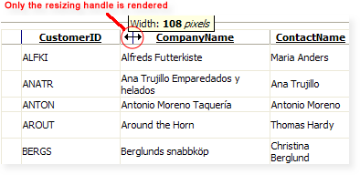
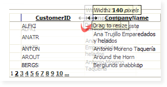
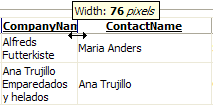

# Resizing


In general, **RadGrid** behaves like a normal **HTML Table**. If you have **table-layout: auto**, then column width is calculated according to the content of the cells. Otherwise column width are specified in **COLGROUP.COL.WIDTH** by the browser.

When scrolling is enabled (the **ClientSettings.Scrolling.AllowScroll** property is **True**) and the grid columns have static headers, **table-layout** is always **fixed** in Mozilla Firefox. Because of this, all columns are displayed with equal widths by default and the sum of all widths is equal to the width of RadGrid. If you want to change this behavior, you should provide a valid width attribute for the columns (using the **HeaderStyle-Width** property).

Another property that affects the **table-layout** attribute of the rendered grid is **ClientSettings.Resizing.ClipCellContentOnResize** (see below). When **ClipCellContentOnResize** is **True**, the **table-layout** attribute is set to **Fixed**.

## Resizable columns

If you want the columns in your grid to be resizable, set the **ClientSettings.Resizing.AllowColumnResize** property to **True**. When **AllowColumnResize** is **True**, users can resize columns by dragging the handle between column headers. The default value for this property is **false**.

>note If you want the rows to be resizable as well, set the **ClientSettings.Resizing.AllowRowResize** property to **True** . This allows users to drag the handle between two rows to resize them. The default value for this property is **False** .
>


When resizing is enabled (**AllowColumnResize** is **True**), you can disable column resizing for individual columns by setting the column's **Resizable** property to **False**. Setting a column's **Resizable** property has no effect if **AllowColumnResize** is **False**.

>note Note that after finishing resizing, the columns located on the right side of the current resized column, will beautomatically resized to eaqual portions. This is expected because the browser resize the rest of the columns by itself. The behavior could be avoided by enabling *ResizeGridOnColumnResize* .
>


## Real-Time Resizing

There are two modes of column resizing with respect to visualization:

* The content of the resized columns can be rendered real-time as the user drags the handle. This feature puts a significant load on client computer's CPU.

* Users can see only the handle moving during a resize operation, and only when the mouse is released are the resized columns rendered. In this mode, the load on the CPU is much lighter.

To specify whether columns are resized using real-time resizing, set the **ClientSettings.Resizing.EnableRealTimeResize** property. The default value for this property is **False**.

When **EnableRealTimeResize** is **False**, only the resizing handle is rendered:



When **EnableRealTimeResize** is **True**, the column content is rendered during resize:



## Resizing Grid on Column Resize

The **ClientSettings.Resizing.ResizeGridOnColumnResize** property lets you specify whether the entire grid changes size when its columns are resized.

When this property is set to **False** (the default), the grid preserves its size and resizes the rest of the columns evenly.

If you set **ResizeGridOnColumnResize** to **True**, the grid changes its size dynamically when the user resizes a column. All other columns retain their original sizes.

>note When using resizing with scrolling and static headers only the **GridTableView** is resized - RadGrid's width remains fixed.
>


## Clipping Cell Content On Resize

The **ClientSettings.Resizing.ClipCellContentOnResize** property controls whether users can resize a column to the point where it can't display its entire contents.

When **ClipCellContentOnResize** is **True** (the default), users can resize a column so that it is too narrow to display its entire contents. Instead, the content is clipped:



When **ClipCellContentOnResize** is **False**, users can't resize a column so that it is too narrow to display its entire contents. Instead, when the column reaches its minimum width, further dragging on the handle does not resize the column:


>note When scrolling is enabled and **UseStaticHeaders** property is set to **true** , **ClipCellContentOnResize** is always **true** .
>


## Resize to fit

With version Q3 2010, grid columns now support the **'resize to fit'** functionality. Double-clicking the resize handle or choosing 'Best Fit' from the grid header context menu will automatically resize the target column to fit the widest cell's content without wrapping. You can also use [resizeToFit]() client-side method to do this programmatically.


|  **To resize the target column to its best fit, select 'Best Fit' from its header context menu, or double-click its resize handle**  |  **After the column is resized to its best fit, it is as wide as its widest cell content without wrapping.**  |
| ------ | ------ |
|||


## Resize next column 

Since Q3 2015 **RadGrid** includes next column resize mode. To enable it you need to set the **EnableNextColumnResize** property to **true**. When this mode is enabled only the width of the currently resized column and the one after it will be changed. The rest of the columns in **RadGrid** will not be resized.

The following images show the columns before and after resizing with **EnableNextColumnResize** enabled.


| Before | After |
| ------ | ------ |
|||


## Configuring resizing modes

You can set the resizing-related properties declaratively at design time:

````ASP.NET
<telerik:RadGrid RenderMode="Lightweight" runat="server">
  <ClientSettings>
    <Resizing AllowColumnResize="True" AllowRowResize="false" ResizeGridOnColumnResize="false"
      ClipCellContentOnResize="true" EnableRealTimeResize="false" AllowResizeToFit="true" />
  </ClientSettings>
  ...
</telerik:RadGrid>
````


You can also set these properties at runtime in the code-behind:


````C#
RadGrid RadGrid1 = new RadGrid();
RadGrid1.ClientSettings.Resizing.AllowColumnResize = true;
RadGrid1.ClientSettings.Resizing.AllowRowResize = false;
RadGrid1.ClientSettings.Resizing.ResizeGridOnColumnResize = false;
RadGrid1.ClientSettings.Resizing.ClipCellContentOnResize = true;
RadGrid1.ClientSettings.Resizing.EnableRealTimeResize = false;
RadGrid1.ClientSettings.Resizing.AllowResizeToFit = false;
//...			
````
````VB
Dim RadGrid1 As RadGrid = New RadGridRadGrid1.ClientSettings.Resizing.AllowColumnResize = True
RadGrid1.ClientSettings.Resizing.AllowRowResize = false
RadGrid1.ClientSettings.Resizing.ResizeGridOnColumnResize = false
RadGrid1.ClientSettings.Resizing.ClipCellContentOnResize = true
RadGrid1.ClientSettings.Resizing.EnableRealTimeResize = false
RadGrid1.ClientSettings.Resizing.AllowResizeToFit = false
'...

````


