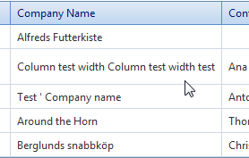

# Resizing


In general, __RadGrid__ behaves like a normal __HTML Table__. If you have __table-layout: auto__, then column width is calculated according to the content of the cells. Otherwise column width are specified in __COLGROUP.COL.WIDTH__ by the browser.

When scrolling is enabled (the __ClientSettings.Scrolling.AllowScroll__ property is __True__) and the grid columns have static headers, __table-layout__ is always __fixed__ in Mozilla Firefox. Because of this, all columns are displayed with equal widths by default and the sum of all widths is equal to the width of RadGrid. If you want to change this behavior, you should provide a valid width attribute for the columns (using the __HeaderStyle-Width__ property).

Another property that affects the __table-layout__ attribute of the rendered grid is __ClientSettings.Resizing.ClipCellContentOnResize__ (see below). When __ClipCellContentOnResize__ is __True__, the __table-layout__ attribute is set to __Fixed__.

## Resizable columns

If you want the columns in your grid to be resizable, set the __ClientSettings.Resizing.AllowColumnResize__ property to __True__. When __AllowColumnResize__ is __True__, users can resize columns by dragging the handle between column headers. The default value for this property is __false__.

>note If you want the rows to be resizable as well, set the __ClientSettings.Resizing.AllowRowResize__ property to __True__ . This allows users to drag the handle between two rows to resize them. The default value for this property is __False__ .
>


When resizing is enabled (__AllowColumnResize__ is __True__), you can disable column resizing for individual columns by setting the column's __Resizable__ property to __False__. Setting a column's __Resizable__ property has no effect if __AllowColumnResize__ is __False__.

>note Note that after finishing resizing, the columns located on the right side of the current resized column, will beautomatically resized to eaqual portions. This is expected because the browser resize the rest of the columns by itself. The behavior could be avoided by enabling *ResizeGridOnColumnResize* .
>


## Real-Time Resizing

There are two modes of column resizing with respect to visualization:

* The content of the resized columns can be rendered real-time as the user drags the handle. This feature puts a significant load on client computer's CPU.

* Users can see only the handle moving during a resize operation, and only when the mouse is released are the resized columns rendered. In this mode, the load on the CPU is much lighter.

To specify whether columns are resized using real-time resizing, set the __ClientSettings.Resizing.EnableRealTimeResize__ property. The default value for this property is __False__.

When __EnableRealTimeResize__ is __False__, only the resizing handle is rendered:


When __EnableRealTimeResize__ is __True__, the column content is rendered during resize:


## Resizing Grid on Column Resize

The __ClientSettings.Resizing.ResizeGridOnColumnResize__ property lets you specify whether the entire grid changes size when its columns are resized.

When this property is set to __False__ (the default), the grid preserves its size and resizes the rest of the columns evenly.

If you set __ResizeGridOnColumnResize__ to __True__, the grid changes its size dynamically when the user resizes a column. All other columns retain their original sizes.

>note When using resizing with scrolling and static headers only the __GridTableView__ is resized - RadGrid's width remains fixed.
>


## Clipping Cell Content On Resize

The __ClientSettings.Resizing.ClipCellContentOnResize__ property controls whether users can resize a column to the point where it can't display its entire contents.

When __ClipCellContentOnResize__ is __True__ (the default), users can resize a column so that it is too narrow to display its entire contents. Instead, the content is clipped:


When __ClipCellContentOnResize__ is __False__, users can't resize a column so that it is too narrow to display its entire contents. Instead, when the column reaches its minimum width, further dragging on the handle does not resize the column:


>note When scrolling is enabled and __UseStaticHeaders__ property is set to __true__ , __ClipCellContentOnResize__ is always __true__ .
>


## Resize to fit

With version Q3 2010, grid columns now support the __'resize to fit'__ functionality. Double-clicking the resize handle or choosing 'Best Fit' from the grid header context menu will automatically resize the target column to fit the widest cell's content without wrapping. You can also use [resizeToFit]() client-side method to do this programatically.


|  __To resize the target column to its best fit, select 'Best Fit' from its header context menu, or double-click its resize handle__  |  __After the column is resized to its best fit, it is as wide as its widest cell content without wrapping.__  |
| ------ | ------ |
|||

## Example

You can set the resizing-related properties declaratively at design time:

````ASPNET
	  <telerik:RadGrid runat="server">
	    <ClientSettings>
	      <Resizing AllowColumnResize="True" AllowRowResize="false" ResizeGridOnColumnResize="false"
	        ClipCellContentOnResize="true" EnableRealTimeResize="false" AllowResizeToFit="true" />
	    </ClientSettings>
	    ...
	  </telerik:RadGrid>
````


You can also set these properties at runtime in the code-behind:

>tabbedCode

````C#
	    RadGrid RadGrid1 = new RadGrid();
	    RadGrid1.ClientSettings.Resizing.AllowColumnResize = true;
	    RadGrid1.ClientSettings.Resizing.AllowRowResize = false;
	    RadGrid1.ClientSettings.Resizing.ResizeGridOnColumnResize = false;
	    RadGrid1.ClientSettings.Resizing.ClipCellContentOnResize = true;
	    RadGrid1.ClientSettings.Resizing.EnableRealTimeResize = false;
	    RadGrid1.ClientSettings.Resizing.AllowResizeToFit = false;
	    //...			
````
````VB.NET
	    Dim RadGrid1 As RadGrid = New RadGridRadGrid1.ClientSettings.Resizing.AllowColumnResize = True
	    RadGrid1.ClientSettings.Resizing.AllowRowResize = false
	    RadGrid1.ClientSettings.Resizing.ResizeGridOnColumnResize = false
	    RadGrid1.ClientSettings.Resizing.ClipCellContentOnResize = true
	    RadGrid1.ClientSettings.Resizing.EnableRealTimeResize = false
	    RadGrid1.ClientSettings.Resizing.AllowResizeToFit = false
	    '...
	
````
>end
