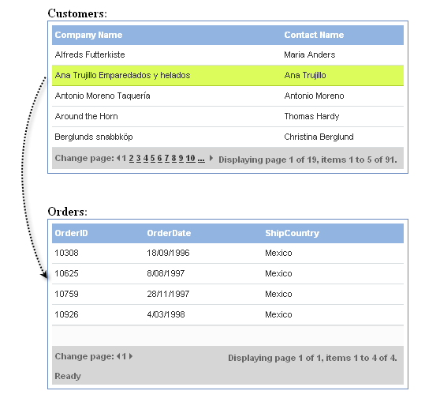

# Master Detail Grids


## 

**RadGrid** provides support for master/detail relationships that use related grids which appear side-by-side, rather than nesting detail grids inside the records of the grid that displays the master table.

To achieve this behavior,

1. Add each linking field from the master table (typically the **primary key field** names) to the **DataKeyNames** array of the related grid's **MasterTableView.**
2. On the data source for the "connected" grid, construct a **SelectParameter** of type **ControlParameter** for each linking field.
	* The **ControlID** of the **SelectParameter** should point to the related grid.
	* The **Name** property should match a field name that was added to the **DataKeyNames** property of the related grid's **MasterTableView**.
	* The **PropertyName** property should be "SelectedValue".
	* Optionally, you can set the **DefaultValue** and **Type** properties as well.
3. Alternatively, define similar SelectParameter using **SelectedValues['<FieldName>']** where <FieldName> represents a column in the grid source.



The following example shows how the screenshot above was generated:

````ASP.NET
<asp:ScriptManager ID="ScriptManager1" runat="server">
</asp:ScriptManager>
<strong>Customers:</strong>
<telerik:RadAjaxManager ID="RadAjaxManager1" runat="server">
  <AjaxSettings>
    <telerik:AjaxSetting AjaxControlID="RadGrid1">
      <UpdatedControls>
        <telerik:AjaxUpdatedControl ControlID="RadGrid1" />
        <telerik:AjaxUpdatedControl ControlID="RadGrid2" />
        <telerik:AjaxUpdatedControl ControlID="RadGrid3" />
      </UpdatedControls>
    </telerik:AjaxSetting>
    <telerik:AjaxSetting AjaxControlID="RadGrid2">
      <UpdatedControls>
        <telerik:AjaxUpdatedControl ControlID="RadGrid2" />
        <telerik:AjaxUpdatedControl ControlID="RadGrid3" />
      </UpdatedControls>
    </telerik:AjaxSetting>
    <telerik:AjaxSetting AjaxControlID="RadGrid3">
      <UpdatedControls>
        <telerik:AjaxUpdatedControl ControlID="RadGrid3" />
      </UpdatedControls>
    </telerik:AjaxSetting>
  </AjaxSettings>
</telerik:RadAjaxManager>
<telerik:RadGrid RenderMode="Lightweight" ID="RadGrid1" runat="server" AllowSorting="true" AllowPaging="true"
  PageSize="5" DataSourceID="SqlDataSource1" GridLines="None" Skin="Web20" Width="95%">
  <ClientSettings AllowKeyboardNavigation="true" EnablePostBackOnRowClick="true">
    <Selecting AllowRowSelect="true" />
  </ClientSettings>
  <MasterTableView DataKeyNames="CustomerID" />
  <PagerStyle Mode="NextPrevAndNumeric" />
</telerik:RadGrid>
<br />
<br />
<strong>Orders:</strong>
<telerik:RadGrid RenderMode="Lightweight" ID="RadGrid2" ShowStatusBar="true" runat="server" AllowSorting="True"
  AllowPaging="True" PageSize="5" DataSourceID="SqlDataSource2" GridLines="None"
  Skin="Web20" Width="95%" HorizontalAlign="NotSet">
  <MasterTableView Width="100%" AutoGenerateColumns="False" DataKeyNames="OrderID"
    DataSourceID="SqlDataSource2">
    <Columns>
      <telerik:GridBoundColumn DataField="OrderID" DataType="System.Int32" HeaderText="OrderID"
        ReadOnly="True" SortExpression="OrderID" UniqueName="OrderID">
      </telerik:GridBoundColumn>
      <telerik:GridBoundColumn DataField="OrderDate" DataType="System.DateTime" HeaderText="OrderDate"
        SortExpression="OrderDate" UniqueName="OrderDate" DataFormatString="{0:d}">
      </telerik:GridBoundColumn>
      <telerik:GridBoundColumn DataField="ShipCountry" HeaderText="ShipCountry" SortExpression="ShipCountry"
        UniqueName="ShipCountry">
      </telerik:GridBoundColumn>
    </Columns>
  </MasterTableView>
  <ClientSettings AllowKeyboardNavigation="true" EnablePostBackOnRowClick="true">
    <Selecting AllowRowSelect="true" />
  </ClientSettings>
  <PagerStyle Mode="NextPrevAndNumeric" />
</telerik:RadGrid>
<br />
<br />
<strong>Orders details:</strong>
<telerik:RadGrid RenderMode="Lightweight" ID="RadGrid3" ShowStatusBar="true" runat="server" AllowSorting="True"
  AllowPaging="True" PageSize="5" DataSourceID="SqlDataSource3" GridLines="None"
  Skin="Web20" Width="95%" HorizontalAlign="NotSet">
  <MasterTableView Width="100%" AutoGenerateColumns="False" DataKeyNames="OrderID"
    DataSourceID="SqlDataSource3">
    <Columns>
      <telerik:GridBoundColumn DataField="UnitPrice" HeaderText="Unit price" SortExpression="UnitPrice"
        UniqueName="UnitPrice">
      </telerik:GridBoundColumn>
      <telerik:GridBoundColumn DataField="Quantity" HeaderText="Quantity" SortExpression="Quantity"
        UniqueName="Quantity">
      </telerik:GridBoundColumn>
      <telerik:GridBoundColumn DataField="Discount" HeaderText="Discount (%)" SortExpression="Discount"
        UniqueName="Discount">
      </telerik:GridBoundColumn>
    </Columns>
  </MasterTableView>
  <PagerStyle Mode="NextPrevAndNumeric" />
</telerik:RadGrid>
<asp:SqlDataSource ID="SqlDataSource1" ConnectionString="<%$ ConnectionStrings:NorthwindConnectionString %>"
  ProviderName="System.Data.SqlClient" SelectCommand="SELECT CustomerID, CompanyName, ContactName, ContactTitle, Address, PostalCode FROM Customers"
  runat="server"></asp:SqlDataSource>
<asp:SqlDataSource ID="SqlDataSource2" ConnectionString="<%$ ConnectionStrings:NorthwindConnectionString %>"
  ProviderName="System.Data.SqlClient" SelectCommand="SELECT [OrderID], [OrderDate], [CustomerID], [ShipCountry] FROM [Orders] WHERE ([CustomerID] = @CustomerID)"
  runat="server">
  <SelectParameters>
    <asp:ControlParameter ControlID="RadGrid1" DefaultValue="ALFKI" Name="CustomerID"
      PropertyName="SelectedValue" Type="String" />
  </SelectParameters>
</asp:SqlDataSource>
<asp:SqlDataSource ID="SqlDataSource3" ConnectionString="<%$ ConnectionStrings:NorthwindConnectionString %>"
  ProviderName="System.Data.SqlClient" SelectCommand="SELECT [OrderID], [UnitPrice], [Quantity], [Discount] FROM [Order Details] WHERE ([OrderID] = @OrderID)"
  runat="server">
  <SelectParameters>
    <asp:ControlParameter ControlID="RadGrid2" Name="OrderID" DefaultValue="10643" PropertyName="SelectedValues['OrderID']"
      Type="Int32" />
  </SelectParameters>
</asp:SqlDataSource>
````


In the code-behind, you can use the **Page_PreRender** event to initialize the selected row of the first grid:


````C#	
protected void Page_PreRender(object sender, EventArgs e)
{
    if (RadGrid1.SelectedIndexes.Count == 0 && RadGrid2.SelectedIndexes.Count == 0)
    {
        RadGrid1.SelectedIndexes.Add(0);
        RadGrid2.SelectedIndexes.Add(0);
    }
}
````
````VB
Protected Sub Page_PreRender(ByVal sender As Object, ByVal e As System.EventArgs) Handles Me.PreRender
    If RadGrid1.SelectedIndexes.Count = 0 AndAlso RadGrid2.SelectedIndexes.Count = 0 Then
        RadGrid1.SelectedIndexes.Add(0)
        RadGrid2.SelectedIndexes.Add(0)
    End If
End Sub
````


For a live example of related grids, see [ Related grids](http://demos.telerik.com/aspnet-ajax/Grid/Examples/Programming/SelectedValue/DefaultCS.aspx)
