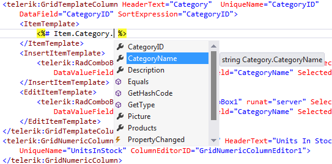
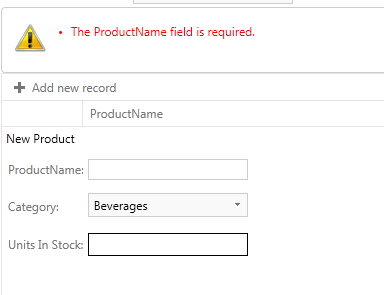

# Model Binding and Strongly Typed Data Controls Support


## Strongly Typed Data Controls Support

When template fields are used into the Telerik data bound controls for customizing templates and bound the field value the late-bound expressions are typically used. For example, below we are using the Eval() helper method to data-bind the "CategoryName" property from an objects which is bound to the RadGrid:

````ASP.NET
<telerik:GridTemplateColumn HeaderText="Category" UniqueName="CategoryID" 
   DataField="CategoryID" SortExpression="CategoryID">
   <ItemTemplate>
      <%# Eval("Category.CategoryName") %>
   <ItemTemplate>
 </telerik:GridTemplateColumn
````


When we perform two-way data-binding the Bind() method is used:

````ASP.NET
<telerik:GridTemplateColumn HeaderText="Category" UniqueName="CategoryID" 
   DataField="CategoryID" SortExpression="CategoryID">
   <EditItemTemplate>
      <telerik:RadComboBox Skin="Metro" ID="ComboBox1" runat="server" SelectMethod="GetCategories" 
          DataValueField="CategoryID" DataTextField="CategoryName" 
          SelectedValue='<%# Bind("CategoryID") %>'></telerik:RadComboBox>
    </EditItemTemplate>
</telerik:GridTemplateColumn>
````


On the other side the .NET 4.5 provides ability to enable strongly-typed data templates. To enable them the **ItemType** property needs to be set on the data bound control. After setting it two new types will be generated in the scope of the control’s template: Item and BindItem.

>note Make sure that you set the **ItemType** property of **RadGrid** and the **GridTableView** containing the columns.
>


For example the code snippet above could be rewritten as:

````ASP.NET
<telerik:GridTemplateColumn HeaderText="Category"  UniqueName="CategoryID" 
DataField="CategoryID" SortExpression="CategoryID">
                        <ItemTemplate>
                            <%# Item.Category.CategoryName %>
                        </ItemTemplate>
                        <EditItemTemplate>
                            <telerik:RadComboBox Skin="Metro" ID="ComboBox1" runat="server" SelectMethod="GetCategories" 
                                DataValueField="CategoryID" DataTextField="CategoryName" SelectedValue="<%# BindItem.CategoryID %>"></telerik:RadComboBox>
                        </EditItemTemplate>
                    </telerik:GridTemplateColumn>
````


The developers could use these variables in data-binding expressions and to get full intellisense support.


>note Due to the fact that the RadGrid control has GridTableView as a child control to have intellisense into grid’s columns you need to set the ItemType property of the MasterTableView.
>


## Model Binding Selecting Data, Paging and Sorting

To bind databound UI controls via ModelBinding you need to set only the SelectMethod property to the name of the public method placed into the page's code-behind file:

````ASP.NET
<telerik:RadGrid ID="RadGrid1" GridLines="None" runat="server" AllowSorting="true" PageSize="10" AllowPaging="True" SelectMethod="GetProducts"
            AutoGenerateColumns="False">
````


The GetProducts method has following declaration:

````C#
DataClassesDataContext context = new DataClassesDataContext(); 
public IQueryable<Employee> GetProducts() 
{ 
    return from e in context.Employees 
           select e; 
} 
````
````VB.NET
Private con As New DataClassesDataContext()
Public Function GetProducts() As IQueryable(Of Employee)
	Return From e In context.Employeese
End Function

````


Or it can be with parameters:

````C#
public IQueryable<Employee> GetProducts(string sortByExpression, int startRowIndex, int maximumRows, out int totalRowCount) 
{ 
	....  
}
````
````VB.NET
Public Function GetProducts(sortByExpression As String, startRowIndex As Integer, maximumRows As Integer, ByRef totalRowCount As Integer) As IQueryable(Of Employee)
	....
End Function
````


In the second signature the developer have to build query which sort and page the datasource items.

When we run the page, the data bound controls will call the above method and automatically retrieve the data and render it. The method has to return IEnumerable or IQueryable. Thus users could easily page and sort through the data within our bound controls. The benefits are that our controls will automatically add the appropriate sort and page operators onto an IQueryable query before executing it.

For example if SelectMethod returns data from Linq DataContext and if the paging of the bound control is turned on, the executed database query will return only items for the current page. If the bound control is sorted by a column the sorting also will be executed on the database and the sorted result will be returned. That is because the Linq will optimize the query to perform the sort and page operation as part of the database query.

>note The returned query needs to be sorted by using OrderBy when LinqToEntities is used, otherwise the exception: The method 'Skip' is only supported for sorted input in LINQ to Entities. The method 'OrderBy' must be called before the method 'Skip' will be thrown.
>MultiColumnsorting is NOT supported when the ModelBinding is used.
>


>note Hierarchical RadGrid is NOT supported. In order to use RadGrid hierarchy you need to use the Declarative Relations or Advanced Data Binding and programmatic hierarchy binding.
>RadGrid calls its SelectMethod twice (once for the grid and once for the MasterTableView) although SelectMethod for the MasterTableView is not declared.The select method must be called twice because the RadGrid calls its base.DataBind() and then the MasterTableVeiw calls its base.DataBind() method. So the framework calls SelectMethod twice, however only one database query is executed to get all data for building items in the MasterTableVeiw.
>


````C#
public IQueryable<Employee> GetProducts(string sortByExpression, int? startRowIndex, int? maximumRows, out int totalRowCount) 
{ 
	....   
} 
````
````VB.NET
Public Function GetProducts(sortByExpression As String, startRowIndex As System.Nullable(Of Integer), maximumRows As System.Nullable(Of Integer), ByRef totalRowCount As Integer) As IQueryable(Of Employee)
	....
End Function
````


## Model Binding Filtering

In order to filter the data source of the data bound control and pass the filtered data to the control you could pass filter parameters to the SelectMethod. You could get these parameters from query string, cookies, form values, controls, viewstate, session and profile. For example:

````C#
public IQueryable<Product> GetProducts([Control("RadComboBoxCategories")] int? categoryID, [QueryString]string name)
{
    // Filter the data source based on categoryID and ProductName 
}
````
````VB.NET
Public Function GetProducts(<Control("RadComboBoxCategories")> categoryID As System.Nullable(Of Integer), <QueryString> name As String) As IQueryable(Of Product)
	' Filter the data source based on categoryID and ProductName 
End Function
````


The code snippet above will get the name parameter from the QueryString and integer value of the selected item of the RadComboBox with ID equals to “RadComboBoxCategories”.

>note When the control is used to pass the filter parameter the control needs to perform post back and the Rebind() method of our data bound control need to be called in order to call the SelectMethod. Otherwise the SelectMethod will not be called and the new data source will not be passed to the data bound control.
>Need to add System.Web.ModelBinding namespace on the page
>


## Model Binding CRUD operations

**Editing**

In order to have editing enabled into the data bound controls you need to set the UpdateMethod of the corresponding control to the web form page’s method. The UpdateMethod can have following signature:

````C#
public void UpdateProduct(int ProductID)
{
    Product updatedProduct = context.Products.Where(p => p.ProductID == ProductID).First();
    TryUpdateModel(updatedProduct);
    if (ModelState.IsValid)
    {
        context.SubmitChanges();
    }
}
````
````VB.NET
Public Sub UpdateProduct(ProductID As Integer)
	Dim updatedProduct As Product = context.Products.Where(Function(p) p.ProductID = ProductID).First()
	TryUpdateModel(updatedProduct)
	If ModelState.IsValid Then
		context.SubmitChanges()
	End If
End Sub
````


Where the “ProductID” is one of the fields set as DataKeyNames of the corresponding bound control.

Or you could use following signature:

````C#
public void UpdateProduct(Product product)
{
    Product updatedProduct = context.Products.Where(p => p.ProductID == product.ProductID).First();
    TryUpdateModel(updatedProduct);
    if (ModelState.IsValid)
    {
        context.SubmitChanges();
    }
}
````
````VB.NET
Public Sub UpdateProduct(product As Product)
	Dim updatedProduct As Product = context.Products.Where(Function(p) p.ProductID = product.ProductID).First()
	TryUpdateModel(updatedProduct)
	If ModelState.IsValid Then
		context.SubmitChanges()
	End If
End Sub
````


**Inserting**

In order to have inserting enabled into the data bound controls you need to set the InsertMethod property of the corresponding control to the name of the web form page’s insert method. The InsertMethod can have following signatures.

You can pass a Product object:


````C#
public void InsertProduct(Product p)
{
	if (ModelState.IsValid)
	{
		context.Products.InsertOnSubmit(p);
		context.SubmitChanges();
	}
}
````
````VB.NET
Public Sub InsertProduct(p As Product)
	If ModelState.IsValid Then
		context.Products.InsertOnSubmit(p)
		context.SubmitChanges()
	End If
End Sub

````


Or you can pass the productID to the Insert method.


````C#
public void InsertProduct(int productID)
{
	Product pr = new Product();
	TryUpdateModel(pr);
	if (ModelState.IsValid)
	{
		context.Products.InsertOnSubmit(p);
		context.SubmitChanges();
	}
}
````
````VB.NET
Public Sub InsertProduct(productID As Integer)
	Dim pr As New Product()
	TryUpdateModel(pr)
	If ModelState.IsValid Then
		context.Products.InsertOnSubmit(p)
		context.SubmitChanges()
	End If
End Sub
````


**Deleting**

In order to have deleting enabled into the data bound controls you need to set the DeleteMethod property of the corresponding control to the name of the web form page’s delete method. The DeleteMethod can have following signature:

````C#
public void DeleteProduct(int ProductID)
{
    Product deletedProduct = context.Products.Where(p => p.ProductID == ProductID).First();
    context.Products.DeleteOnSubmit(deletedProduct);
    context.SubmitChanges();
}
````
````VB.NET
Public Sub DeleteProduct(ProductID As Integer)
	Dim deletedProduct As Product = context.Products.Where(Function(p) p.ProductID = ProductID).First()
	context.Products.DeleteOnSubmit(deletedProduct)
	context.SubmitChanges()
End Sub
````


## ModelBinding Validation

Due to the fact that Model Binding system in Web Forms supports model validation using the same validation attributes from the System.ComponentModel.DataAnnotations you could use validation into our databound controls. You could decorate properties from your model classes with the attributes provided in System.ComponentModel.DataAnnotations namespace. For example if you have DataContext mapped to a Northwind database “Product” table and you want to ensure that when inserting new product or update existing one the ProductName field is populated, you could set [Required] attribute to it into the DataClasses.designer.cs file:

````C#
[Required]
[global::System.Data.Linq.Mapping.ColumnAttribute(Storage = "_ProductName", DbType = "NVarChar(40) NOT NULL", CanBeNull = false)]
public string ProductName
{
    get
    {
        return this._ProductName;
    }
    set
    {
        if ((this._ProductName != value))
        {
            this.OnProductNameChanging(value);
            this.SendPropertyChanging();
            this._ProductName = value;
            this.SendPropertyChanged("ProductName");
            this.OnProductNameChanged();
        }
    }
}
````
````VB.NET
<Required> _
<System.Data.Linq.Mapping.ColumnAttribute(Storage := "_ProductName", DbType := "NVarChar(40) NOT NULL", CanBeNull := False)> _
Public Property ProductName() As String
	Get
		Return Me._ProductName
	End Get
	Set
		If (Me._ProductName <> value) Then
			Me.OnProductNameChanging(value)
			Me.SendPropertyChanging()
			Me._ProductName = value
			Me.SendPropertyChanged("ProductName")
			Me.OnProductNameChanged()
		End If
	End Set
End Property

````


Then when values from databound control editors are submitted to the server the the Web Forms Model Binding system will track whether any of these validation rules are violated in the page's ModelState property.

````C#
public void InsertProduct(Product p)
{
    if (ModelState.IsValid)
    {
        context.Products.InsertOnSubmit(p);
        context.SubmitChanges();
    }
}
````
````VB.NET
Public Sub InsertProduct(p As Product)
	If ModelState.IsValid Then
		context.Products.InsertOnSubmit(p)
		context.SubmitChanges()
	End If
End Sub
````


To show any validation errors you could use asp:ValidationSummary control or asp:ModelErrorMessage:

````ASP.NET
<asp:ValidationSummary runat="server" ID="ValidationSummary1" />
````



>note You need to call TryUpdateModel(object) before checking the ModelState.IsValid when inserting items. Otherwise the validation will not track any errors. The other approach is to pass the entire object as a parameter to the function:
>


````C#
public void InsertProduct(int productID)
{
    Product pr = new Product();
    TryUpdateModel(pr);

    if (ModelState.IsValid)
    {
        context.Products.InsertOnSubmit(p);
        context.SubmitChanges();
    }
}
public void InsertProduct(Product p)
{
    if (ModelState.IsValid)
    {
        context.Products.InsertOnSubmit(p);
        context.SubmitChanges();
    }
}
````
````VB.NET

Public Sub InsertProduct(productID As Integer)
	Dim pr As New Product()
	TryUpdateModel(pr)

	If ModelState.IsValid Then
		context.Products.InsertOnSubmit(p)
		context.SubmitChanges()
	End If
End Sub
Public Sub InsertProduct(p As Product)
	If ModelState.IsValid Then
		context.Products.InsertOnSubmit(p)
		context.SubmitChanges()
	End If
End Sub
````


## ModelBinding Limitations

We do not support model binding when the **ViewState** of the page is **disabled**. In order to use the model binding you need to set **Page.EnableViewState = “true”**
