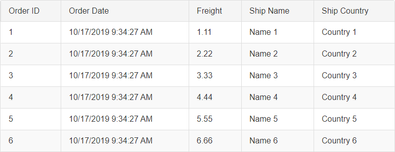

# Telerik RadGrid Data Binding Basics


**RadGrid** is a powerful component that displays data obtained from a database or other data source. The data is presented in tabular view and can be further enhanced with templates or other customization options.

There are 3 ways to bind the grid to a data source:

* [**Declarative Binding**]() in the mark-up via the **DataSourceID** property - By using declarative data source controls (introduced in ASP.NET 2.0), you can bind the grid declaratively, with no coding necessary. This mode also supports [Automatic CRUD operations](https://demos.telerik.com/aspnet-ajax/grid/examples/data-editing/automatic-crud-operations/defaultcs.aspx).

* [**Programmatic Binding**]() in the code-behind via the **DataSource** property and using the **NeedDataSource** event - **RadGrid** calls this event each time it needs a data source query like Paging, Sorting, Filtering, Grouping, etc. This approach is convenient when you have the data source present in C# or VB code, for instance a List of Class or Objects.

* [**Client-Side Binding**]() - **RadGrid** provides a variety of options here like RadClientDataSource, WebServices, PageMethods, local JSON objects, etc. More information you can find in our dedicated Client-Side Binding [articles]() and [demos](https://demos.telerik.com/aspnet-ajax/grid/examples/data-binding/client-side/client-data-source-binding/defaultcs.aspx).

>note It is highly recommended to avoid using the DataBind() method:  
[How to bind RadGrid properly on server-side](https://www.telerik.com/support/kb/aspnet-ajax/grid/details/how-to-bind-radgrid-properly-on-server-side)
>

Here is a basic runnable example which you can directly copy-paste to your project:
```ASP.NET
<telerik:RadGrid ID="RadGrid1" runat="server"
    OnNeedDataSource="RadGrid1_NeedDataSource">
</telerik:RadGrid>
```
```C#
protected void RadGrid1_NeedDataSource(object sender, GridNeedDataSourceEventArgs e)
{
    (sender as RadGrid).DataSource = Enumerable.Range(1, 6).Select(x => new
    {
        ID = x,
        Name = "Item " + x
    });
}
```
```VB.NET
Protected Sub RadGrid1_NeedDataSource(ByVal sender As Object, ByVal e As GridNeedDataSourceEventArgs)
    (TryCast(sender, RadGrid)).DataSource = Enumerable.Range(1, 6).[Select](Function(x) New With {Key
        .ID = x, Key
        .Name = "Item " & x
    })
End Sub
```


Resulting to this:


## Hierarchical grids

In a hierarchical grid, it is logical for the detail tables to be bound separately from their parent tables, using a separate data source. When binding detail tables, it is also a common requirement to manage the relationship of the records in the detail data source to the parent table so that the child items are loaded depending on the parent item. 

There are two methods for managing this relationship:

* [Using declarative relations]()

* [Using the DetailTableDataBind event]().

## Programmatic Source Types

When binding the grid by setting the **DataSource** property in the **NeedDataSource** event handler, you can use an instance of any of the following types:

*  **DataSet** , **DataTable** , or **DataView** 
* Array of **DataRow** 
* Any object collection that implements the **IListSource** , **IList** , **IEnumerable** , or **ICustomTypeDescriptor** interface.

Here is another basic runnable example with dummy DataTable which you can once again directly copy-paste to your project:
```ASP.NET
<telerik:RadGrid ID="RadGrid1" runat="server" 
    OnNeedDataSource="RadGrid1_NeedDataSource">
</telerik:RadGrid>
```
```C#
protected void RadGrid1_NeedDataSource(object sender, GridNeedDataSourceEventArgs e)
{
    (sender as RadGrid).DataSource = GetGridSource();
}
private DataTable GetGridSource()
{
    DataTable dataTable = new DataTable();

    DataColumn column = new DataColumn();
    column.DataType = Type.GetType("System.Int32");
    column.ColumnName = "OrderID";
    dataTable.Columns.Add(column);

    column = new DataColumn();
    column.DataType = Type.GetType("System.DateTime");
    column.ColumnName = "OrderDate";
    dataTable.Columns.Add(column);

    column = new DataColumn();
    column.DataType = Type.GetType("System.Decimal");
    column.ColumnName = "Freight";
    dataTable.Columns.Add(column);

    column = new DataColumn();
    column.DataType = Type.GetType("System.String");
    column.ColumnName = "ShipName";
    dataTable.Columns.Add(column);

    column = new DataColumn();
    column.DataType = Type.GetType("System.String");
    column.ColumnName = "ShipCountry";
    dataTable.Columns.Add(column);

    DataColumn[] PrimaryKeyColumns = new DataColumn[1];
    PrimaryKeyColumns[0] = dataTable.Columns["OrderID"];
    dataTable.PrimaryKey = PrimaryKeyColumns;

    for (int i = 0; i <= 8; i++)
    {
        DataRow row = dataTable.NewRow();
        row["OrderID"] = i + 1;
        row["OrderDate"] = DateTime.Now;
        row["Freight"] = (i + 1) + (i + 1) * 0.1 + (i + 1) * 0.01;
        row["ShipName"] = "Name " + (i + 1);
        row["ShipCountry"] = "Country " + (i + 1);

        dataTable.Rows.Add(row);
    }

    return dataTable;
}
```
```VB
Protected Sub RadGrid1_NeedDataSource(sender As Object, e As GridNeedDataSourceEventArgs)
    (TryCast(sender, RadGrid)).DataSource = GetGridSource()
End Sub
Private Function GetGridSource() As DataTable
    Dim dataTable As New DataTable()

    Dim column As New DataColumn()
    column.DataType = Type.[GetType]("System.Int32")
    column.ColumnName = "OrderID"
    dataTable.Columns.Add(column)

    column = New DataColumn()
    column.DataType = Type.[GetType]("System.DateTime")
    column.ColumnName = "OrderDate"
    dataTable.Columns.Add(column)

    column = New DataColumn()
    column.DataType = Type.[GetType]("System.Decimal")
    column.ColumnName = "Freight"
    dataTable.Columns.Add(column)

    column = New DataColumn()
    column.DataType = Type.[GetType]("System.String")
    column.ColumnName = "ShipName"
    dataTable.Columns.Add(column)

    column = New DataColumn()
    column.DataType = Type.[GetType]("System.String")
    column.ColumnName = "ShipCountry"
    dataTable.Columns.Add(column)


    Dim PrimaryKeyColumns As DataColumn() = New DataColumn(0) {}
    PrimaryKeyColumns(0) = dataTable.Columns("OrderID")
    dataTable.PrimaryKey = PrimaryKeyColumns

    For i As Integer = 0 To 8
        Dim row As DataRow = dataTable.NewRow()
        row("OrderID") = i + 1
        row("OrderDate") = DateTime.Now
        row("Freight") = (i + 1) + (i + 1) * 0.1 + (i + 1) * 0.01
        row("ShipName") = "Name " & (i + 1)
        row("ShipCountry") = "Country " & (i + 1)

        dataTable.Rows.Add(row)
    Next

    Return dataTable
End Function
```


Resulting to this:


## Bindable Property Types

**RadGrid** understands the following bindable property types:

* All primitive types - **bool**, **byte**, **sbyte**, **char**, **short**, **ushort**, **int**, **uint**, **long**, **ulong**, **decimal**, **double**, **float**, **DateTime**, etc.

* **GUID**

* **String**

* **TimeSpan**

* **Enum** types

* **Nullable** types

**RadGrid** uses the static method **RadGrid.IsBindableType()** to determine if the property of an object can be bound.
