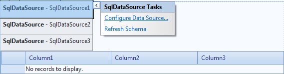
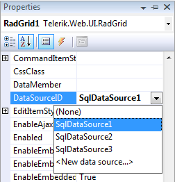
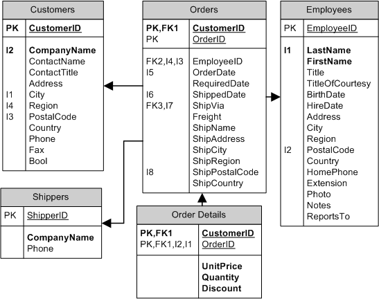
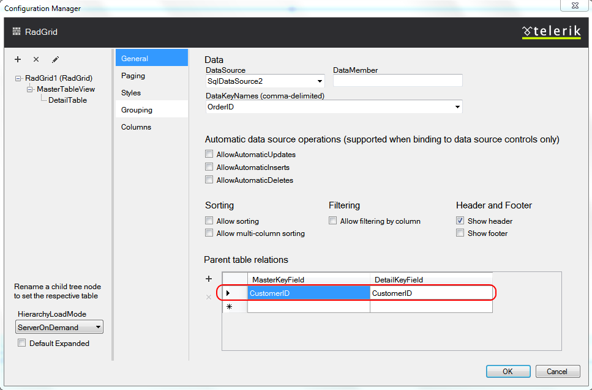

# Declarative DataSource


The simplest method of data-binding a **RadGrid** control is to use declarative data sources. The following steps describe how to use declarative data binding with a **RadGrid**:

1. Create and configure the data source controls. **RadGrid** can be bound to any ASP.NET data source control, including **SqlDataSource**, **AccessDataSource**, **ObjectDataSource**, **XmlDataSource**, **EntityDataSource**, **OpenAccessDataSource,****LinqDataSource** and **ObjectContainerDataSource**.

1. At design time, Assign the **DataSourceID** property of the RadGrid (and of any detail tables) to the desired data source control.

1. For hierarchical grids, set the **DataKeyNames** property for any parent table views.

1. For hierarchical grids, set the **ParentTableRelation** property to specify the linking fields between the parent and detail tables.

These steps are described in more detail below:

## Create and configure the DataSource controls

Before binding the **RadGrid** control, you need to create a separate **DataSource** control for each table in the grid (Master table and all detail tables). Thus, for example, if you have a three level hierarchy, you need three DataSource controls.

The data source controls for detail tables must use parameters to select only those records appropriate to a specific record of the parent table. The following example shows how this is done:

````ASP.NET
<asp:SqlDataSource ID="SqlDataSource1" ConnectionString="<%$ ConnectionStrings:NorthwindConnectionString %>"
  ProviderName="System.Data.SqlClient" SelectCommand="SELECT * FROM Customers" runat="server">
</asp:SqlDataSource>
<asp:SqlDataSource ID="SqlDataSource2" ConnectionString="<%$ ConnectionStrings:NorthwindConnectionString %>"
  ProviderName="System.Data.SqlClient" SelectCommand="SELECT * FROM Orders Where CustomerID = @CustomerID"
  runat="server">
  <SelectParameters>
    <asp:SessionParameter Name="CustomerID" SessionField="CustomerID" Type="string" />
  </SelectParameters>
</asp:SqlDataSource>
<asp:SqlDataSource ID="SqlDataSource3" ConnectionString="<%$ ConnectionStrings:NorthwindConnectionString %>"
  ProviderName="System.Data.SqlClient" SelectCommand="SELECT * FROM [Order Details] where OrderID = @OrderID"
  runat="server">
  <SelectParameters>
    <asp:SessionParameter Name="OrderID" SessionField="OrderID" Type="Int32" />
  </SelectParameters>
</asp:SqlDataSource>
````


You can easily generate this declaration using the **Configure Data Source** wizard. You can launch the wizard by choosing **Configure Data Source** from the Smart Tag of the DataSource component:



For a tutorial that walks you through using the wizard to configure **SqlDataSource** controls for a hierarchical grid, see [Tutorial: Building a Hierarchical Grid]().

## Assign the DataSourceID property

Once you have set up the data source controls, you need to pair each **GridTableView** with the appropriate data source control. You must first assign a data source for the top-level table in the grid. To do this, set the **DataSourceID** property of the **RadGrid** control. You can do this using the **RadGrid**[ Smart Tag](), or in the **RadGrid** Properties pane:



>caution You must set the **DataSourceID** property for the **RadGrid** object so that it is automatically bound on page load.
>


Each **GridTableView** (including the **MasterTableView** and any table views in the **DetailTables** collection of another table view) also has a property **DataSourceID**. When you set the **DataSourceID** property of the **RadGrid** control, the **DataSourceID** property of the **MasterTableView** is automatically set as well.

In a hierarchical grid, you must set the **DataSourceID** property for each of the detail tables. You can do this using the [RadGrid Configuration Manager](), or in the **RadGrid** properties pane.

Use the following steps when binding detail tables with the **RadGrid** properties pane:

1. Choose the detail table to which you want to assign datasource.

1. Next, click on the General tab and select the **DataSource** dropdown control.

1. Click on the desired datasource and the detail table will bound to it at run time.


## Set the DataKeyNames property on parent tables

For any table that acts as a parent table in a hierarchical grid, you must set the **DataKeyNames** property of the corresponding **GridTableView** object to include any key fields that are used to link detail tables to the parent table. These are the fields in the parent table that supply values for the parameters in the detail data sources.

Below is the scheme of the sample Northwind database. For our sample grid, the first level (**MasterTableView**) displays the Customers table. The second level displays the Orders table. It is related to its parent through CustomerID field. The third level is Order Details table and it is related to the second level through OrderID field.



Thus, the **MasterTableView** must include the **CustomerID** field in its **DataKeyNames** property, because this field is used to link the Orders table to the master table view. The detail for the Orders table must include the **OrderID** field in its **DataKeyNames** property, because this field is used to link the Order Details table to the Orders table. The Order Details table is not a parent table, so you do not need to set its **DataKeyNames** property.

## Set the ParentTableRelation property for each Detail TableView

For each detail table, you need to indicate which fields in the **DataSource** for the detail correspond to which fields from the **DataSource** of the parent table. This is done using the **ParentTableRelation** property of the detail's **GridTableView** object.

Still in the General tab, navigate to the **Parent Table relations** and set the appropriate fields for the master and detail key fields.



For each field that links the detail table to its parent, you must add a **GridRelationFields** object to the **ParentTableRelation** collection. Each **GridRelationFields** object has two properties:

* **DataKeyField**: the name of a field in the **DataSource** of the detail table that is used to link to the parent table. This is the field whose value must match a parameter on the DataSource control.

* **MasterKeyField**: the name of a field in the **DataSource** of the parent table that is used to define the link. This field must exist in the parent table's **DataSource** and be listed in the **DataKeyNames** property of the parent table view. (It need not be displayed in a column of the parent table view, however).

## The resulting declaration

The following declaration is the result of following the steps listed above:

````ASP.NET
<telerik:RadGrid ID="RadGrid1" runat="server" DataSourceID="SqlDataSource1">
  <MasterTableView DataKeyNames="CustomerID" DataSourceID="SqlDataSource1">
    <DetailTables>
      <telerik:GridTableView runat="server" DataKeyNames="OrderID" DataSourceID="SqlDataSource2">
        <ParentTableRelation>
          <telerik:GridRelationFields DetailKeyField="CustomerID" MasterKeyField="CustomerID" />
        </ParentTableRelation>
        <DetailTables>
          <telerik:GridTableView runat="server" DataSourceID="SqlDataSource3">
            <ParentTableRelation>
              <telerik:GridRelationFields DetailKeyField="OrderID" MasterKeyField="OrderID" />
            </ParentTableRelation>
          </telerik:GridTableView>
        </DetailTables>
      </telerik:GridTableView>
    </DetailTables>
  </MasterTableView></telerik:RadGrid>
<asp:SqlDataSource ID="SqlDataSource1" ConnectionString="<%$ ConnectionStrings:NorthwindConnectionString %>"
  ProviderName="System.Data.SqlClient" SelectCommand="SELECT * FROM Customers" runat="server">
</asp:SqlDataSource>
<asp:SqlDataSource ID="SqlDataSource2" ConnectionString="<%$ ConnectionStrings:NorthwindConnectionString %>"
  ProviderName="System.Data.SqlClient" SelectCommand="SELECT * FROM Orders Where CustomerID = @CustomerID"
  runat="server">
  <SelectParameters>
    <asp:SessionParameter Name="CustomerID" SessionField="CustomerID" Type="string" />
  </SelectParameters>
</asp:SqlDataSource>
<asp:SqlDataSource ID="SqlDataSource3" ConnectionString="<%$ ConnectionStrings:NorthwindConnectionString %>"
  ProviderName="System.Data.SqlClient" SelectCommand="SELECT * FROM [Order Details] where OrderID = @OrderID"
  runat="server">
  <SelectParameters>
    <asp:SessionParameter Name="OrderID" SessionField="OrderID" Type="Int32" />
  </SelectParameters>
</asp:SqlDataSource>
````


