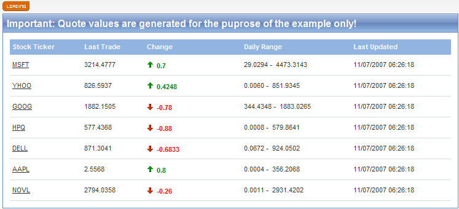

# Server Binding


## 

The following code snippet demonstrates how RadGrid can be integrated with the ASP.NET AJAX framework. The example features the following components:

* RadGrid - displays the stock quote data.

* ASP.NET AJAX UpdatePanel -- wraps the grid control and performs the Ajax requests.

* ASP.NET AJAX UpdateProgress -- responsible for the visual indication on the client-side of an ongoing Ajax request.

* ASP.NET AJAX Timer -- triggers the Ajax requests for data refresh on a regular interval.

The grid is bound via an ObjectDataSource control that returns a dataset with the respective quote data. The ObjectDataSource implementation internally uses WebService calls to handle the data retrieval. When the WebService is called for the first time it establishes a connection to a website (finance.yahoo.com) and gets some real-world data that will be used as a starting point for the sample application. The quote data is then persisted locally in an xml file for later use and a resultant dataset is generated from the same xml file. For consequent calls to the WebService (essentially triggered by the timer component on the client-side) no data is downloaded from the Internet but the data from the xml is modified locally to simulate stock quote rate changes; then it is persisted again in the same xml file and a resultant dataset is returned to the ObjectDataSource instance.

The example can be easily extended to use real data by supplying a different DataSet in the StockQuoteService.GetStockQuotes(...) WebService method.




````JavaScript
Sys.WebForms.PageRequestManager.getInstance().add_endRequest(endRequest);
function endRequest(sender, e) {
  if (e.get_error()) {
    debug.trace("[" + new Date().toLocaleTimeString() + "] An error occurred while processing the request on the server. Please try again later.");
    e.set_errorHandled(true);
  }
}
Sys.Application.notifyScriptLoaded();
````
````ASP.NET
<?xml version="1.0" encoding="utf-8" ?>
<quotes>  
    <quote stockTicker="MSFT" lastTrade="29.0294" change="-0.4596" lastUpdated="12/20/2006 17:07:52" dailyMaxRange="30.24" dailyMinRange="29.0294" />  
    <quote stockTicker="YHOO" lastTrade="26.2045" change="0.3" lastUpdated="12/20/2006 17:07:52" dailyMaxRange="26.31" dailyMinRange="25.3645" />  
    <quote stockTicker="GOOG" lastTrade="467.5230" change="0.5" lastUpdated="12/20/2006 17:07:52" dailyMaxRange="471.50" dailyMinRange="467.0230" />  
    <quote stockTicker="HPQ" lastTrade="40.3625" change="-0.5550" lastUpdated="12/20/2006 17:07:52" dailyMaxRange="41.742" dailyMinRange="40.35" />  
    <quote stockTicker="DELL" lastTrade="25.8672" change="-0.4" lastUpdated="12/20/2006 17:07:52" dailyMaxRange="26.3650" dailyMinRange="25.4050" />  
    <quote stockTicker="AAPL" lastTrade="87.6258" change="-0.3790" lastUpdated="12/20/2006 17:07:52" dailyMaxRange="88.7048" dailyMinRange="85.76" />  
    <quote stockTicker="NOVL" lastTrade="3.5758" change="-0.166" lastUpdated="12/20/2006 17:07:52" dailyMaxRange="6.14" dailyMinRange="3.5758" />
</quotes>
````
````ASP.NET
<asp:ScriptManager ID="ScriptManager1" runat="server">
  <Scripts>
    <asp:ScriptReference Path="~/Scripts/TraceUtils.js" />
  </Scripts>
</asp:ScriptManager>
<div style="height: 20px">
  <asp:UpdateProgress ID="UpdateProgress1" runat="server" AssociatedUpdatePanelID="UpdatePanel1"
    DisplayAfter="0">
    <ProgressTemplate>
      
    </ProgressTemplate>
  </asp:UpdateProgress>
</div>
<div style="height: auto;">
  <asp:UpdatePanel ID="UpdatePanel1" runat="server">
    <ContentTemplate>
      <asp:Timer ID="Timer1" runat="server" Interval="3000" OnTick="Timer1_Tick">
      </asp:Timer>
      <div class="quotes">
        Important: Quote values are generated for the puprose of the example only!</div>
      <telerik:RadGrid ID="RadGrid1" runat="server" Width="718px" Skin="Web20" AutoGenerateColumns="False"
        DataSourceID="ObjectDataSource1" HorizontalAlign="NotSet" GridLines="none" OnItemDataBound="RadGrid1_ItemDataBound">
        <MasterTableView DataSourceID="ObjectDataSource1">
          <Columns>
            <telerik:GridHyperLinkColumn DataTextField="StockTicker" DataNavigateUrlFields="StockTicker"
              UniqueName="StockTicker" HeaderText="Stock Ticker" DataNavigateUrlFormatString="http://ddue.schemas.microsoft.com/authoring/2003/5" />
            <telerik:GridBoundColumn DataField="LastTrade" UniqueName="LastTrade" HeaderText="Last Trade" />
            <telerik:GridTemplateColumn UniqueName="Change" HeaderText="Change">
              <ItemTemplate>
                <asp:Image ID="DirectionImage" runat="server" />&nbsp;
                <asp:Label ID="ChangeLabel" runat="server" Style="font-weight: bold;" Text='<%# Eval("Change") %>' />
              </ItemTemplate>
              <ItemStyle Width="150px" />
            </telerik:GridTemplateColumn>
            <telerik:GridTemplateColumn UniqueName="DailyRange" HeaderText="Daily Range" FilterImageUrl=""
              SortAscImageUrl="" SortDescImageUrl="">
              <ItemTemplate>
                <asp:Label ID="DailyMinLabel" runat="server" Text='<%# Eval("DailyMinRange") %>' />&nbsp;-&nbsp;
                <asp:Label ID="DailyMaxLabel" runat="server" Text='<%# Eval("DailyMaxRange") %>' />
              </ItemTemplate>
            </telerik:GridTemplateColumn>
            <telerik:GridBoundColumn DataField="LastUpdated" UniqueName="LastUpdated" HeaderText="Last Updated"
              FilterImageUrl="" SortAscImageUrl="" SortDescImageUrl="" />
          </Columns>
          <EditFormSettings>
            <EditColumn CancelImageUrl="" EditImageUrl="" FilterImageUrl="" InsertImageUrl=""
              SortAscImageUrl="" SortDescImageUrl="" UpdateImageUrl="">
            </EditColumn>
          </EditFormSettings>
          <ExpandCollapseColumn CollapseImageUrl="" ExpandImageUrl="" FilterImageUrl="" SortAscImageUrl=""
            SortDescImageUrl="" Visible="False">
            <HeaderStyle Width="19px" />
          </ExpandCollapseColumn>
          <RowIndicatorColumn FilterImageUrl="" SortAscImageUrl="" SortDescImageUrl="" Visible="False">
            <HeaderStyle Width="20px" />
          </RowIndicatorColumn>
        </MasterTableView>
      </telerik:RadGrid><asp:ObjectDataSource ID="ObjectDataSource1" runat="server" SelectMethod="GetData"
        TypeName="QuoteHelper" OldValuesParameterFormatString="original_{0}"></asp:ObjectDataSource>
    </ContentTemplate>
  </asp:UpdatePanel>
</div>
````
````C#
protected void Timer1_Tick(object sender, EventArgs e)
{
    RadGrid1.Rebind();
}
protected void RadGrid1_ItemDataBound(object sender, GridItemEventArgs e)
{
    if (e.Item is GridDataItem)
    {
        GridDataItem item = (GridDataItem)e.Item;
        TableCell cell = item["Change"];
        Image directionImage = (Image)cell.FindControl("DirectionImage");
        Label changeText = (Label)cell.FindControl("ChangeLabel");
        Decimal change = Decimal.Parse(((DataRowView)e.Item.DataItem).Row["Change"].ToString(), CultureInfo.InvariantCulture);
        if (change > 0)
        {
            directionImage.ImageUrl = "Images/up.gif";
            changeText.Style["color"] = "green";
        }
        else if (change < 0)
        {
            directionImage.ImageUrl = "Images/down.gif";
            changeText.Style["color"] = "red";
        }
        else
        {
            directionImage.Visible = false;
        }
    }
}
````
````VB
Protected Sub Timer1_Tick(ByVal sender As Object, ByVal e As EventArgs)
    RadGrid1.Rebind()
End Sub
'Timer1_Tick
Protected Sub RadGrid1_ItemDataBound(ByVal sender As Object, ByVal e As GridItemEventArgs)
    If TypeOf e.Item Is GridDataItem Then
        Dim item As GridDataItem = CType(e.Item, GridDataItem)
        Dim cell As TableCell = item("Change")
        Dim directionImage As System.Web.UI.WebControls.Image = CType(cell.FindControl("DirectionImage"), System.Web.UI.WebControls.Image)
        Dim changeText As Label = CType(cell.FindControl("ChangeLabel"), Label)
        Dim change As [Decimal] = [Decimal].Parse(CType(e.Item.DataItem, DataRowView).Row("Change").ToString(), CultureInfo.InvariantCulture)
        If change > 0 Then
            directionImage.ImageUrl = "Images/up.gif"
            changeText.Style("color") = "green"
        ElseIf change < 0 Then
            directionImage.ImageUrl = "Images/down.gif"
            changeText.Style("color") = "red"
        Else
            directionImage.Visible = False
        End If
    End If
End Sub
````


