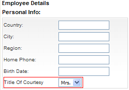

# API for Controlling the Automatic Operations


When placing Telerik RadGrid in "Insert" mode, you can use the overloaded versions of **GridTableView.InsertItem()** method. This can help you set predefined values to specific fields. The example below demonstrates how to set predefined values to a dropdown list in an edit form with a single row of code.


````VB.NET
	    Protected Sub RadGrid1_ItemCommand(ByVal source As Object, ByVal e As Telerik.Web.UI.GridCommandEventArgs) Handles RadGrid1.ItemCommand
	        If e.CommandName = RadGrid.InitInsertCommandName Then '"Add new" button clicked
	            e.Canceled = True
	            'Prepare an IDictionary with the predefined values
	            Dim newValues As System.Collections.Specialized.ListDictionary = New System.Collections.Specialized.ListDictionary()
	            newValues("TitleOfCourtesy") = "Mrs."
	            'Insert the item and rebind
	            e.Item.OwnerTableView.InsertItem(newValues)
	        End If
	    End Sub
````
````C#
	    protected void RadGrid1_ItemCommand(object source, GridCommandEventArgs e)
	    {
	        if (e.CommandName == RadGrid.InitInsertCommandName) //"Add new" button clicked
	        {
	            e.Canceled = true;
	            //Prepare an IDictionary with the predefined values
	            System.Collections.Specialized.ListDictionary newValues = new System.Collections.Specialized.ListDictionary();
	            newValues["TitleOfCourtesy"] = "Mrs.";
	            //Insert the item and rebind
	            e.Item.OwnerTableView.InsertItem(newValues);
	        }
	    }
````




* **InsertItem()** - no default values.

* **InsertItem(object dataItem)** - the new Item of Telerik RadGrid will be bound to the dataItem object. This method can be used to set the default values of the editors that will appear in the InsertItem.

* **InsertItem(IDictionary newValues)** - the new Item of Telerik RadGrid will be bound to an empty object with only values taken from the **newValues** dictionary. This method can be used to set the default values of the editors that will appear in the InsertItem.

Telerik RadGrid will place the newly inserted item just below the header item on the last page. This item can be accessed after grid is bound in "Insert" mode (after **InsertItem** method has been executed or "InitInsert" command has bubbled) using the **GetInsertedItem()** method of **GridTableView**.

There are three basic functions of **GridTableView** that control the Telerik RadGrid behavior when you want to perform automatic updates:

* PerformDelete (GridEditableItem, [boolean suppressRebind]) - performs automatic delete using the DataSource control

* PerformUpdate (GridEditableItem, [boolean suppressRebind]) - performs automatic update using the DataSource control

* PerformInsert (GridEditableItem, [boolean suppressRebind]) - performs automatic insert using the DataSource control

The **suppressRebind** is an optional parameter. It sets if the grid will be rebound after the automatic update. The default value for **suppressRebind** is **false**, i.e. the grid will rebound unless you set otherwise.

## Handling custom commands - Delete command (Command Item online example)

Generally you can handle any command, using the **ItemCommandEvent**. The example below shows hot to handle a custom command "DeleteSelected". It will delete all selected Items. In the ASPX file, we set the **CommandName** property to "DeleteSelected". Then in the **ItemCommandEvent** handler, we check if the **CommandName** was "DeleteSelected" and call a method, which will delete all selected items.


````ASPNET
	
	  <CommandItemTemplate>
	      <asp:LinkButton ID="LinkButton1" OnClientClick="javascript:return confirm('Delete all selected customers?')"
	           runat= "server" CommandName="DeleteSelected">
	       Delete Selected Custoemrs
	      </asp:LinkButton>
	  </CommandItemTemplate>
	          
````
````C#
	    protected void RadGrid1_ItemCommand(object source, Telerik.Web.UI.GridCommandEventArgs e)
	    {
	        //....
	        if (e.CommandName == "DeleteSelected")
	        {
	            if (RadGrid1.SelectedIndexes.Count == 0)
	            {
	                return;
	            }
	
	            foreach (GridDataItem item in RadGrid1.SelectedItems)
	            {
	                Hashtable itemValues = new Hashtable();
	                e.Item.OwnerTableView.ExtractValuesFromItem(itemValues, item);
	                DeleteItem(itemValues); //This function is supposed to delete the selected data item
	            }
	
	            e.Item.OwnerTableView.Rebind();
	            return;
	        }
	        //....
	    }
	
````
````VB.NET
	    Protected Sub RadGrid1_ItemCommand(ByVal source As Object, ByVal e As Telerik.Web.UI.GridCommandEventArgs) Handles RadGrid1.ItemCommand
	        If e.CommandName = "DeleteSelected" Then
	            If RadGrid1.SelectedIndexes.Count = 0 Then
	                Return
	            End If
	
	            For Each item As GridDataItem In RadGrid1.SelectedItems
	                Dim itemValues As Hashtable = New Hashtable
	                e.Item.OwnerTableView.PerformDelete(item, True)
	                DeleteItem(itemValues) 'This function is supposed to delete the selected data item
	            Next
	            e.Item.OwnerTableView.Rebind()
	            Return
	        End If
	    End Sub
````

