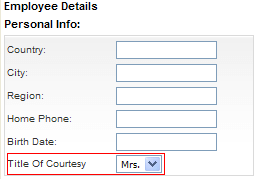

# API for Controlling the Automatic Operations


When placing Telerik RadGrid in "Insert" mode, you can use the overloaded versions of **GridTableView.InsertItem()** method. This can help you set predefined values to specific fields. The example below demonstrates how to set predefined values to a dropdown list in an edit form with a single row of code.


````C#
protected void RadGrid1_ItemCommand(object source, GridCommandEventArgs e)
{
    if (e.CommandName == RadGrid.InitInsertCommandName) //"Add new" button clicked
    {
        e.Canceled = true;
        //Prepare an IDictionary with the predefined values
        System.Collections.Specialized.ListDictionary newValues = new System.Collections.Specialized.ListDictionary();
        newValues["TitleOfCourtesy"] = "Mrs.";
        //Insert the item and rebind
        e.Item.OwnerTableView.InsertItem(newValues);
    }
}
````
````VB
Protected Sub RadGrid1_ItemCommand(ByVal source As Object, ByVal e As Telerik.Web.UI.GridCommandEventArgs) Handles RadGrid1.ItemCommand
    If e.CommandName = RadGrid.InitInsertCommandName Then '"Add new" button clicked
        e.Canceled = True
        'Prepare an IDictionary with the predefined values
        Dim newValues As System.Collections.Specialized.ListDictionary = New System.Collections.Specialized.ListDictionary()
        newValues("TitleOfCourtesy") = "Mrs."
        'Insert the item and rebind
        e.Item.OwnerTableView.InsertItem(newValues)
    End If
End Sub
````




* **InsertItem()** - no default values.

* **InsertItem(object dataItem)** - the new Item of Telerik RadGrid will be bound to the dataItem object. This method can be used to set the default values of the editors that will appear in the InsertItem.

* **InsertItem(IDictionary newValues)** - the new Item of Telerik RadGrid will be bound to an empty object with only values taken from the **newValues** dictionary. This method can be used to set the default values of the editors that will appear in the InsertItem.

Telerik RadGrid will place the newly inserted item just below the header item on the last page. This item can be accessed after grid is bound in "Insert" mode (after **InsertItem** method has been executed or "InitInsert" command has bubbled) using the **GetInsertedItem()** method of **GridTableView**.

There are three basic functions of **GridTableView** that control the Telerik RadGrid behavior when you want to perform automatic updates:

* PerformDelete (GridEditableItem, [boolean suppressRebind]) - performs automatic delete using the DataSource control

* PerformUpdate (GridEditableItem, [boolean suppressRebind]) - performs automatic update using the DataSource control

* PerformInsert (GridEditableItem, [boolean suppressRebind]) - performs automatic insert using the DataSource control

The **suppressRebind** parameter is optional. It determines whether the grid is rebound after the automatic update. The default value is **false**, so the grid is rebound unless you set the parameter to **true**.

## Handling Custom Commands - Delete Command (Command Item Online Example)

Generally, you can handle any command by using the **ItemCommandEvent**. The example below shows how to handle a custom command named `DeleteSelected`. It deletes all selected items. In the ASPX file, set the **CommandName** property to `DeleteSelected`. Then, in the **ItemCommandEvent** handler, check whether the **CommandName** is `DeleteSelected` and call a method that deletes the selected items.


````ASP.NET	
<CommandItemTemplate>
    <asp:LinkButton ID="LinkButton1" OnClientClick="javascript:return confirm('Delete all selected customers?')"
         runat= "server" CommandName="DeleteSelected">
     Delete Selected Customers
    </asp:LinkButton>
</CommandItemTemplate>   
````
````C#
protected void RadGrid1_ItemCommand(object source, Telerik.Web.UI.GridCommandEventArgs e)
{
    //....
    if (e.CommandName == "DeleteSelected")
    {
        if (RadGrid1.SelectedIndexes.Count == 0)
        {
            return;
        }

        foreach (GridDataItem item in RadGrid1.SelectedItems)
        {
            Hashtable itemValues = new Hashtable();
            e.Item.OwnerTableView.ExtractValuesFromItem(itemValues, item);
            DeleteItem(itemValues); //This function is supposed to delete the selected data item
        }

        e.Item.OwnerTableView.Rebind();
        return;
    }
    //....
}
````
````VB
Protected Sub RadGrid1_ItemCommand(ByVal source As Object, ByVal e As Telerik.Web.UI.GridCommandEventArgs) Handles RadGrid1.ItemCommand
    If e.CommandName = "DeleteSelected" Then
        If RadGrid1.SelectedIndexes.Count = 0 Then
            Return
        End If

        For Each item As GridDataItem In RadGrid1.SelectedItems
            Dim itemValues As Hashtable = New Hashtable
            e.Item.OwnerTableView.PerformDelete(item, True)
            DeleteItem(itemValues) 'This function is supposed to delete the selected data item
        Next
        e.Item.OwnerTableView.Rebind()
        Return
    End If
End Sub
````

## See Also

- [Automatic DataSource operations]()
- [Command item template]()


