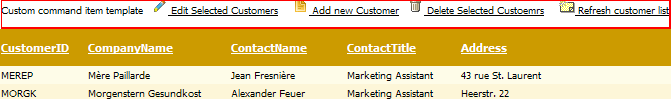

# Command Item Template


In order to show the command item, you should set the **CommandItemDisplay** property of the **GridTableView**. The **CommandItemDisplay** property can take four values:	**None**, **Top**, **Bottom** and **TopAndBottom**, corresponding to the place where it will appear.	You can customize the command item content using the template of a **GridTableView.CommandItemTemplate**as shown in **Example 1**.

**Example 1**: Shows how custom commands could be implemented via the**CommandItemTemplate**.

````ASP.NET
	                <CommandItemTemplate>
	                    Custom command item template
	                    <asp:LinkButton Style="vertical-align: bottom" ID="btnEditSelected" runat="server"
	                        CommandName="EditSelected" Visible='<%# RadGrid1.EditIndexes.Count == 0 %>'> Edit Selected Customers</asp:LinkButton>
	                    <asp:LinkButton ID="btnUpdateEdited" runat="server" CommandName="UpdateEdited" Visible='<%# RadGrid1.EditIndexes.Count > 0 %>'> Update Customers</asp:LinkButton>
	                    <asp:LinkButton ID="btnCancel" runat="server" CommandName="CancelAll" Visible='<%# RadGrid1.EditIndexes.Count > 0 || RadGrid1.MasterTableView.IsItemInserted %>'> Cancel editing</asp:LinkButton>
	                    <asp:LinkButton ID="LinkButton3" runat="server" CommandName="InitInsert" Visible='<%# !RadGrid1.MasterTableView.IsItemInserted %>'> Add new Customer</asp:LinkButton>
	                    <asp:LinkButton ID="LinkButton4" runat="server" CommandName="PerformInsert" Visible='<%# RadGrid1.MasterTableView.IsItemInserted %>'> Add this Customer</asp:LinkButton>
	                    <asp:LinkButton ID="LinkButton5" OnClientClick="javascript:return confirm('Delete all selected customers?')"
	                        runat="server" CommandName="DeleteSelected"> Delete Selected Customers</asp:LinkButton>
	                    <asp:LinkButton ID="LinkButton6" runat="server" CommandName="Re bindGrid"> Refresh customer list</asp:LinkButton>
	                    <br />
	                </CommandItemTemplate>
````


Running the code from **Example 1** will generate **Figure 1**.
>caption Figure 1: Show the result of the custom commands implementation from Example 1.



In the **CommandItemTemplate** you can add any type of buttons that raise a command event and Telerik **RadGrid** will fire the	**ItemCommandEvent** (see below) on the server when this button is clicked.

````ASP.NET
	<asp:LinkButton ID="LinkButton2" runat="server" CommandName="InitInsert">Add New</asp:LinkButton>
````


When a user clicks the link in the previous code snippet, it will automatically set **RadGrid** in "Insert" mode because the "InitInsert" command is processed internally by	**RadGrid**. You can also fetch the command in the **ItemCommandEvent** and check the value of the event argument **CommandName**	for the value of "InitInsert" (corresponding to the value of the static member **RadGrid.InitInsertCommandName**).

## Handling Custom Commands:Delete Command (CommandItem Example)

Generally, you can handle any command using the **ItemCommandEvent**. **Example 2** shows how to handle a custom command "DeleteSelected".It will delete all selected Items. In the ASPX file, we set the **CommandName** property to "DeleteSelected". Then in the **ItemCommandEvent**handler, we check if the **CommandName** was "DeleteSelected" and call the **PerformDelete** method, which will delete all selected items.Note that you will need to set **AllowAutomaticDeletes** property to **true**.

**Example 2:** Shows how to implement a custom "DeleteSelected" command.


````ASP.NET
	                <CommandItemTemplate>
	                    <asp:LinkButton ID="LinkButton7" OnClientClick="javascript:return confirm('Delete all selected customers?')"
	                        runat="server" CommandName="DeleteSelected"> Delete Selected Custoemrs</asp:LinkButton>
	                </CommandItemTemplate>
````
````C#
	
	  protected void RadGrid1_ItemCommand(object source, Telerik.Web.UI.GridCommandEventArgs e)
	  {
	    if (e.CommandName == "DeleteSelected")
	      {
	        if (RadGrid1.SelectedIndexes.Count == 0)
	        {
	          return;
	        }
	
	        foreach (GridDataItem item in RadGrid1.SelectedItems)
	        {
	          e.Item.OwnerTableView.PerformDelete(item, true);
	        }
	
	        e.Item.OwnerTableView.Rebind();
	        return;
	      }
	  }
	          
````
````VB
	    Protected Sub RadGrid1_ItemCommand(ByVal source As Object, ByVal e As Telerik.Web.UI.GridCommandEventArgs) Handles RadGrid1.ItemCommand
	        If e.CommandName = "DeleteSelected" Then
	
	            If RadGrid1.SelectedIndexes.Count = 0 Then
	                Return
	            End If
	
	            For Each item As GridDataItem In RadGrid1.SelectedItems
	                e.Item.OwnerTableView.PerformDelete(item, True)
	            Next
	            e.Item.OwnerTableView.Rebind()
	            Return
	        End If
	    End Sub
````


## How to Customize the Add New Record/Refresh Text in the CommandItem Area

You can use the **CommandItemTemplate** to customize the “Add new item/refresh” text in the CommandItem Area as shown in **Example 3**.

**Example 3**: Shows how to customize the text of the command buttons.

````ASP.NET
	          <telerik:RadGrid ID="RadGrid1" runat="server">
	            <MasterTableView CommandItemDisplay="Top">
	                <CommandItemTemplate>
	                    <asp:Button ID="Button1" Text="Add new item" runat="server" CommandName="InitInsert">
	                    </asp:Button>
	                </CommandItemTemplate>
	            </MasterTableView>
	        </telerik:RadGrid>
````


If you have two buttons, you can place the buttons in a **HTML table** embedded inside the **CommandItemTemplate**. **Example 4** shows a sample structure:

**Example 4**: Shows how to organize the command buttons in an **HTML table** element.

````ASP.NET
	                <CommandItemTemplate>
	                    <table>
	                        <tr>
	                            <td width="30%">
	                                <asp:LinkButton ID="LinkButton8" Text="Add new item" CommandName="InitInsert" runat="server"></asp:LinkButton>
	                            </td>
	                            <td width="40%">
	                            </td>
	                            <td width="30%">
	                                <asp:LinkButton ID="LinkButton9" Text="Refresh data" CommandName="Rebind" runat="server"></asp:LinkButton>
	                            </td>
	                        </tr>
	                    </table>
	                </CommandItemTemplate>
````


## Setting Preferences for Controls Inside the CommandItemTemplate at Runtime

There are cases in which you may want to access the controls inside your **CommandItemTemplate** from the code-behind and dynamicallychange their preferences (for example, with some particular restrictions/certain conditions). Here are the steps you can perform to reference controls inside the **CommandItemTemplate** programmatically:

1. Subscribe to the **ItemCreated** event of **RadGrid**.

1. Check whether the currently bound item is **GridCommandItem**.

1. Locate the respective control using the **FindControl** method of the command item.

1. Change its attributes according to your needs.

**Example 5** shows how to change the **Text** and **CommandName** properties for a **LinkButton** insidethe **CommandItemTemplate** object.

**Example 5**: Changing properties of a **LinkButton** in a **CommandItemTemplate**.


````ASP.NET
	
	  <telerik:RadGrid ID="RadGrid1" DataSourceID="SqlDataSource1" runat="server" OnItemCreated="RadGrid1_ItemCreated">
	    <MasterTableView Width="100%" CssClass="MasterTable" DataSourceID="SqlDataSource1"
	      CommandItemDisplay="Top">
	      <CommandItemTemplate>
	        <asp:LinkButton ID="LinkButton1" runat="server">Default Text</asp:LinkButton>
	      </CommandItemTemplate>
	    </MasterTableView>
	  </telerik:RadGrid>
	  <asp:SqlDataSource ID="SqlDataSource1" runat="server" ConnectionString="<%$ ConnectionStrings:NorthwindConnectionString %>"
	     SelectCommand="SELECT * FROM [Customers]">
	  </asp:SqlDataSource>
````
````C#
	
	protected void RadGrid1_ItemCreated(object sender, GridItemEventArgs e)
	{
	         if (e.Item is GridCommandItem)
	        {
	            GridCommandItem commandItem = e.Item as GridCommandItem;
	            LinkButton button = commandItem.FindControl("LinkButton1")as LinkButton;
	
	            button.CommandName = "MyCommandName";
	            button.Text = "Perform custom operation";
	        }
	}
	          
````
````VB
	    Protected Sub RadGrid1_ItemCreated(ByVal sender As Object, ByVal e As GridItemEventArgs)
	
	        If TypeOf e.Item Is GridCommandItem Then
	
	            Dim commandItem As GridCommandItem = CType(e.Item, GridCommandItem)
	            Dim button As LinkButton = CType(commandItem.FindControl("LinkButton1"), LinkButton)
	
	            button.CommandName = "MyCommandName"
	            button.Text = "Perform custom operation"
	        End If
	    End Sub
````


## Display Different Controls in a CommandItemTemplate with CommandItemDisplay = "TopAndBottom"

There are cases in which you may want to display different controls inside the top/bottom command item when choosing the **CommandItemDisplay="TopAndBottom"** option.You can do this by switching the visibility of the controls in **ItemCreated**. Note that you can determine whether the command item will be displayed in theheader/footer of the grid by checking the **NamingContainer** for the **GridCommandItem** object (it will be **GridTHead**for the header and **GridTFoot** for the footer). **Example 6** illustrates a sample implementation.

**Example 6**: Showing and hiding command controls dynamically.


````ASP.NET
	        <telerik:RadGrid ID="RadGrid2" runat="server" AllowSorting="true" AllowMultiRowSelection="true"
	            AllowMultiRowEdit="true">
	            <MasterTableView CommandItemDisplay="TopAndBottom">
	                <CommandItemTemplate>
	                    <table>
	                        <tr>
	                            <td width="30%">
	                                <asp:LinkButton ID="btnAdd" Text="Add new item" CommandName="InitInsert" runat="server"></asp:LinkButton>
	                                <asp:LinkButton ID="btnEdit" Text="Edit selected" CommandName="EditSelected" runat="server"></asp:LinkButton>
	                            </td>
	                            <td width="40%">
	                            </td>
	                            <td width="30%">
	                                <asp:LinkButton ID="btnRefresh" Text="Refresh data" CommandName="Rebind" runat="server"></asp:LinkButton>
	                                <asp:LinkButton ID="btnUpdate" Text="Update edited" CommandName="UpdateEdited" runat="server"></asp:LinkButton>
	                            </td>
	                        </tr>
	                    </table>
	                </CommandItemTemplate>
	            </MasterTableView>
	            <ClientSettings>
	                <Selecting AllowRowSelect="true" />
	            </ClientSettings>
	        </telerik:RadGrid>
````
````VB
	    Private Sub RadGrid1_ItemCreated(ByVal sender As Object, ByVal e As Telerik.Web.UI.GridItemEventArgs) Handles RadGrid1.ItemCreated
	        If (TypeOf e.Item Is GridCommandItem) Then
	            Dim commandItem As GridCommandItem = CType(e.Item, GridCommandItem)
	
	            If (TypeOf commandItem.NamingContainer Is GridTHead) Then
	                commandItem.FindControl("btnEdit").Visible = False
	                commandItem.FindControl("btnUpdate").Visible = False
	
	            ElseIf (TypeOf commandItem.NamingContainer Is GridTFoot) Then
	
	                commandItem.FindControl("btnAdd").Visible = False
	                commandItem.FindControl("btnRefresh").Visible = False
	            End If
	        End If
	    End Sub
````
````C#
	
	protected void RadGrid1_ItemCreated(object sender, Telerik.Web.UI.GridItemEventArgs e)
	{
	    if (e.Item is GridCommandItem)
	    {
	        GridCommandItem commandItem = (GridCommandItem)e.Item;
	    
	    if (commandItem.NamingContainer is GridTHead)
	    {
	       commandItem.FindControl("btnEdit").Visible = false;
	       commandItem.FindControl("btnUpdate").Visible = false;
	    }
	    else if (commandItem.NamingContainer is GridTFoot)
	    {
	       commandItem.FindControl("btnAdd").Visible = false;
	       commandItem.FindControl("btnRefresh").Visible = false;
	    }
	    }
	}
	
	          
````


## Define CommandItemTemplate Programmatically

If you want to define a **CommandItemTemplate** programmatically, you need to design your custom class (holding the set of controls forthe **CommandItemTemplate**) which implements the**ITemplate** interface. Then you can assign an instance of this classto the **CommandItemTemplate** of the corresponding **GridTableView**.

**Example 7** shows how to embed **LinkButtons** (for add record and refresh) in the **CommandItemTemplate** of the **MasterTableView** at runtime.

**Example 7**: Programmatic creation of a custom class that defines the **CommandItemTemplate**.


````C#
	
	protected RadGrid RadGrid1;
	
	private class MyCommandItemTemplate : ITemplate
	{
	
	    protected LinkButton addButton;
	
	    protected LinkButton refreshButton;
	
	    public MyCommandItemTemplate()
	    {
	    }
	
	    public void InstantiateIn(System.Web.UI.Control container)
	    {
	        addButton = new LinkButton();
	        addButton.ID = "addButton";
	        addButton.Text = "Add record";
	        addButton.CommandName = "InitInsert";
	
	        refreshButton = new LinkButton();
	        refreshButton.ID = "refreshButton";
	        refreshButton.Text = "Refresh grid";
	        refreshButton.CommandName = "Rebind";
	
	        container.Controls.Add(addButton);
	        container.Controls.Add( new LiteralControl("      "));
	        container.Controls.Add(refreshButton);
	    }
	}
	
	    protected override void OnInit(EventArgs e)
	    {
	        InitializeComponent;
	        DefineGridStructure();
	        base.OnInit(e);
	    }
	
	    private void DefineGridStructure()
	    {
	        this.RadGrid1 = new RadGrid();
	        this.RadGrid1.AutoGenerateColumns = false;
	        this.RadGrid1.MasterTableView.CommandItemDisplay = GridCommandItemDisplay.Top;
	
	        RadGrid1.NeedDataSource += new System.EventHandler(this.RadGrid1_NeedDataSource);
	
	        RadGrid1.MasterTableView.CommandItemTemplate = new MyCommandItemTemplate();
	         // runtime column definitions 
	    }
	          
````
````VB
	    Protected WithEvents RadGrid1 As RadGrid
	
	    Private Class MyCommandItemTemplate
	        Implements ITemplate
	
	        Protected addButton As LinkButton
	        Protected refreshButton As LinkButton
	
	        Public Sub New()
	            MyBase.New()
	
	        End Sub
	
	        Public Sub InstantiateIn(ByVal container As System.Web.UI.Control) Implements System.Web.UI.ITemplate.InstantiateIn
	            addButton = New LinkButton
	            addButton.ID = "addButton"
	            addButton.Text = "Add record"
	            addButton.CommandName = "InitInsert"
	
	            refreshButton = New LinkButton
	            refreshButton.ID = "refreshButton"
	            refreshButton.Text = "Refresh grid"
	            refreshButton.CommandName = "Rebind"
	
	            container.Controls.Add(addButton)
	            container.Controls.Add(New LiteralControl("      "))
	            container.Controls.Add(refreshButton)
	        End Sub
	    End Class
	
	    Protected Overrides Sub OnInit(ByVal e As EventArgs)
	        InitializeComponent()
	        DefineGridStructure()
	        MyBase.OnInit(e)
	    End Sub
	
	    Private Sub DefineGridStructure()
	        Me.RadGrid1 = New RadGrid
	        Me.RadGrid1.AutoGenerateColumns = False
	        Me.RadGrid1.MasterTableView.CommandItemDisplay = GridCommandItemDisplay.Top
	
	        AddHandler RadGrid1.NeedDataSource, AddressOf Me.RadGrid1_NeedDataSource
	
	        RadGrid1.MasterTableView.CommandItemTemplate = New MyCommandItemTemplate()
	        'runtime column definitions
	    End Sub
````


You can find detailed information about how to create templates programmatically in	[this MSDN article](http://msdn.microsoft.com/en-us/library/aa289501%28v=vs.71%29.aspx).

## See Also

 * [Command Reference ]()

 * [Creating Web Server Control Templates Programmatically](http://msdn.microsoft.com/en-us/library/aa289501%28v=vs.71%29.aspx)
