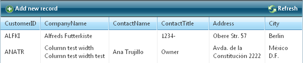

# CommandItem Overview


## 

The **CommandItem** is a placeholder for commands that can perform some action on the selected/all items. See the [Command reference]( http://www.telerik.com/help/aspnet-ajax/grid-command-reference.html ) topic for details about the available commands.



The [Add new record] and [Refresh] buttons will be automatically placed in a command item (**GridCommandItem**). If you need to access them server-side you have to know their IDs:

* **AddNewRecordButton -**Add new record image button

* **InitInsertButton -**Add new record link button

* **RefreshButton -**Refresh image button

* **RebindGridButton -** Refresh link button

Additionally, you have the option of exposing buttons for exporting RadGrid data to the four supported export types: Word, Excel, PDF and CSV. This functionality is available through the

**ShowExportTo[Excel/Word/Pdf/Csv]Button** properties in the **CommandItemSettings**.


The four export buttons have the following server-side IDs:

* **ExportToExcelButton**

* **ExportToWordButton**

* **ExportToPdfButton**

* **ExportToCsvButton**


You need to know the IDs of the export buttons if you are exporting through an AJAX-ified RadGrid, as described in the [following help topic]().

The [***Save Changes***] and [***Cancel Changes***] buttons must be used only with **Batch Editing**:

* **SaveChanges -**Initiates saving for the changes made on a **RadGrid** in **Batch** edit mode

* **CancelChanges -**Cancels the changes made on a **RadGrid** in **Batch** edit mode

The **CommandItem** is availableas a property (**CommandItemDisplay**) ofthe MasterTableView tag of RadGrid.

To enable the **CommandItem**, you need to use the **CommandItemDisplay** property of the **MasterTableView** of RadGrid, choosing an appropriate position for the command item-(**Top** / **Bottom** / **TopAndBottom** / **None**).

Basically, there are two groups of properties, pertaining to the Command Item. One of them is set in the tag of the **MasterTableView**, and the other one, as properties for the **RadGrid** control. Additionally, there is a group of style settings, which can be set through the **CommandItemStyle** tag of the RadGrid control (and which are also available as properties of **RadGrid**, and the **MasterTableView**). This is demonstrated in the code snippet below:

````ASP.NET
<CommandItemStyleBackColor="#FFC0C0" BorderColor="#FFE0C0" BorderStyle="Dotted"
BorderWidth="1px"Font-Bold="True" Font-Italic="True" Font-Names="Arial Black"
Font-Overline="True"Font-Size="Small" Font-Strikeout="True" Font-Underline="True"
ForeColor="#404040"Height="40px" HorizontalAlign="Left" VerticalAlign="Middle"
Width="800px"Wrap="True" />			
````


The same settings are available as properties of the grid control:

````ASP.NET
<telerik:RadGrid
 CommandItemStyle-BackColor="lightblue"
 CommandItemStyle-Font-Bold="true"	
 ...		
````


The style settings can also be set through the **MasterTableView** declaration:

````ASP.NET
<telerik:RadGrid RenderMode="Lightweight"        
   ID="RadGrid1" runat="server" AllowSorting="True" DataSourceID="SqlDataSource1" GridLines="None">        
      <MasterTableView CommandItemDisplay="Top" CommandItemStyle-BackColor="lightblue"  CommandItemStyle-Font-Bold="true">...			
````


There is one additional tag, the **CommandItemSettings**, which includes settings for the commandItem’s image paths, button text and the options to show or hide the default command buttons (Add New Record, Refresh and the four export buttons).

````ASP.NET
<MasterTableView
  CommandItemDisplay="Top"           
  AutoGenerateColumns="False"
  DataKeyNames="CustomerID"  
  DataSourceID="AccessDataSource1">                             
  <CommandItemSettings
    AddNewRecordImageUrl="Image1.jpg"
    AddNewRecordText="AddNewRecordCustomText"
    RefreshImageUrl="Image2.jpg"
    RefreshText="RefreshCustomtext"
    ShowExportToExcelButton="true"
    ShowExportToCsvButton="true" />               
</MasterTableView>  			
````


These settings can also be included directly as settings of the **MasterTableView** declaration of **RadGrid**:

````ASP.NET
<MasterTableView
  CommandItemSettings-AddNewRecordImageUrl="Image1.jpg"
  CommandItemSettings-AddNewRecordText="AddNewRecordCustomText"
  CommandItemSettings-RefreshImageUrl="Image2.jpg"
  CommandItemSettings-RefreshText="RefreshCustomtext"
  CommandItemSettings-ShowExportToPdfButton="true"
  CommandItemDisplay="Top"              
  AutoGenerateColumns="False"
  DataKeyNames="CustomerID"
  DataSourceID="AccessDataSource1">
</MasterTableView>
````


The **RadGrid.ItemCommand** event will be fired when a custom command bubbles from the **CommandItem**, which lets you define any functionality you can think of. A great benefit is that all the buttons residing in the **CommandItem**, will automatically take advantage of the RadGrid AJAX mechanism, without writing any extra code.

## See Also

 * [Command Reference ]()

 * [Command Item Template]()

 * [Styling the CommandItem]()
